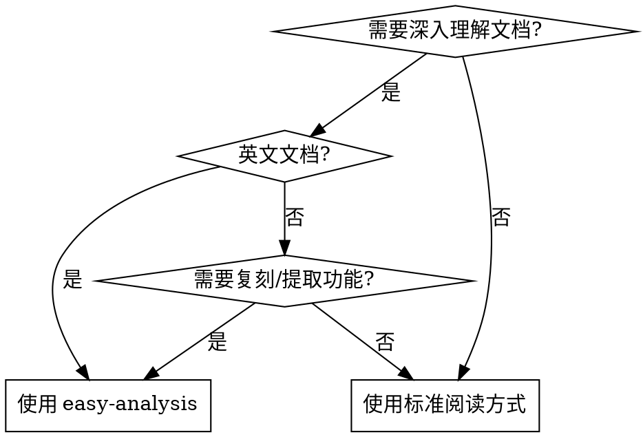
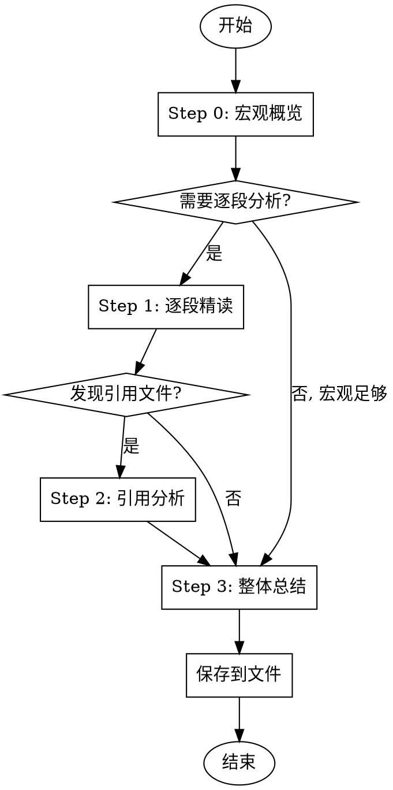

# Easy Analysis

## 概述

**先宏观，后微观。** 对复杂技术文档进行逐段精读、翻译、总结，确保彻底理解每个细节，特别适合英语不熟练的用户深入理解英文技术文档。

## 使用场景



**使用时机：**
- 用户说"分析这个文档"、"帮我理解"、"逐段分析"
- 用户明确表示"我看不懂"或"我英语不好"
- 准备从文档中复刻某个 skill、模式或功能
- 分析 SKILL.md 文件、工作流程文档或技术规范
- 任何需要拆解复杂文档的场景

**不要使用：**
- 快速查阅（直接用 find-docs 或读取文件）
- 代码审查或调试（使用对应 skill）
- 用户只需要一句话总结

## 硬门槛

<CRITICAL>
在完成 Step 0（宏观概览）之前，禁止开始逐段阅读。
禁止跳过任何段落的翻译。
禁止将多个段落合并到一个块中。
禁止遗漏任何段落的要点。

**没有例外：**
- 不因"文档很短"而跳过
- 不因"我已经知道内容"而跳过
- 不因"用户想要快速答案"而跳过
- 不因"这些段落相关"而合并
</CRITICAL>

## 分析流程



### Step 0: 宏观概览

**在开始任何逐段阅读之前**，先提供：

```markdown
## 分析概要

### 文档定位
[一句话：这是什么类型的文档？skill/workflow/tech-spec/API doc？]

### 核心主张
[一句话：这个文档的核心观点或目的是什么？]

### 结构骨架
[用列表或表格展示文档的整体结构，不用展开细节]

### 关键洞察
[2-3个最重要的 takeaway，还没读细节就能知道的东西]

### 与我何干
[为什么用户需要理解这个？复刻？使用？学习？]

---
```

**为什么重要：** 用户需要"地图"再读"地形"。没有宏观上下文，段落细节只是孤立的事实。这也让用户判断是否需要完整分析。

### Step 1: 逐段精读

**一个段落 = 一个块。** 绝不合并段落，即使它们看起来相关。

每个块遵循以下格式：

```markdown
### 段落 N

**原文:**
[原文，逐字复制]

**翻译:**
[中文翻译，直译但通顺]

**要点:**
- 要点 1: [为什么重要 / 隐含意义]
- 要点 2: [与其他概念的联系]
- 要点 3: [可执行的建议]
```

**要点不是翻译的总结。** 它们回答：
- 这个段落为什么存在？
- 如果删除这个段落，什么会改变？
- 这与文档的核心主张如何联系？

### Step 2: 引用文件分析

如果段落引用了外部文件，在段落后追加详细解释：

**对于脚本文件：**
- **代码结构**：分段解释，每段加注释
- **关键逻辑**：核心算法/流程说明
- **数据流**：输入输出、状态变化

**对于文档文件：**
- **结构概述**：文件整体结构
- **核心概念**：定义的关键概念
- **使用示例**：提供的示例代码

**规则：** 引用文件属于分析范围。"详见 X.md"意味着你必须读取 X.md 并纳入分析。

### Step 3: 整体总结

所有段落分析完成后，提供：

```markdown
## 整体总结

### 核心概念
[文档中定义的关键术语和概念]

### 工作流程
[步骤化的流程图/清单]

### 关键文件
[文件清单及其作用]

### 如何复刻/应用
[实际应用该 skill/模式的方法]
```

## 输出格式

分析结果保存到 `docs/<project-name>/` 目录：

```
<NN>-<skill-name>-analysis.md
```

示例：`07-brainstorming-skill.md`

**强制要求。** 仅聊天输出是不够的。

## 反模式

| 借口 | 为什么错 | 正确做法 |
|------|---------|---------|
| "文档很短，跳过宏观概览" | 无论长短，宏观都提供上下文 | Step 0 永不跳过 |
| "总结和翻译效果一样" | 总结 = 作者的解释；翻译 = 用户自己的解释 | 两者都需要 |
| "这些段落相关，合并吧" | 破坏粒度，用户无法定位具体段落 | 一个段落 = 一个块 |
| "翻译已经说清楚了，不要要点" | 要点解释 WHY，不是 WHAT | 两者都需要 |
| "用户只问了这篇文档" | 引用文件是文档意义的一部分 | 追踪所有引用 |
| "聊天就行，不用保存文件" | 文件提供持久参考 | 必须保存到文件 |
| "已经有分析文件了，我读那个" | 现有分析是他人的解释，不是一手来源 | 始终读取用户指定的原始文件 |

## 规则

1. **Step 0 优先** — 逐段阅读之前必须有宏观概览。没有例外。
2. **一个段落 = 一个块** — 绝不合并、跳过或跨段落总结。
3. **每段都翻译** — 即使看起来简单。逐字复制原文。
4. **每段都要点** — 解释为什么重要，而不只是说了什么。
5. **追踪引用** — 外部文件属于分析范围。读取并分析它们。
6. **保存到文件** — `docs/<project-name>/<NN>-<skill-name>-analysis.md`
7. **使用中文** — 所有解释、总结、要点必须用中文。
8. **保持结构层次** — 严格跟随原文的标题层级。
9. **只读原始文件** — 不要读取已有的分析文件、总结或二手来源。始终分析用户指定的一手文档。

## 示例

用户请求："分析 @docs/gsd/01-map-codebase-workflow.md"

**Step 0 输出：**
```markdown
## 分析概要

### 文档定位
这是一个代码库映射（codebase mapping）的工作流程文档。

### 核心主张
通过系统化步骤将复杂代码库转化为可理解的架构文档（ARCHITECTURE.md）。

### 结构骨架
1. 准备阶段（环境检查、工具确认）
2. 分析阶段（目录结构、依赖关系、核心模块）
3. 文档生成（ARCHITECTURE.md 模板填充）
4. 验证阶段（人工审查、更新机制）

### 关键洞察
- 不是一次性任务，需要持续更新
- 依赖外部工具（tree、find、cloc 等）
- 输出是团队 onboarding 的核心文档

### 与我何干
用户可能要复刻这个流程到自己的项目，或理解 map-codebase skill 的工作原理。

---
```

**Step 1 输出（段落 1）：**
```markdown
### 段落 1

**原文:**
This workflow maps a codebase to produce an ARCHITECTURE.md document suitable for onboarding and refactoring decisions.

**翻译:**
这个工作流程将一个代码库映射为生成 ARCHITECTURE.md 文档，该文档适用于 onboarding 和重构决策。

**要点:**
- 明确产出物是 ARCHITECTURE.md，不是其他格式
- 两个核心用途：onboarding（新人理解）和 refactoring（重构决策）
- 暗示这个文档需要足够清晰，让不熟悉代码的人也能理解
```

[... 更多段落 ...]

**Step 3 输出：**
```markdown
## 整体总结

### 核心概念
- **Codebase Map**: 代码库的拓扑结构表示
- **ARCHITECTURE.md**: 标准化输出文档
- **Onboarding**: 新人快速理解项目

### 工作流程
1. 环境准备 → 2. 结构分析 → 3. 依赖分析 → 4. 文档生成 → 5. 验证更新

### 关键文件
| 文件 | 作用 |
|------|------|
| map-codebase.sh | 主脚本，orchestrates 整个流程 |
| ARCHITECTURE.md.template | 输出模板 |

### 如何复刻/应用
在自己的项目中：1) 复制脚本结构 2) 适配模板 3) 设置定时更新机制
```
