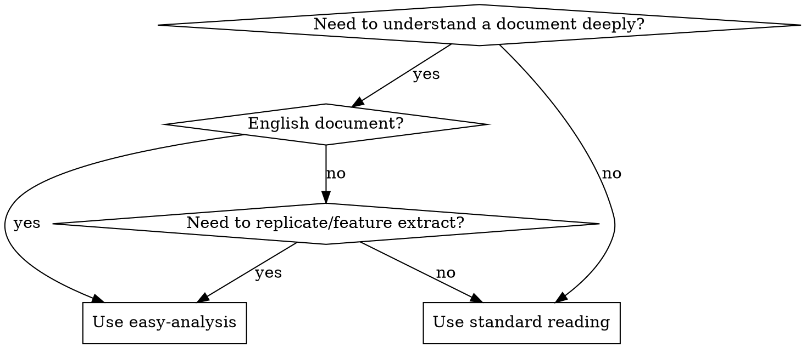
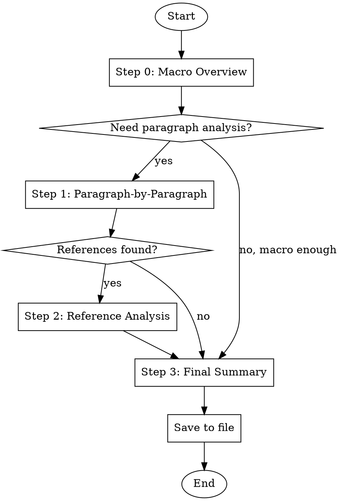

# Easy Analysis

## Overview

**Macro first, micro second.** Provide paragraph-by-paragraph deep reading with translation and summarization. Target audience: users who need thorough understanding of complex technical documents, especially English documentation.

## When to Use



**Use when:**
- User says "analyze this document", "help me understand", "paragraph-by-paragraph"
- User explicitly says "I don't understand" or "my English is not good"
- Preparing to replicate a skill, pattern, or feature from documentation
- Analyzing SKILL.md files, workflow documents, or technical specifications
- Any scenario requiring dismantling complex documentation piece by piece

**Don't use when:**
- Quick reference lookup (use find-docs or direct reading)
- Code review or debugging (use appropriate skills)
- User just wants a one-sentence summary

## HARD-GATE

<CRITICAL>
Do NOT start paragraph-by-paragraph reading until you have completed Step 0 (Macro Overview).
Do NOT skip translation for any paragraph.
Do NOT mix multiple paragraphs into one block.
Do NOT omit Key Points for any paragraph.

**No exceptions:**
- Not for "short documents"
- Not for "I already know what this says"
- Not for "user wants quick answer"
- Not for "these paragraphs are related"
</CRITICAL>

## Analysis Flow



### Step 0: Macro Overview

**Before ANY paragraph-by-paragraph reading**, provide:

```markdown
## 分析概要

### 文档定位
[一句话：这是什么类型的文档？skill/workflow/tech-spec/API doc？]

### 核心主张
[一句话：这个文档的核心观点或目的是什么？]

### 结构骨架
[用列表或表格展示文档的整体结构，不用展开细节]

### 关键洞察
[2-3个最重要的takeaway，还没读细节就能知道的东西]

### 与我何干
[为什么用户需要理解这个？复刻？使用？学习？]

---
```

**Why this matters:** Users need the "map" before the "terrain". Without macro context, paragraph details are isolated facts without connection. This also lets users decide if they need full analysis or can stop here.

### Step 1: Paragraph-by-Paragraph Reading

**ONE paragraph = ONE block.** Never combine paragraphs, even if they seem related.

Each block follows this exact format:

```markdown
### Paragraph N

**Original:**
[Original text, copy verbatim]

**Translation:**
[Chinese translation, literal but fluent]

**Key Points:**
- Point 1: [Why this matters / implication]
- Point 2: [Connection to other concepts]
- Point 3: [Actionable takeaway]
```

**Key Points are NOT a summary of translation.** They answer:
- Why does this paragraph exist?
- What would change if this paragraph were removed?
- How does this connect to the document's core claim?

### Step 2: Reference File Analysis

If the paragraph references external files, append detailed explanation after the paragraph:

**For script files:**
- **Code Structure**: Segment-by-segment explanation with comments
- **Key Logic**: Core algorithm/flow description
- **Data Flow**: Input/output, state changes

**For document files:**
- **Structure Overview**: Overall document structure
- **Core Concepts**: Key concepts defined
- **Usage Examples**: Example code provided

**Rule:** References are IN SCOPE. "See X.md for details" means you MUST read X.md and include it in analysis.

### Step 3: Final Summary

After all paragraphs, provide:

```markdown
## 整体总结

### 核心概念
[Key terms and concepts defined in the document]

### 工作流程
[Step-by-step flowchart/checklist]

### 关键文件
[File list and their roles]

### 如何复刻/应用
[How to apply this skill/pattern in practice]
```

## Output Format

Save analysis results to `docs/<project-name>/` directory:

```
<NN>-<skill-name>-analysis.md
```

Example: `07-brainstorming-skill.md`

**This is MANDATORY.** Chat output alone is insufficient.

## Anti-Patterns

| Rationalization | Why It's Wrong | Correct Response |
|-----------------|----------------|------------------|
| "Short document, skip macro" | Macro provides context regardless of length | Step 0 is NEVER optional |
| "Summary achieves same goal as translation" | Summary = author's interpretation; translation = user's interpretation | Both are required |
| "These paragraphs are related, combine them" | Destroys granularity; user can't reference specific paragraphs | ONE paragraph = ONE block |
| "Translation speaks for itself, no key points needed" | Key points explain WHY, not WHAT | Both are required |
| "User asked about THIS doc only" | References are part of the document's meaning | Chase ALL references |
| "Chat format, no file needed" | File provides persistent reference | ALWAYS save to file |
| "There's already an analysis file, I'll read that" | Existing analysis is someone else's interpretation, not primary source | ALWAYS read the ORIGINAL file specified by user |

## Rules

1. **Step 0 first** — Macro overview before any paragraph reading. No exceptions.
2. **ONE paragraph = ONE block** — Never combine, never skip, never summarize across paragraphs.
3. **Translate every paragraph** — Even seemingly simple ones. Copy original verbatim.
4. **Key points for every paragraph** — Explain why it matters, not just what it says.
5. **Chase references** — External files are in scope. Read and analyze them.
6. **Save to file** — `docs/<project-name>/<NN>-<skill-name>-analysis.md`
7. **Use Chinese** — All explanations, summaries, and key points must be in Chinese.
8. **Preserve structure hierarchy** — Follow original heading levels.
9. **Read original files only** — Do NOT read existing analysis files, summaries, or secondary sources. Always analyze the primary document specified by the user.

## Example

User request: "Analyze @docs/gsd/01-map-codebase-workflow.md"

**Step 0 Output:**
```markdown
## 分析概要

### 文档定位
这是一个代码库映射（codebase mapping）的工作流程文档。

### 核心主张
通过系统化步骤将复杂代码库转化为可理解的架构文档（ARCHITECTURE.md）。

### 结构骨架
1. 准备阶段（环境检查、工具确认）
2. 分析阶段（目录结构、依赖关系、核心模块）
3. 文档生成（ARCHITECTURE.md 模板填充）
4. 验证阶段（人工审查、更新机制）

### 关键洞察
- 不是一次性任务，需要持续更新
- 依赖外部工具（tree、find、cloc 等）
- 输出是团队 onboarding 的核心文档

### 与我何干
用户可能要复刻这个流程到自己的项目，或理解 map-codebase skill 的工作原理。

---
```

**Step 1 Output (Paragraph 1):**
```markdown
### Paragraph 1

**Original:**
This workflow maps a codebase to produce an ARCHITECTURE.md document suitable for onboarding and refactoring decisions.

**Translation:**
这个工作流程将一个代码库映射为生成 ARCHITECTURE.md 文档，该文档适用于 onboarding 和重构决策。

**Key Points:**
- 明确产出物是 ARCHITECTURE.md，不是其他格式
- 两个核心用途：onboarding（新人理解）和 refactoring（重构决策）
- 暗示这个文档需要足够清晰，让不熟悉代码的人也能理解
```

[... more paragraphs ...]

**Step 3 Output:**
```markdown
## 整体总结

### 核心概念
- **Codebase Map**: 代码库的拓扑结构表示
- **ARCHITECTURE.md**: 标准化输出文档
- **Onboarding**: 新人快速理解项目

### 工作流程
1. 环境准备 → 2. 结构分析 → 3. 依赖分析 → 4. 文档生成 → 5. 验证更新

### 关键文件
| 文件 | 作用 |
|------|------|
| map-codebase.sh | 主脚本， orchestrates 整个流程 |
| ARCHITECTURE.md.template | 输出模板 |

### 如何复刻/应用
在自己的项目中：1) 复制脚本结构 2) 适配模板 3) 设置定时更新机制
```
