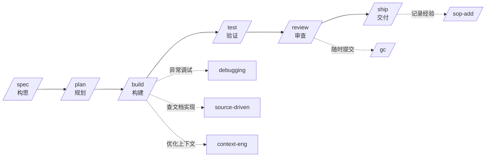

# ys-powers

`ys-powers` 是一套用于增强 Claude Code 工作流的本地能力集，包含 **skills**（场景化行为技能）、**commands**（显式调用命令）、**agents**（专用子智能体）、**rules**（编码规范）四类配置。

## 快速开始

```bash
# 进入目标项目并安装
cd /path/to/your-project
python /path/to/ys-powers/install/local-install.py

# 验证
ls -la .claude/
```

安装策略：`skills/` 文件夹级全量覆盖；`rules/`、`commands/` 文件级同名覆盖，保留目标独有文件。

## 按场景速查

不知道自己该用什么？按当前场景选择：

| 我在做什么 | 推荐入手 |
|-----------|---------|
| 有一个模糊想法，想梳理成需求 | `/spec` → 自动触发 `idea-refine`、`spec-driven-development` |
| 需求已明确，要拆任务 | `/plan` |
| 写代码/改逻辑 | `/build`（增量实现）或 `/refactor`（重构） |
| 写 UI/前端 | `frontend-ui-engineering` [skill] 自动触发 |
| 修 bug | `/test`（先写重现测试）→ `/build` |
| 代码写完了，要审查 | `/review` |
| 准备发版 | `/ship` |
| 提交代码 | `/gc`（完整 Git 流程）或 `/local-commit`（极简本地提交） |
| 看不懂某段代码 | `/teach-code` |
| 项目结构混乱，想理清楚 | `/doc-codebase` |

## 典型工作流

开发新功能的完整路径：



**主线**（实线）：构思 → 规划 → 构建 → 验证 → 审查 → 交付  
**支撑**（虚线）：构建、审查、交付阶段按需触发的横向能力，非强制步骤

## 能力分类速览

| 类型 | 数量 | 调用方式 | 核心代表 |
|------|------|----------|----------|
| 显式命令 | 16 | 直接输入 `/command` | `/spec` `/plan` `/build` |
| 行为技能 | 28 | 场景自动触发 | `idea-refine` `test-driven-development` |
| 子智能体 | 3 | 自动指派 | `code-reviewer` |
| 编码规范 | 1 | 自动生效 | `code.md` |

### 显式命令（`/command`）

直接输入使用，按开发阶段分组：

| 阶段 | 命令 |
|------|------|
| 构思与规划 | `/spec` `/plan` |
| 构建与验证 | `/build` `/test` |
| 审查与优化 | `/review` `/refactor` `/code-simplify` |
| 交付与提交 | `/ship` `/gc` `/local-commit` |
| 辅助 | `/sop-add` `/s2m` `/doc-codebase` `/teach-code` `/wskill` `/easy-analysis` |

### 行为技能（自动触发）

在对应场景自动应用：

**构思与规划** — `idea-refine` · `explore-then-ask` · `spec-driven-development` · `planning-and-task-breakdown` · `brainstorming`

**构建** — `incremental-implementation` · `frontend-ui-engineering` · `api-and-interface-design`

**验证** — `test-driven-development` · `browser-testing-with-devtools`

**审查** — `code-review-and-quality` · `security-and-hardening` · `performance-optimization`

**交付** — `shipping-and-launch` · `ci-cd-and-automation` · `git-workflow-and-versioning`

**维护** — `code-simplification` · `debugging-and-error-recovery` · `documentation-and-adrs` · `deprecation-and-migration`

**支撑** — `using-agent-skills`（元技能）· `context-engineering` · `source-driven-development` · `sop-search` · `writing-skills`

### 子智能体（Agent）

- `code-reviewer` — 五维度审查（正确性、可读性、架构、安全、性能）
- `security-auditor` — 漏洞检测与加固
- `test-engineer` — 测试策略与覆盖率

### 编码规范

- `code.md` — 先思考再编码、简化优先、精准修改、不随意重构

## 目录结构

```
ys-powers/
├── skills/      # 28 个场景化行为技能
├── commands/    # 16 个显式调用命令
├── agents/      # 3 个专用子智能体
├── rules/       # 编码规范与行为约束
├── install/     # 安装到任意项目 .claude/ 的脚本
└── docs/        # 项目内部文档与架构说明
```

## 使用示例

开发新功能时，通常按此顺序调用：

```bash
# 1. 先写 spec
/spec

# 2. 拆任务
/plan

# 3. 逐个实现
/build

# 4. 补测试
/test

# 5. 审查
/review

# 6. 提交
/gc

# 7. 上线检查
/ship
```
