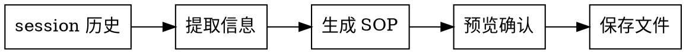

# SOP-ADD

从当前 session 历史提取关键信息，生成 SOP 文件。

## 流程



## 提取规则

### 1. 分析 session

从当前对话中提取：

- **问题/需求类型**: bug-fix | feature
- **涉及文件**: 新建/修改 > 核心逻辑 > 配置
- **执行的命令**: session 中实际运行过的命令
- **讨论的方案**: 技术选型、权衡决策

### 2. 生成各 section

| Section | 规则 |
|---------|------|
| title | 从问题描述提取，一句话概括 |
| tags | 预定义标签 + 自由补充（见下方） |
| summary | LLM 自由措辞，bug-fix 用"解决了"，feature 用"实现了" |
| background | `[场景] + [问题/需求]` |
| solution | 算法描述型步骤 |
| key files | 按文件组织: `file > class > function` |
| key commands | session 中实际执行的命令 |
| key decisions | 非必需，有则提取 |

### 3. 预定义标签

```
auth | api | database | bug-fix | refactor | config | deploy | testing
```

必选日期标签: `YYYY-MM-DD-HH`（精确到小时）

可自由补充: `["双token方案", "httpOnly", ...]`

## SOP 格式

```yaml
---
title: "SOP: ..."
created: YYYY-MM-DD
tags: [预定义标签, 自由标签]
project: 项目名
---

## 背景

[场景] + [问题/需求]

## 解决方案

### 伪代码步骤

1. [步骤1]
2. [步骤2]
3. [步骤3]

### 关键信息

- path/to/file.ts
  - class ClassName
    - methodName()
  - functionName()

### 关键命令

```bash
npm test
```

### 关键决策

- [决策点]
```

## 示例

```yaml
---
title: "SOP: 修复 JWT 过期后掉线问题"
created: 2026-04-17
tags: [auth, bug-fix, 2026-04-17-14, 双token方案]
project: ys-powers
---

## 背景

在长时间会话场景下，JWT 过期后用户被迫重新登录。

## 解决方案

### 伪代码步骤

1. 检查 token 是否过期
2. 如果过期，调用 refresh 接口获取新 token
3. 如果 refresh 成功，保存新 token 并重试请求
4. 如果 refresh 失败，跳转登录页

### 关键信息

- src/auth/session.ts
  - class TokenManager
    - refresh()
    - checkExpiry()
  - function saveToken()
- src/auth/api.ts
  - refreshToken()

### 关键命令

```bash
npm test auth/session
```

### 关键决策

- 采用双 token 方案：access token + refresh token
- refresh token 存 httpOnly cookie
```

## 文件命名

```
sop/sop-{日期}-{序号}-{关键词}.md
sop-20260417-001-auth-fix.md
```

- 关键词从 title 中提取，kebab-case 格式
- 序号按当日文件数量自动递增
