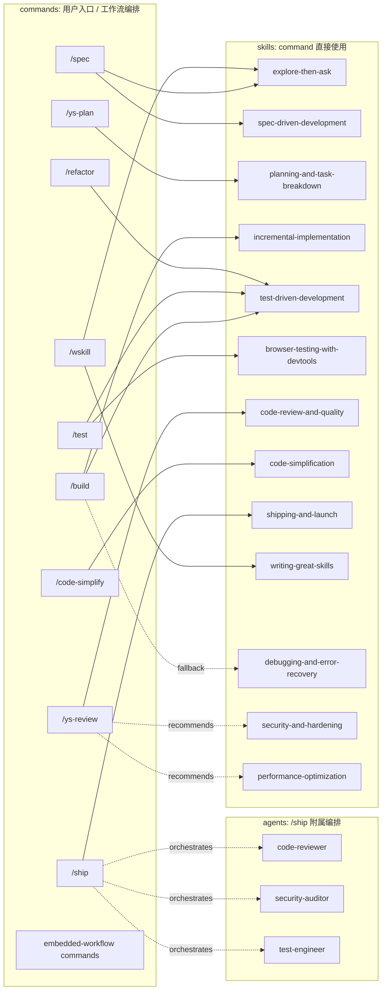
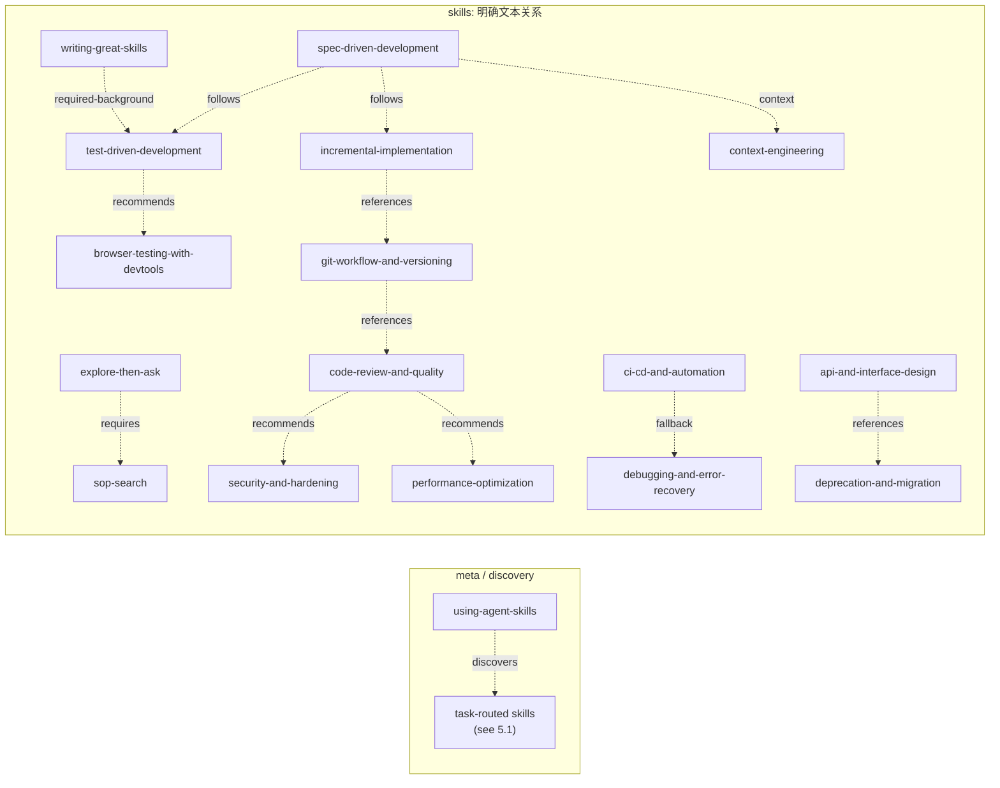

# ys-powers commands / skills 依赖关系说明

本文从 `commands/` 和 `skills/` 的作者视角出发，说明 ys-powers 的能力组织方式。

核心口径：

- `commands/` 是用户入口和工作流编排层，回答“用户触发什么入口”。
- `skills/` 是可复用能力模块层，回答“入口背后使用什么方法论或执行规范”。
- `Command -> Skill` 和 `Skill -> Skill` 都是本文主线。
- `agents/` 不是主线，只在 `/ship` 明确并行编排时作为附录说明。
- `.claude/` 是安装产物，不作为本文判断源依赖关系的依据。

---

## 1. 阅读口径

本文只使用当前源目录作为依据：

```text
commands/*.md
skills/*/SKILL.md
agents/*.md
agents/README.md
```

其中：

- 当前 `commands/` 下有 16 个 command。
- 当前 `skills/` 下有 25 个 skill。
- 当前 `agents/` 下有 3 个 persona，加一个 `README.md`。

本文不把“开发生命周期阶段”当作依赖关系。生命周期可以帮助理解使用顺序，但它不是代码式依赖。如果一个 skill 只是出现在生命周期示例里，本文会写成“发现 / 建议 / 索引关系”，而不是强依赖。

本文也不把“读者可能会连续使用两个 skill”自动当成 `Skill -> Skill`。只有源文件里明确出现的关系，才进入 `Skill -> Skill` 主线。

---

## 2. 关系类型

为了避免把弱引用画成强调用，本文统一使用以下关系类型。

### 2.1 Command -> Skill

| 类型 | 含义 | 图中表示 |
|------|------|----------|
| `invokes` | command 明确写了 `Invoke the ... skill` | 实线箭头 |
| `combines` | command 明确组合多个 skills，通常有串联或并行语义 | 多条实线箭头 |
| `fallback` | command 在失败、异常或特定条件下要求 follow 某个 skill | 虚线箭头 |
| `embedded-workflow` | command 自身写完整流程，没有显式委托 skill | 不连到 skill，单独归组 |
| `orchestrates` | command 编排 agents，而不是调用 skill | 虚线箭头到 agents |

### 2.2 Skill -> Skill

| 类型 | 含义 | 图中表示 |
|------|------|----------|
| `requires` | 当前 skill 明确要求先执行另一个 skill 或步骤 | 虚线箭头 |
| `discovers` | meta skill 根据任务场景帮助选择其他 skills | 虚线箭头 |
| `sequence-example` | 源文件给出典型连续使用顺序，但不是强制调用 | 虚线箭头 |
| `follows` | 当前 skill 明确要求实现阶段遵循其他 skills | 虚线箭头 |
| `recommends` | 当前 skill 建议进一步参考或配合另一个 skill | 虚线箭头 |
| `fallback` | 当前 skill 遇到失败场景时转入另一个 skill | 虚线箭头 |
| `required-background` | 当前 skill 要求理解另一个 skill 的方法论背景 | 虚线箭头 |
| `unresolved-reference` | 源文件提到了 skill 名，但当前 `skills/` 不存在 | 文本标注，不画成有效依赖 |

`Skill -> Skill` 是主线，但不是“运行时调用链”。它更接近能力模块之间的协作说明、前置知识和工作流衔接。

---

## 3. 两张主图总览

当前依赖关系用两张图表达，而不是压进一张复杂图：

- 图一只表达 `Command -> Skill`：用户入口如何直接使用 skills。
- 图二只表达 `Skill -> Skill`：skills 文档之间有哪些明确关系。

这样可以避免两类关系互相污染。`Command -> Skill` 更接近入口执行关系；`Skill -> Skill` 更接近能力协作、背景知识、专项深入或失败路径。

### 3.1 Command -> Skill 入口图

这张图只回答一个问题：用户调用某个 command 时，会直接进入哪些 skills？

实线表示 command 明确调用或组合 skill。虚线表示条件路径、失败路径或 agent 编排。



### 3.2 Skill -> Skill 关系图

这张图只回答一个问题：skills 之间有哪些明确文本关系？

所有边都使用虚线，因为这些关系不是运行时强调用。它们可能是发现、后续阶段衔接、专项深入、失败路径或前置知识。



注意：这两张图都不是“所有可能使用顺序”。它们只表达源文件中明确出现的关系。没有出现在图里的 skill，不代表不重要，只代表当前源文件里没有明确的跨 skill 关系需要放入图中。

---

## 4. Command -> Skill 主线

### 4.1 Command 清单

当前 `commands/` 源目录包含 16 个 command：

| Command | 类型 | 直接关系 |
|---------|------|----------|
| `/spec` | 多 skill 串联型 | `explore-then-ask`, `spec-driven-development` |
| `/ys-plan` | 单 skill 委托型 | `planning-and-task-breakdown` |
| `/build` | 多 skill 组合型 | `incremental-implementation`, `test-driven-development`; 失败时 `debugging-and-error-recovery` |
| `/test` | 多 skill 组合型 | `test-driven-development`; 浏览器相关时 `browser-testing-with-devtools` |
| `/ys-review` | 单 skill 委托型 + 审查维度建议 | `code-review-and-quality`; 安全 / 性能维度提到 `security-and-hardening`, `performance-optimization` |
| `/code-simplify` | 单 skill 委托型 | `code-simplification` |
| `/ship` | skill 委托型 + agent fan-out | `shipping-and-launch`; 并行编排 3 个 agents |
| `/wskill` | 多 skill 串联型 | `explore-then-ask`, `writing-great-skills` |
| `/refactor` | 单 skill 委托型 + 自包含方案设计 gate | `test-driven-development` |
| `/doc-codebase` | embedded-workflow | 无显式 skill 依赖 |
| `/easy-analysis` | embedded-workflow | 无显式 skill 依赖 |
| `/gc` | embedded-workflow | 无显式 skill 依赖 |
| `/local-commit` | embedded-workflow | 无显式 skill 依赖 |
| `/s2m` | embedded-workflow | 无显式 skill 依赖 |
| `/sop-add` | embedded-workflow | 无显式 skill 依赖 |
| `/teach-code` | embedded-workflow | 无显式 skill 依赖 |

旧文档中出现过的 `/review`、`/spec-review`、`/map-codebase` 不在当前 `commands/` 源目录中，因此不进入当前主清单。

### 4.2 `/spec`

类型：多 skill 串联型 command。

直接关系：

- `invokes` `explore-then-ask`
- `invokes` `spec-driven-development`

说明：

`/spec` 先要求使用 `explore-then-ask` 澄清需求，再要求使用 `spec-driven-development` 生成结构化 spec。这里是强关系，因为 command 源文件明确写了 `Invoke the ... skill`。

维护注意：

如果以后 `/spec` 增加 plan 或 build 阶段，不应直接把后续阶段画进 `/spec` 的强依赖，除非 command 源文件明确要求 invoke 对应 skill。

### 4.3 `/ys-plan`

类型：单 skill 委托型 command。

直接关系：

- `invokes` `planning-and-task-breakdown`

说明：

`/ys-plan` 的核心流程在 `planning-and-task-breakdown` 中。command 自身主要负责读取 spec、进入 plan mode、确认保存路径等命令级约束。

### 4.4 `/build`

类型：多 skill 组合型 command。

直接关系：

- `combines` `incremental-implementation`
- `combines` `test-driven-development`
- `fallback` `debugging-and-error-recovery`

说明：

`/build` 明确要求同时使用 `incremental-implementation` 和 `test-driven-development`。这表示实现时既要按小步增量推进，也要用测试证明行为。

`debugging-and-error-recovery` 是失败路径：command 写明 “If any step fails, follow the debugging-and-error-recovery skill.” 因此它不属于正常主路径，但属于明确条件关系。

### 4.5 `/test`

类型：多 skill 组合型 command。

直接关系：

- `invokes` `test-driven-development`
- `conditional` `browser-testing-with-devtools`

说明：

`/test` 的主路径是 TDD。浏览器相关问题还要使用 `browser-testing-with-devtools` 做真实运行时验证。因此 `browser-testing-with-devtools` 是条件关系，不是每次 `/test` 都必然执行。

### 4.6 `/ys-review`

类型：单 skill 委托型 command，带审查维度建议。

直接关系：

- `invokes` `code-review-and-quality`
- `recommends` `security-and-hardening`
- `recommends` `performance-optimization`

说明：

`/ys-review` 直接委托 `code-review-and-quality` 做五维 review。command 在安全和性能维度中分别写了 “Use security-and-hardening skill” 和 “Use performance-optimization skill”。这两个不是入口主 skill，但属于 review 过程中明确提到的专项补充。

### 4.7 `/code-simplify`

类型：单 skill 委托型 command。

直接关系：

- `invokes` `code-simplification`

说明：

`/code-simplify` 的目标是保持行为不变的代码简化。command 源文件明确 invoke `code-simplification`，后续测试、构建、review 作为流程要求存在，但不是新的 command 级 skill 依赖。

### 4.8 `/ship`

类型：skill 委托型 + agent fan-out 编排。

直接关系：

- `invokes` `shipping-and-launch`
- `orchestrates` `code-reviewer`
- `orchestrates` `security-auditor`
- `orchestrates` `test-engineer`

说明：

`/ship` 先委托 `shipping-and-launch`，然后并行调度三个 specialist personas。三个 agents 独立检查当前变更，结果回到主 agent 汇总成 go / no-go 决策和 rollback plan。

这里的 agents 是 `/ship` 的执行辅助，不是全局依赖主线。

### 4.9 `/wskill`

类型：多 skill 串联型 command。

直接关系：

- `invokes` `explore-then-ask`
- `invokes` `writing-great-skills`

说明：

`/wskill` 先按需澄清 skill 需求，再用 `writing-great-skills` 控制 trigger、scope、information hierarchy 和 pruning。旧 `writing-skills` 保留为手动 legacy reference，不再作为日常入口。

### 4.10 `/refactor`

类型：自包含方案设计 gate + skill 委托型 command。

直接关系：

- `uses` `test-driven-development`

说明：

`/refactor` 的 hard gate 要求先分析目标代码、调用方、测试覆盖和 code smells，输出重构方案并获得用户批准。执行阶段严格遵循 TDD。方案设计逻辑保留在 command 内部，不再依赖单独的设计 skill。

### 4.11 Embedded-workflow commands

以下 commands 没有显式 invoke 某个 skill，而是在 command 文件中写完整流程：

| Command | 自包含流程重点 |
|---------|----------------|
| `/doc-codebase` | 分析代码库并生成 `docs/codebase/ARCHITECTURE.md` |
| `/easy-analysis` | 对复杂文档做宏观概览、逐段精读、引用分析和总结 |
| `/gc` | 分支、提交、推送、PR 的智能 Git 工作流 |
| `/local-commit` | 本地极简提交流程 |
| `/s2m` | worktree 场景下安全返回 main 并清理环境 |
| `/sop-add` | 从 session 历史抽取 SOP 文档 |
| `/teach-code` | 由浅入深讲解代码模块并生成理解笔记 |

这些 commands 仍然可能在文本中提到 skill、rule 或其他概念，但没有形成 `Command -> Skill` 的显式委托关系。

---

## 5. Skill -> Skill 主线

`Skill -> Skill` 是本文第二条主线。它说明能力模块之间如何协作，但必须区分“发现关系”“建议关系”“背景知识”和“失败路径”。

### 5.1 `using-agent-skills`

类型：meta discovery skill。

关系：

- `discovers` `idea-refine`
- `discovers` `spec-driven-development`
- `discovers` `planning-and-task-breakdown`
- `discovers` `incremental-implementation`
- `discovers` `frontend-ui-engineering`
- `discovers` `api-and-interface-design`
- `discovers` `context-engineering`
- `discovers` `source-driven-development`
- `discovers` `test-driven-development`
- `discovers` `browser-testing-with-devtools`
- `discovers` `debugging-and-error-recovery`
- `discovers` `code-review-and-quality`
- `discovers` `security-and-hardening`
- `discovers` `performance-optimization`
- `discovers` `git-workflow-and-versioning`
- `discovers` `ci-cd-and-automation`
- `discovers` `documentation-and-adrs`
- `discovers` `shipping-and-launch`

理由：

`using-agent-skills` 的作用是根据任务类型发现应该使用哪个 skill。它列出 skill discovery 决策树、典型 lifecycle sequence 和 quick reference。

这不是普通强依赖。不能理解为 `using-agent-skills` 在运行时“调用所有 skill”。它更像索引和路由说明。

### 5.2 `explore-then-ask`

类型：需求澄清与设计确认 skill。

关系：

- `requires` `sop-search`

理由：

`explore-then-ask` 的 checklist 第一步要求先搜索历史 SOP，并明确写到 “always search ... first”。因此这不是普通引用，而是进入澄清流程前的必做步骤。

### 5.3 `spec-driven-development`

类型：spec 到实现阶段的衔接 skill。

关系：

- `follows` `incremental-implementation`
- `follows` `test-driven-development`
- `recommends` `context-engineering`

理由：

`spec-driven-development` 在 Phase 4: Implement 中明确写到：执行任务时 follow `incremental-implementation` 和 `test-driven-development`，并使用 `context-engineering` 加载正确 spec section 和源文件。

这里是实现阶段衔接关系，不是 spec 阶段内部的直接调用。


### 5.4 `test-driven-development`

类型：测试与验证方法论 skill。

关系：

- `recommends` `browser-testing-with-devtools`

理由：

`test-driven-development` 在 Browser Testing with DevTools 部分写明：对于浏览器运行的内容，单元测试不够，需要结合 Chrome DevTools MCP 做运行时验证，并指向 `browser-testing-with-devtools`。

这是浏览器场景下的补充验证关系，不是所有 TDD 场景的强制关系。

### 5.5 `code-review-and-quality`

类型：五维 code review skill。

关系：

- `recommends` `security-and-hardening`
- `recommends` `performance-optimization`

理由：

`code-review-and-quality` 在安全检查和性能检查部分分别提示：更详细的安全指导见 `security-and-hardening`，更详细的 profiling / optimization 见 `performance-optimization`。

这两条是专项深入关系。review 主 skill 仍然是 `code-review-and-quality`。

### 5.6 `incremental-implementation`

类型：增量实现 skill。

关系：

- `references` `git-workflow-and-versioning`

理由：

`incremental-implementation` 的增量循环中提到 commit，并提示参考 `git-workflow-and-versioning` 的 atomic commit guidance。

这是提交实践引用，不是实现流程的前置依赖。

### 5.7 `git-workflow-and-versioning`

类型：git 工作流 skill。

关系：

- `references` `code-review-and-quality`

理由：

`git-workflow-and-versioning` 在控制 change size 时提到：超过约 1000 行的变更应该拆分，并参考 `code-review-and-quality` 中的 splitting strategies。

这是 reviewability 相关的引用关系。

### 5.8 `ci-cd-and-automation`

类型：CI/CD 自动化 skill。

关系：

- `fallback` `debugging-and-error-recovery`

理由：

`ci-cd-and-automation` 在 CI failure handling 中明确写到：Test failure 时 agent follows `debugging-and-error-recovery` skill。

这是失败路径关系，不属于正常 CI 配置主路径。

### 5.9 `api-and-interface-design`

类型：API 与模块边界设计 skill。

关系：

- `references` `deprecation-and-migration`

理由：

`api-and-interface-design` 在接口演进和兼容性语境中提到 deprecation / migration planning。这里是设计时的迁移参考关系，不代表每次 API 设计都必须进入迁移流程。

### 5.10 `writing-great-skills`

类型：skill / command 编写参考 skill。

关系：

- `used-by` `/wskill`
- `used-by` `/wcommand`

理由：

`writing-great-skills` 聚焦 predictability：invocation、description、information hierarchy、progressive disclosure、single source of truth、no-op pruning。相比旧 `writing-skills` 的重型 RED-GREEN-REFACTOR，它更适合作为日常 authoring single source of truth。

### 5.11 当前没有明确对外 skill 关系的 skills

以下 skills 当前没有作为 source 进入 `Skill -> Skill` 主线，不代表不重要，只代表源文件中没有明确的对外 skill 关系需要记录：

- `browser-testing-with-devtools`
- `code-simplification`
- `context-engineering`
- `debugging-and-error-recovery`
- `deprecation-and-migration`
- `documentation-and-adrs`
- `frontend-ui-engineering`
- `idea-refine`
- `performance-optimization`
- `planning-and-task-breakdown`
- `security-and-hardening`
- `shipping-and-launch`
- `sop-search`
- `source-driven-development`

维护时可以新增关系，但必须能在对应 `SKILL.md` 中找到明确依据。

---

## 6. Agents 附录

当前 `agents/` 包含：

| Agent | 角色 | 在本文中的位置 |
|-------|------|----------------|
| `code-reviewer` | Senior Staff Engineer | `/ship` fan-out 的一个审查视角 |
| `security-auditor` | Security Engineer | `/ship` fan-out 的安全视角 |
| `test-engineer` | QA Engineer | `/ship` fan-out 的测试覆盖视角 |

`agents/README.md` 对三层关系的说明很重要：

```text
Skill   = the how
Persona = the who
Command = the when
```

因此本文不把 agents 放进主依赖图。它们不是 `commands` 和 `skills` 的平级主线，而是 `/ship` 的并行执行资源。

---

## 7. 维护规则

### 7.1 新增或修改 command 时

更新本文的 `Command -> Skill` 主线：

1. 在 `commands/` 清单中确认 command 文件存在。
2. 如果 command 明确写了 `Invoke the ... skill`，加入 `invokes`。
3. 如果 command 同时使用多个 skills，标成 `combines`，并说明是串联、并行还是不同阶段。
4. 如果 command 只在失败时 follow 某个 skill，标成 `fallback`。
5. 如果 command 自己写完整流程，不显式 invoke skill，标成 `embedded-workflow`。
6. 如果 command 编排 agents，写到 agents 附录，不要提升为全局主线。

### 7.2 新增或修改 skill 时

更新本文的 `Skill -> Skill` 主线：

1. 只记录 `SKILL.md` 中明确出现的 skill 名。
2. 先判断关系类型，再写入正文：
   - 发现 / 索引：`discovers`
   - 后续阶段衔接：`follows`
   - 专项深入：`recommends`
   - 失败路径：`fallback`
   - 前置知识：`required-background`
   - 不存在目标：`unresolved-reference`
3. 不要把 lifecycle 示例直接画成强依赖。
4. 不要把 `using-agent-skills` 画成依赖所有 skills 的强调用链。
5. 如果只是“可能会一起用”，但源文件没写，不进入本文。

### 7.3 更新 Mermaid 时

图优先保持“两张主图”：

- 第一张图只表达 `Command -> Skill`，不要放 `Skill -> Skill`。
- 第二张图只表达 `Skill -> Skill`，不要放 commands 或 agents。
- 实线只给 `Command -> Skill` 的明确调用。
- 虚线给条件关系、失败路径、`Skill -> Skill` 和 `/ship -> agents`。
- 不按 phase 分组。
- 不按依赖深度分组。
- 不把所有 skill 都强行放进图里；复杂索引关系可以用汇总节点承载，正文再展开。

---

## 8. 快速索引

### 8.1 Command 查 Skill

| Command | Direct Skills |
|---------|---------------|
| `/spec` | `explore-then-ask`, `spec-driven-development` |
| `/ys-plan` | `planning-and-task-breakdown` |
| `/build` | `incremental-implementation`, `test-driven-development`, fallback `debugging-and-error-recovery` |
| `/test` | `test-driven-development`, conditional `browser-testing-with-devtools` |
| `/ys-review` | `code-review-and-quality`, recommends `security-and-hardening`, `performance-optimization` |
| `/code-simplify` | `code-simplification` |
| `/ship` | `shipping-and-launch`; orchestrates agents |
| `/wskill` | `explore-then-ask`, `writing-great-skills` |
| `/refactor` | `test-driven-development` |

### 8.2 Skill 查 Command

| Skill | 被 command 使用 |
|-------|-----------------|
| `explore-then-ask` | `/spec`, `/wskill` |
| `spec-driven-development` | `/spec` |
| `planning-and-task-breakdown` | `/ys-plan` |
| `incremental-implementation` | `/build` |
| `test-driven-development` | `/build`, `/test`, `/refactor` |
| `debugging-and-error-recovery` | `/build` fallback |
| `browser-testing-with-devtools` | `/test` conditional |
| `code-review-and-quality` | `/ys-review` |
| `security-and-hardening` | `/ys-review` recommends |
| `performance-optimization` | `/ys-review` recommends |
| `code-simplification` | `/code-simplify` |
| `shipping-and-launch` | `/ship` |
| `writing-great-skills` | `/wskill`, `/wcommand` |

### 8.3 Skill 查 Skill

| Source Skill | Target Skill | Type |
|--------------|--------------|------|
| `using-agent-skills` | 多个 skills | `discovers` |
| `explore-then-ask` | `sop-search` | `requires` |
| `spec-driven-development` | `incremental-implementation` | `follows` |
| `spec-driven-development` | `test-driven-development` | `follows` |
| `spec-driven-development` | `context-engineering` | `recommends` |
| `test-driven-development` | `browser-testing-with-devtools` | `recommends` |
| `code-review-and-quality` | `security-and-hardening` | `recommends` |
| `code-review-and-quality` | `performance-optimization` | `recommends` |
| `incremental-implementation` | `git-workflow-and-versioning` | `references` |
| `git-workflow-and-versioning` | `code-review-and-quality` | `references` |
| `ci-cd-and-automation` | `debugging-and-error-recovery` | `fallback` |
| `api-and-interface-design` | `deprecation-and-migration` | `references` |
