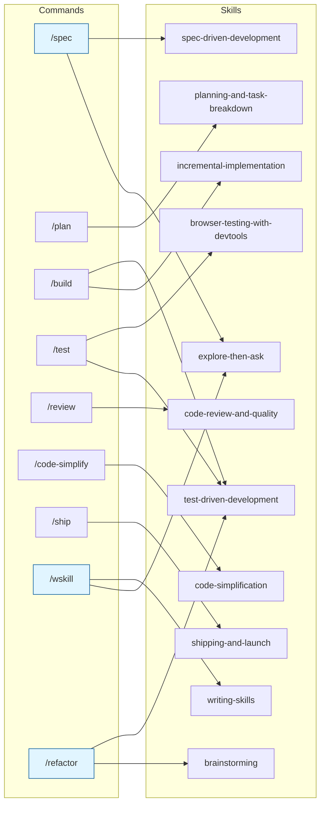
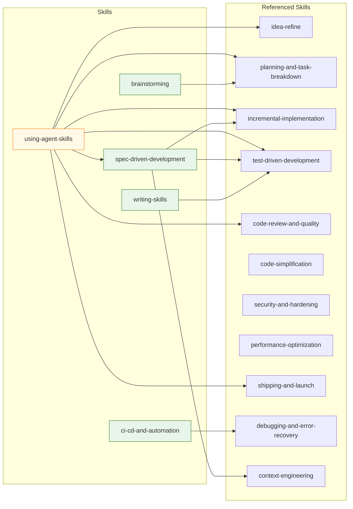
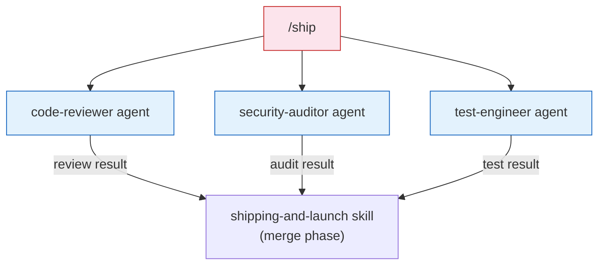
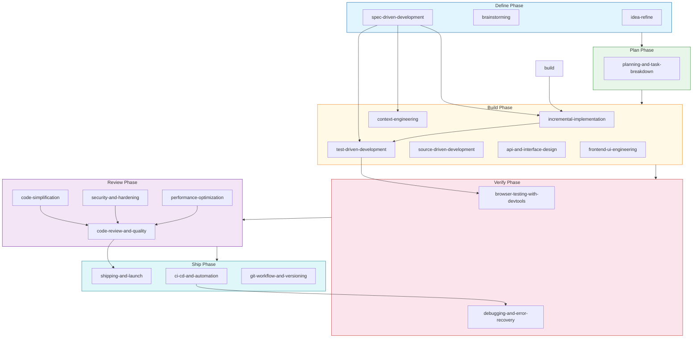
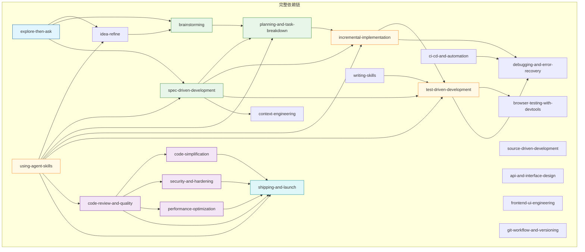

# ys-powers 依赖关系图

> 全面分析 skills / commands / agents 三层组件的显式调用关系、隐式引用关系及 Phase 串联顺序。
> 生成时间：2026-05-11

---

## 1. 组件清单

### 1.1 Skills（25 个）

位于 `skills/<name>/SKILL.md`，按 Phase 分组：

| Phase | Skills |
|-------|--------|
| **Meta** | `using-agent-skills`, `explore-then-ask` |
| **Define** | `idea-refine`, `brainstorming`, `spec-driven-development` |
| **Plan** | `planning-and-task-breakdown` |
| **Build** | `incremental-implementation`, `context-engineering`, `source-driven-development`, `api-and-interface-design`, `frontend-ui-engineering` |
| **Verify** | `test-driven-development`, `browser-testing-with-devtools`, `debugging-and-error-recovery` |
| **Review** | `code-review-and-quality`, `code-simplification`, `security-and-hardening`, `performance-optimization` |
| **Ship** | `shipping-and-launch`, `ci-cd-and-automation`, `git-workflow-and-versioning` |
| **Maintain** | `deprecation-and-migration`, `documentation-and-adrs`, `sop-search` |
| **Develop** | `writing-skills` |

### 1.2 Commands（18 个）

位于 `commands/<name>.md`，由 slash command 触发：

| Command | 调用 Skill | 说明 |
|---------|-----------|------|
| `/spec` | `explore-then-ask` → `spec-driven-development` | 阶段式：先澄清需求，再生成 spec |
| `/plan` | `planning-and-task-breakdown` | 任务拆解 |
| `/build` | `incremental-implementation` + `test-driven-development` | 增量构建 + TDD |
| `/test` | `test-driven-development` + `browser-testing-with-devtools` | TDD + 浏览器验证 |
| `/review` | `code-review-and-quality` | 五维 code review |
| `/code-simplify` | `code-simplification` | 代码简化（不改变行为） |
| `/ship` | `shipping-and-launch` | 发射检查清单（并行程式调用） |
| `/wskill` | `explore-then-ask` → `writing-skills` | 阶段式：先澄清需求，再写 skill |
| `/refactor` | `brainstorming` + `test-driven-development` | 重构方案设计 + TDD 执行 |
| `/spec-review` | — | 自包含流程（无显式 skill 调用） |
| `/doc-codebase` | — | 自包含流程（生成架构文档） |
| `/easy-analysis` | — | 自包含流程（逐段精读文档） |
| `/map-codebase` | — | 自包含流程（代码库架构映射） |
| `/teach-code` | — | 自包含流程（代码教学） |
| `/sop-add` | — | 自包含流程（SOP 抽取） |
| `/gc` | — | 自包含流程（Git 工作流） |
| `/local-commit` | — | 自包含流程（本地提交） |
| `/s2m` | — | 自包含流程（worktree 管理） |

### 1.3 Agents（3 个）

位于 `agents/<name>.md`，作为 specialist subagent 被 `/ship` 并行调用：

| Agent | 角色 | 用于 |
|-------|------|------|
| `code-reviewer` | Senior Staff Engineer | 五维 review（正确性/可读性/架构/安全/性能） |
| `security-auditor` | Security Engineer | 漏洞检测、OWASP 风格审计 |
| `test-engineer` | QA Engineer | 测试策略、覆盖率分析 |

> Agents 无 `skills:` frontmatter 声明，是纯 system prompt，不参与 skill → skill 调用链。

---

## 2. Mermaid 依赖图

### 2.1 Command → Skill 显式调用



### 2.2 Skill → Skill 引用关系



### 2.3 Agent → Skill（/ship 并行调用）



### 2.4 Phase 内 Skill 串联顺序



---

## 3. 详细依赖分析

### 3.1 Command → Skill 显式调用（完整表）

| Command | 调用的 Skill | 调用模式 |
|---------|-------------|---------|
| `/spec` | `explore-then-ask` → `spec-driven-development` | 串联两阶段 |
| `/wskill` | `explore-then-ask` → `writing-skills` | 串联两阶段 |
| `/refactor` | `brainstorming` → `test-driven-development` | 串联两阶段（方案设计 + 执行） |
| `/build` | `incremental-implementation` + `test-driven-development` | 并行调用 |
| `/test` | `test-driven-development` + `browser-testing-with-devtools` | 并行调用（浏览器相关时） |
| `/plan` | `planning-and-task-breakdown` | 单个 |
| `/review` | `code-review-and-quality` | 单个 |
| `/code-simplify` | `code-simplification` | 单个 |
| `/ship` | `shipping-and-launch` | 单个（内含并行 subagent 调用） |
| 其他 9 个 | — | 自包含流程，无显式 skill 调用 |

### 3.2 Skill → Skill 显式引用

| Skill | 引用的 Skill | 说明 |
|-------|-------------|------|
| `using-agent-skills` | `idea-refine`, `spec-driven-development`, `planning-and-task-breakdown`, `incremental-implementation`, `test-driven-development`, `code-review-and-quality`, `shipping-and-launch` | 定义标准生命周期序列 |
| `spec-driven-development` | `incremental-implementation`, `test-driven-development`, `context-engineering` | 执行阶段调用 |
| `brainstorming` | `planning-and-task-breakdown` | 终端状态：产重构计划 |
| `ci-cd-and-automation` | `debugging-and-error-recovery` | 测试失败时触发 |
| `writing-skills` | `test-driven-development` | 前置知识要求 |

### 3.3 Agent → Skill 声明

**结论：无显式声明。**

三个 agent（`code-reviewer`, `security-auditor`, `test-engineer`）的 frontmatter 均无 `skills:` 字段。它们是纯 persona，通过 `/ship` 的并行 fan-out 机制被调用，而非通过 skill 系统发现激活。

---

## 4. Phase 串联关系详解

### 4.1 Define Phase（需求定义）

```
idea-refine → brainstorming → spec-driven-development
```

- `idea-refine`：结构化头脑风暴，收敛模糊想法
- `brainstorming`：设计评审，产出具体方案
- `spec-driven-development`：生成结构化 spec 文档

### 4.2 Plan Phase（任务规划）

```
spec-driven-development → planning-and-task-breakdown
```

- `planning-and-task-breakdown`：将 spec 拆解为可验证的小任务

### 4.3 Build Phase（增量构建）

```
planning-and-task-breakdown → incremental-implementation + test-driven-development
                              (+ context-engineering, source-driven-development)
```

- `context-engineering`：在每步加载正确上下文
- `source-driven-development`：查文档再实现
- `api-and-interface-design`：接口设计
- `frontend-ui-engineering`：UI 构建

### 4.4 Verify Phase（验证）

```
test-driven-development → browser-testing-with-devtools
                          (+ debugging-and-error-recovery)
```

- `test-driven-development`：红绿重构循环
- `browser-testing-with-devtools`：浏览器环境验证
- `debugging-and-error-recovery`：问题定位与修复

### 4.5 Review Phase（评审，串联顺序）

```
code-review-and-quality
    ↓  (串联，review 后可接简化)
code-simplification
    ↓  (可选)
security-and-hardening
    ↓  (可选)
performance-optimization
```

> 四者同级并列，可按需串联。`code-review-and-quality` 通常是入口。

### 4.6 Ship Phase（发射）

```
code-review-and-quality → shipping-and-launch
                           (+ ci-cd-and-automation, git-workflow-and-versioning)
```

- `shipping-and-launch`：启动并行 fan-out（code-reviewer + security-auditor + test-engineer）
- `ci-cd-and-automation`：CI/CD 质量门
- `git-workflow-and-versioning`：版本和分支策略

### 4.7 Meta Skills（跨所有 Phase）

| Meta Skill | 作用 |
|-----------|------|
| `using-agent-skills` | 元 skill：定义何时使用哪个 skill |
| `explore-then-ask` | 需求澄清对话（任何阶段入口） |
| `brainstorming` | 方案设计（任何需要设计决策时） |

---

## 5. 自包含 Commands（无 Skill 调用）

以下 9 个 command 不通过 skill 系统工作，而是内嵌完整工作流：

| Command | 内嵌工作流 |
|---------|-----------|
| `/spec-review` | Spec 评审：AI 提炼关键点 + 列 issues，人勾选 blocker |
| `/doc-codebase` | 代码库架构分析，生成 `docs/codebase/ARCHITECTURE.md` |
| `/easy-analysis` | 逐段精读复杂文档（先宏观后微观） |
| `/map-codebase` | 代码库映射（ARCHITECTURE.md 生成） |
| `/teach-code` | 代码教学：AI 逐步讲解，用户追问确认 |
| `/sop-add` | 从 session 历史抽取 SOP |
| `/gc` | 智能 Git 工作流（分支/提交/推送/PR 一步） |
| `/local-commit` | 本地极简提交（暂存/生成 message/确认/提交） |
| `/s2m` | Git worktree 管理（返回 main/更新/清理） |

---

## 6. 关键设计模式

### 6.1 Command 两种模式

| 模式 | 示例 | 特征 |
|------|------|------|
| **Skill 委托型** | `/review` → `code-review-and-quality` | command 文本很短，核心逻辑在 skill |
| **自包含型** | `/easy-analysis` | command 包含完整工作流定义 |

### 6.2 Skill 激活两种方式

| 方式 | 示例 | 触发机制 |
|------|------|---------|
| **Command 显式调用** | `/build` → `incremental-implementation` | slash command |
| **Description 自动发现** | "Use when code is hard to read" | `using-agent-skills` 的元 skill 发现机制 |

### 6.3 并行 Fan-out

`/ship` 采用 Pattern 3（并行 fan-out with merge），三个 agent 并行工作，结果汇聚后做 go/no-go 决策：

```
/ship
  ├── code-reviewer     ─┐
  ├── security-auditor  ─┼─→ merge → shipping-and-launch
  └── test-engineer     ─┘
```

---

## 7. 依赖关系总结

### 7.1 所有 Skill 调用链（按 Phase）



### 7.2 快速索引表

**Command 查 Skill：**

| /spec | /plan | /build | /test | /review | /code-simplify | /ship | /wskill | /refactor |
|-------|-------|--------|-------|---------|----------------|-------|---------|-----------|
| explore + specdev | planTB | impl + tdd | tdd + browser | reviewSkill | simplify | shipSkill | explore + writing | brainstorm + tdd |

**Skill 查被谁调用（仅显式）：**

| Skill | 被调用来源 |
|-------|-----------|
| `explore-then-ask` | `/spec`, `/wskill` |
| `spec-driven-development` | `/spec` |
| `planning-and-task-breakdown` | `/plan`, `brainstorming` |
| `incremental-implementation` | `/build` |
| `test-driven-development` | `/build`, `/test`, `/refactor`, `spec-driven-development`, `writing-skills` |
| `code-review-and-quality` | `/review` |
| `code-simplification` | `/code-simplify` |
| `shipping-and-launch` | `/ship` |
| `writing-skills` | `/wskill` |
| `brainstorming` | `/refactor` |
| `browser-testing-with-devtools` | `/test` |
| `context-engineering` | `spec-driven-development` |
| `debugging-and-error-recovery` | `ci-cd-and-automation` |
