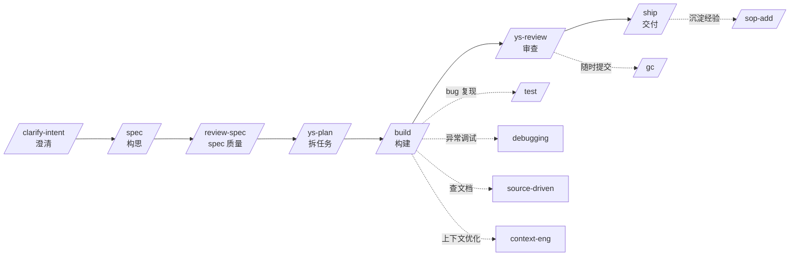

# ys-powers: AI Coding 工作流增强(v2)

> v2 主要变化: 把 `/clarify-intent` 提到流程首位, `/spec` 不再承担澄清职责, 标注 `/ys-plan` `/test` 为可选, 新增 `/review-spec` 提及, 补全 HTML vs Markdown 一节.

## refer

### 自研项目(4 个)

- **`spec-coding`(即 `ys-powers`)**: https://github.com/carl10086/ys-powers
  - 覆盖 coding 全流程, 核心抽象层次: `commands` → `skills` → `subagent` → `reference`
- **`cc-view`**: https://github.com/carl10086/cc-view
  - TypeScript 实现, 用来观察和管理 Claude Code 的底层运行时
- **`ys-code`**: https://github.com/carl10086/ys-code
  - TypeScript 实现, 基于 `pi-mono` 架构复刻 Claude Code, 帮助你彻底搞清楚每一个命令背后到底发生了什么
- **`cc-switch-tui`**: https://github.com/carl10086/cc-switch-tui
  - Rust 实现的多模型切换工具
  - 解决传统 `cc-switch` 的两个痛点: 不支持同时启用多个模型; 会污染唯一的 `settings.json`
  - 多 Kimi-code 实例并发, 响应更快、性价比更高
- **`cc-notify`**: 基于 Rust 实现, 为 Claude Code 提供更友好的通知体验

### 配套推荐工具

- `cmux`: 多窗口支持, 命令行体验更舒服
- `mdr`: https://github.com/CleverCloud/mdr (终端 Markdown 渲染器)
- `opencli`: https://github.com/jackwener/opencli

---

## 1. 介绍

### 1.1 AI Coding 的三阶段演进

**Prompt Engineering (2022–2024)** 关注**单次交互**的优化 — 通过 Few-shot Learning、Chain-of-Thought、角色设定等技巧, 让模型在一次对话中给出更好的回答. 它的核心隐喻是"写好一封邮件".

**Context Engineering (2025)** 向前迈了一步, 关注的是"**给 Agent 看什么**" — 动态构建的上下文窗口中应该填充哪些文档、对话历史、工具定义和 RAG (检索增强生成) 检索结果. Shopify CEO Tobi Lütke 将其类比为"给邮件附上所有正确的附件". 这一阶段的核心突破是认识到: **模型的表现上限取决于上下文的质量, 而非 prompt 的措辞**.

**Harness Engineering (2026)** 则站在更高的抽象层次, 不再只关注"一次对话"或"一次上下文窗口", 而是设计跨越多个会话、多个 Agent 角色、多个执行阶段的**完整系统架构**. 正如 OpenAI 工程师 Ryan Lopopolo 在团队用 Agent 构建百万行代码产品后总结的:

> "Agents aren't hard; the Harness is hard."

### 1.2 Coding Agent 的四类典型问题

讲完了演进, 必须先把"为什么需要 Harness"摆出来. 这是 ys-powers 整套设计要对付的敌人.

**Failure Mode 1 — One-shot Syndrome (试图一步到位)**
Agent 拿到复杂需求后, 倾向于在单个上下文窗口内完成全部工作. 实现到一半时上下文已被消耗大半, 模型开始出现幻觉、循环输出、格式错误的 Tool Call. Anthropic 的经验数据表明, 上下文窗口的 Sweet Spot 在 **40% 以下填充率**; 超过此阈值, 输出质量快速衰退.

**Failure Mode 2 — Premature Victory Declaration (过早宣布胜利)**
Agent 完成部分工作就宣布任务结束, 核心功能尚未实现或验证. 这在实践中极为常见 — Agent 输出"编码完成", 但实际上**编译都过不了**.

**Failure Mode 3 — Premature Feature Completion (过早标记功能完成)**
Agent 认为功能已实现, 但未做端到端测试验证, 部署后才发现关键路径不通. Anthropic 的解决方案是引入 Browser Automation (Puppeteer MCP, Model Context Protocol)做自动化的端到端验证截图.

**Failure Mode 4 — Cold Start Problem (环境启动困难)**
多次会话间缺乏持久化记忆, 每次新会话都要花大量 Token 重新理解项目结构, 真正用于编码的 Token Budget 被严重挤压.

**这四类问题不是某个 skill 能修的, 必须靠 Harness 层的工程化约束**. 这是后面整套命令体系的出发点.

---

## 2. 实现思路

Spec 编程的本质, 是把**传统工程的编程思想**和**个人操作习惯**结合起来以提升效率. 无论是 `super-powers`、`gsd`、`gstack`、`agent-skills`, 还是后面层出不穷的新方法论, 底层思路相通.

### 2.1 三层抽象

- **`commands`**: 把你自己对工作流的理解, 用 workflow 的方式组织起来, 编排多个 skill 与 subagent 协作
- **`skills`**: 可复用的工程最佳实践, **无状态**
- **`subagents`**: 隔离主上下文、防止污染的关键工具, 在大型任务中非常有用

### 2.2 开发全阶段总览(v2 重画)

`ys-powers` 把一个完整的开发周期切成 8 个节点, 其中 CLARIFY / SPECIFY / BUILD / REVIEW / SHIP 是 5 个**主干**节点(必须走), 其余 3 个 `[REVIEW]` `[PLAN]` `[TEST]` 是**可选**节点(按需触发).



- **实线主干**: 澄清 → 构思 → spec 审查 → 拆任务 → 构建 → 审查 → 交付. v2 把澄清从 `/spec` 拆出来, 因为这两件事的关注点完全不同
- **方括号节点**(`/review-spec` `/plan` `/test`): 不是必经路径. 小改动直接在 spec 里带过就行; bug 修复或显式 TDD 才单独跑 `/test`
- **虚线支撑**: 主干任一节点按需触发的横向能力

### 2.3 /clarify-intent — 流程的真正起点(v2 新增)

为什么单独成节? 因为 v1 把澄清职责塞在 `/spec` 里, 结果 spec 阶段又被问需求又被写文档, 角色打架. v2 把"聊明白"独立出来.

**核心职责**: 通过结构化访谈确认真实意图, 产出**确认的 intent 陈述**(不是设计, 不是 spec).

**背后 skill**: `interview-me`. 一次一问, 附带猜测, 直到 95% 置信度才重述并请你确认.

**为什么不让 `/spec` 干这事**: spec 阶段一旦进入"准备 workspace + 写文档"的状态, 上下文已被工程化细节占满, 再回头澄清会被既有词汇绑架. 澄清必须发生在读 spec 模板之前.

**典型场景**:
- 用户说"加个 dashboard", 你不知道是扩展 `/app/metrics` 还是新建视图
- 用户说"性能优化", 你不知道是数据库慢查询还是前端渲染瓶颈
- 用户说"支持多租户", 你不知道是数据隔离还是 UI 切换

这些场景里, `/clarify-intent` 用 3-5 个问题收敛意图, 然后 `/spec` 拿到的输入才是干净的.

### 2.4 /spec — 把澄清结果写成设计文档(v2 重构)

`/spec` 的职责现在很纯: **把澄清完的意图落到结构化设计文档上**. 不再承担澄清.

**Phase 1 — `explore-then-ask` 追问**

读项目上下文(README / CLAUDE.md / 相关源码), 用 `explore-then-ask` skill 把意图里没问清的细节补完 — 目标用户、验收标准、技术栈、Always/Ask/Never 边界.

**Phase 1.5 — `domain-modeling` checkpoint**

如果意图引入了新概念 / 跟 `CONTEXT.md` 冲突 / 满足 ADR 三条标准(难逆转、不写下来会忘、来自真实权衡), 调 `domain-modeling` 落地. 这一步是 v2 新增的, 防止"spec 写完发现术语跟项目其他地方对不上".

**Phase 2 — `prepare-workspace`**

按改动规模分三档:
- worktree: 大改动, 完全隔离
- feature branch: 常规改动
- 当前分支: 单文件 / 配置类小改

**Phase 3 — `spec-driven-development` skill**

从 6 个维度产出 spec: 目标 / 命令 / 项目结构 / 代码风格 / 测试策略 / 边界. 写到 `docs/ys-powers/specs/YYYY-MM-DD-<feature>-design.md`.

**(可选) Phase 4 — `html-generator` subagent**

生成"人类自包含、易阅读"的 HTML 版 spec. **必须用 subagent**, 避免长 HTML 污染主上下文. 这一步只在需要对外分享 spec 时调用.

### 2.5 可选节点: /review-spec · /plan · /test

v1 把 `/test` 画在主干上, v2 改为可选. 原因是 `/build` 里每个 task 已经走"写测试 → 实现 → 跑全量", 单独再调 `/test` 大多是冗余. 真正需要单独调 `/test` 的场景:

- **修 bug**: 用 Prove-It pattern — 先写一个能重现 bug 的失败测试, 再修
- **补全边界/异常/并发测试**: `/build` 写的是 happy path, 这些用例值得专项补
- **用户明确要求显式 TDD**

`/ys-plan` 同理: 小改动直接在 spec 里列 acceptance criteria 就行, 单独拆 task 反而冗余. 大特性(spec 涉及多模块、跨多人)才走 `/ys-plan`.

#### `/ys-plan` 自动触发条件

`/ys-plan` 标注为"可选"不等于"随便跳过". 下面是建议**自动**触发它的判断条件(任一命中即建议跑):

| 信号 | 阈值 | 说明 |
|------|------|------|
| 改动模块数 | ≥ 3 | 跨模块改动需要明确依赖顺序 |
| spec 涉及 phase 数 | ≥ 3 | 多阶段工作必须显式编排 |
| 跨人协作 | ≥ 2 人 | 任务分配与 ownership 需要清晰 |
| 引入新依赖 | vcpkg / npm / pip 任何新增 | 需要单独 task 跑通依赖链 |
| 引入新外部服务 | 数据库 / 队列 / 第三方 API 任一 | 需要早期探活 + smoke test |
| 用户显式请求 | 任意 | 优先级最高, 直接跑 |

**为什么不自动强制跑**: 单文件或单模块改动, 拆 task 是在给自己制造仪式感 — 真正需要的只是 acceptance criteria 已经写好. **让阶段数自己说话**.

#### `/plan` 实际输出示例

跑完后, 输出是这样:

```text
⏺ Plan 已生成: docs/ys-powers/plans/2026-07-15-cvoice-implementation.md

---
Plan 摘要

5 个阶段 / 13 个任务

┌──────────────────────────────────┬───────────────┬──────────────────────────────────────────────────────────────┐
│               阶段               │     任务      │                             内容                             │
├──────────────────────────────────┼───────────────┼──────────────────────────────────────────────────────────────┤
│ Phase 1: 基础设施                │ T1, T2        │ vcpkg 依赖、clang-format / clang-tidy / cmake warnings       │
├──────────────────────────────────┼───────────────┼──────────────────────────────────────────────────────────────┤
│ Phase 2: 扩展已有模块 + 视频     │ T3, T4, T5    │ AiBot 加视频、VideoPipeline、Config                          │
├──────────────────────────────────┼───────────────┼──────────────────────────────────────────────────────────────┤
│ Phase 3: 单元测试                │ T6, T7        │ 4 个测试文件(audio/video pipeline + config + room_manager)  │
├──────────────────────────────────┼───────────────┼──────────────────────────────────────────────────────────────┤
│ Phase 4: HTTP 控制面 + main 重构 │ T8, T9, T10   │ ControlHttp、控制面测试、main.cc 4 种模式                    │
├──────────────────────────────────┼───────────────┼──────────────────────────────────────────────────────────────┤
│ Phase 5: 集成 + 远程验证         │ T11, T12, T13 │ smoke.sh、integration_test、远程服务器验证                   │
└──────────────────────────────────┴───────────────┴──────────────────────────────────────────────────────────────┘

4 个 Checkpoint 分布在每个 Phase 结束, 强制 git commit + 验证.

风险已识别并缓解:

- TRTC AppID/Key 阻塞 T12 → 用 GTEST_SKIP 跳过
- 远程服务器网络 → T13 早期探活
- cpp-httplib 兼容性 → T1 早期验证
- L-size 任务(T7、T10)→ 标注了 a/b 拆分建议

每个 task 包含:

- Acceptance criteria(可勾选 checklist)
- Verification(具体命令 + 期望输出)
- Dependencies(前序 task)
- Files likely touched
- Estimated scope(S/M/L)

---
下一步

按 ys-powers 工作流:

- /build —— 按 plan 逐个 task 实现, 每个 task 内部已经走「写测试 → 实现 → 跑全量测试」循环
- 或者你想先调整 plan 哪里?
```

**关键看三点**:

1. **阶段切分不是水平分层**: 注意 Phase 2 的 T3/T4/T5 是"扩 AiBot / 做 VideoPipeline / 做 Config" — 这是一个**垂直切片**, 不是"先把所有 DAO 写完, 再写所有 Service". 每个 phase 都有可演示的增量价值, 不是攒到最后才跑得起来.
2. **Checkpoint 而不是 task 级 git commit**: 每个 Phase 结束才 commit + 验证, 不是每个 task 一次. 因为 task 间的代码可能互相依赖, 半成品 commit 污染历史. **Phase 是真正的"原子交付单元"**.
3. **风险前置**: TRTC AppID/Key、远程服务器、cpp-httplib 兼容性 这些是**已知阻塞**, 提前在 T1/T13 探活, 而不是等到 P5 才暴雷. 这就是 plan 与"边写边想"的本质区别.

`/review-spec` 是 v2 新加的环节: spec 写完后, 对 6 个维度(Completeness / Clarity / Coherence / Coverage / Conciseness / Correctness)打分, 平均 ≥ 7.0 且无维度 < 5 才算通过. 高风险特性建议跑一遍.

#### /review-spec 自动触发条件

`/review-spec` 标注为"可选"不等于"随便跳过". 下面是建议**自动**触发它的判断条件(任一命中即建议跑):

| 信号 | 阈值 | 说明 |
|------|------|------|
| 改动模块数 | ≥ 3 | 跨模块改动容易漏边界 |
| 涉及敏感路径 | `auth` / `payment` / `data-migration` / `secret` 任一命中 | 一旦错, 修复成本高 |
| spec 行数 | > 200 行 | 复杂度高, 人眼自查容易漏 |
| 影响下游 consumer | API breaking change / 数据库 schema 变更 | 错一处整条链路断 |
| 用户显式请求 | 任意 | 优先级最高, 直接跑 |

**为什么不自动强制跑**: 小改动(spec < 100 行、单文件、单模块)跑一次 6 维度 review 是过度消耗 — 它的 ROI 在低复杂度场景下急剧下降. **让信号自己说话, 比"为安全起见都跑"更工程化**.

#### `/ys-review` vs `/review-spec` — 两个 review 的分工

| 维度 | `/review-spec` | `/ys-review` |
|------|---------------|-------------|
| 触发时机 | spec 写完后, build 之前 | 代码提交后, ship 之前 |
| 审查对象 | 设计文档 (`.md` 6 维度) | 代码变更 (5 轴) |
| 通过门槛 | avg ≥ 7.0 且无维度 < 5 | 无强制门槛, 输出 Critical/Important/Suggestion |
| 失败处理 | 阻断 `/build`, 回到 spec 修订 | 不阻断, 由用户决定是否修复 |
| 最大轮次 | 3 轮, 强制收敛 | 单轮, 可手动复跑 |

两者形成"spec 端 + 代码端"的双层 review, 任一独立工作. 同一个 spec 设计, 可能在 `/review-spec` 里过了 9 分, 但代码实现在 `/ys-review` 里发现 Security Critical — 这不是矛盾, 而是不同抽象层暴露的不同问题.

#### `/review-spec` 实际输出示例

Round 1 跑完后, 用户回答"yes"继续 Round 2, 输出收敛后是这样:

```text
SPEC REVIEW REPORT — Round 2/3
═══════════════════════════════════════════════════
Spec:     docs/ys-powers/specs/2026-07-15-cvoice-design.md
Score:    54/60 (avg 9.0)  Gate: PASS
Rounds:   2 (converged: yes, scores unchanged from R1)

Dimension      R1   R2   Δ     Findings   Action
─────────────  ───  ───  ───   ────────   ──────
Completeness   9    9    —     1 fix      applied (dir state markers)
Clarity        9    9    —     1 fix      applied (MVP mode table)
Feasibility    9    9    —     0          pass
Consistency    9    9    —     0          pass
Testability    9    9    —     0          pass
Simplicity     9    9    —     0          pass

Auto-fixed:  2 items (R2)
Ask items:   0 items

✓ Quality converged at Round 2. No further improvements detected.

═══════════════════════════════════════════════════
VERDICT: Ready for build
```

**关键看三点**:

1. **R1 vs R2 的 Δ 列**: 加了什么、改了什么一目了然. 如果 Δ 大量跳分, 说明 R1 没看清 — 不止是分数问题, 是发现过程的迭代
2. **`Auto-fixed` vs `Ask items`**: 机械修复 (格式、漏字段) 自动落, 判断题 (scope、架构) 抛回用户. 这是 spec review 与普通 lint 的本质区别
3. **`converged: yes`**: 两轮分数完全一致 → 没有新发现 → 强制停. 不让 review 变成无限打磨游戏

收敛后的 spec 状态会被 `/build` 直接读取, 不再二次校验 — 这是 6 维度质量门真正的价值: 把"spec 是否够好"的判断锁死在 `/build` 之前, 避免实现到一半才发现 spec 有结构性漏洞.

### 2.6 /build · /ys-review · /ship — 主干三连

这三个主干节点 v1 描述得已经够细, v2 主要调整措辞, 把"为什么这样设计"补一句.

#### `/build` — 构建阶段

`/build` 内部走 RED-GREEN-REFACTOR: 读 task → 读验收标准 → 写失败测试 → 最小实现 → 跑全量套件 → 编译 → 提交 → 标记完成 → 下一个. 任何步骤失败 → 自动转 `debugging-and-error-recovery` 找根因, 修完再回来.

**为什么 task 级 TDD 而不是全局 TDD**: 单个 task 的反馈回路短(分钟级), 全局测试等到最后才发现失败就太晚. task 内部再切 RED-GREEN-REFACTOR, 失败定位精确到单个断言.

#### `/build` 自动依赖解析(pre-flight)

`/build` 启动时不是直接跳到第一个 task, 而是先做一次 **pre-flight**: 读 plan, 解析每个 Task 的 dependencies, 注册到内部 TaskList, 标出哪些 task 现在 ready、哪些被 blocked. 这一步是 `/build` 与"手动按顺序读 plan"的本质区别.

实际启动日志长这样:

```text
⏺ 先做 pre-flight: 读取 plan, 解析每个 Task, 注册到 TaskList.

⏺ Pre-flight 完成. 13 个 task 已注册, 依赖关系已设置.

  ---
  当前 Task 列表

  T1 (vcpkg) ✅ ready
  T2 (clang) 🔒 blocked by T1
  T3 (AiBot video) 🔒 blocked by T1, T2
  T4 (VideoPipeline) 🔒 blocked by T3
  T5 (Config) 🔒 blocked by T1, T2
  T6 (pipeline tests) 🔒 blocked by T4
  T7 (RoomManager + tests) 🔒 blocked by T5
  T8 (ControlHttp) 🔒 blocked by T7
  T9 (ControlHttp tests + test.sh) 🔒 blocked by T8
  T10 (main.cc refactor) 🔒 blocked by T9
  T11 (smoke.sh + run_dev.sh) 🔒 blocked by T10
  T12 (integration tests) 🔒 blocked by T11
  T13 (remote verify) 🔒 blocked by T12

  ---
  开始 Task 1: vcpkg 依赖管理

⏺ Skill(incremental-implementation)
  ⎿  Successfully loaded skill

· Registering Task 1… (46s · ↑ 2.0k tokens)
  ⎿  ◼ Task 1: vcpkg dependency management
     ◻ Task 2: clang-format / clang-tidy / cmake warnings › blocked by #27
     ◻ Task 3: AiBot video support › blocked by #27, #28
     ◻ Task 4: VideoPipeline (对称 AudioPipeline) › blocked by #29
     ◻ Task 5: Config + YAML example › blocked by #27, #28
      … +8 pending
```

**关键看三点**:

1. **依赖图自动建**: 注意 T3 和 T5 都是 `blocked by T1, T2` — 这两个 task 互相**没有依赖**, 它们是潜在的并行点. pre-flight 不是简单"按 plan 顺序排", 而是真正把 dependencies 字段解析成 DAG, 让你一眼看到"现在能并行做哪几个".
2. **并行机会可见但默认串行**: T1 完成时, T2/T3/T5 三个 task 都同时变成 ready. 但 `/build` 默认**串行**执行 (T2 → T3 → T5), 因为: (a) 多数 ys-powers 用户在同一台机器跑单个 LLM agent, 并行写代码会污染彼此上下文; (b) 串行的 commit 历史更干净, 方便 review. **并行留给 `/ship` 的三个 specialist 那种"读代码不写代码"的场景**.
3. **Skill 自动加载**: `Skill(incremental-implementation)` 在 T1 真正开始**前**就加载 — 不是在每个 task 内部手动调, 是 pre-flight 阶段一并准备好. 这是 `/build` 把方法论"前置注入"的设计: 不用每个 task 都"先想该用什么 skill".

整个 pre-flight 在 plan 文件清晰的前提下通常 5-10 秒, 但换来的好处是后续 13 个 task 的执行顺序永远正确 — 不会出现"做完 T5 发现忘做 T4"这种串行手动执行的经典翻车.

#### `/ys-review` — 审查阶段

对当前变更做 5 轴结构化审查: Correctness / Readability / Architecture / Security / Performance. 输出按 Critical / Important / Suggestion 三级分类, 带 file:line 引用. 涉及浏览器代码时, 额外调 `browser-testing-with-devtools` 做真实运行时验证.

#### `/ys-review` 自动触发条件

`/ys-review` 在主干上必经, 但**触发深度**也分档:

| 信号 | 触发档位 | 说明 |
|------|---------|------|
| 改动行数 | < 100 行 → 单轴快速扫; > 500 行 → 全 5 轴 | 大改动需要 architecture + security 深度 |
| 改动文件 | 跨 ≥ 3 模块 → 加 architecture 维 | 单文件改动不需要架构审查 |
| 涉及敏感路径 | `auth` / `payment` / `secret` / `data-migration` 命中 → security 必跑 | 一票否决 |
| 引入新依赖 | npm / pip / vcpkg / apt 任一新增 → dependency review | 看是否真需要新依赖 |
| 引入新外部 API | HTTP client / DB driver / SDK → architecture + security | 边界和凭据处理 |
| 用户显式请求全 5 轴 | 任意 | 重大 release 前手动跑 |

**为什么不每次都跑全 5 轴**: 5 轴 × N 文件 = 几分钟到几十分钟, 单文件 typo 修复用不上. **让改动规模自己决定深度**.

#### `/ys-review` 实际输出示例

跑 12 个 commit 的 cvoice MVP, 输出是这样:

```text
⏺ /ys-review: cvoice MVP 12 个 commit 五维度审查

  Context
  - Branch: feat/cvoice-mvp
  - Commits: 12 (T1 vcpkg → T12 integration tests)
  - Spec: docs/ys-powers/specs/2026-07-15-cvoice-design.md
  - Plan: docs/ys-powers/plans/2026-07-15-cvoice-implementation.md

  ---
  五维度发现

  1. Correctness

  ┌─────┬──────────────────────────────┬────────────┬──────────────────────────────────────────────────┐
  │  #  │             文件             │    等级    │                       发现                       │
  ├─────┼──────────────────────────────┼────────────┼──────────────────────────────────────────────────┤
  │ C1  │ src/control_http.cc          │ Important  │ app_id=0 的请求会构造无效 AiBot, SDK 进房失败  │
  │     │                              │            │ 但 HTTP 返回 500. 应早返回 400                    │
  ├─────┼──────────────────────────────┼────────────┼──────────────────────────────────────────────────┤
  │ C2  │ src/config.cc                │ Important  │ --mode=video_loopback 走到 TODO 分支, 但 spec   │
  │     │                              │            │ 没标记, 用户会困惑                                │
  ├─────┼──────────────────────────────┼────────────┼──────────────────────────────────────────────────┤
  │ C3  │ include/cvoice/ai_bot.h      │ Suggestion │ room_id=0 被当 "未设" 处理, 但 0 是合法值.       │
  │     │                              │            │ Magic value 问题                                  │
  ├─────┼──────────────────────────────┼────────────┼──────────────────────────────────────────────────┤
  │ C4  │ tests/audio_pipeline_test.cc │ Suggestion │ 没断言 pts/sample_rate/channels 透传. happy path │
  │     │                              │            │ 不够                                                │
  └─────┴──────────────────────────────┴────────────┴──────────────────────────────────────────────────┘

  3. Architecture

  ┌─────┬─────────────────────┬────────────┬────────────────────────────────────────────────┐
  │  #  │        文件         │    等级    │                    发现                     │
  ├─────┼─────────────────────┼────────────┼────────────────────────────────────────────────┤
  │ A1  │ 整个项目            │ Critical   │ 集成测试只在 Linux + 真实 SDK 端到端验证.    │
  │     │                     │            │ T12 deferred → T13 也 deferred. MVP 验证缺口  │
  ├─────┼─────────────────────┼────────────┼────────────────────────────────────────────────┤
  │ A2  │ src/room_manager.cc │ Important  │ RoomManager::CreateBot 调真实 TRTCCloud,    │
  │     │                     │            │ 无法单元测试. 抽象 IRoomBot 可让可测.         │
  │     │                     │            │ MVP 可接受, 应明确 follow-up                  │
  ├─────┼─────────────────────┼────────────┼────────────────────────────────────────────────┤
  │ A3  │ src/main.cc         │ Suggestion │ cvoice_core 抽出来了, 但 4 个 Run 函数直接   │
  │     │                     │            │ link 具体类型, 没用到抽象                       │
  └─────┴─────────────────────┴────────────┴────────────────────────────────────────────────┘

  4. Security 🔒

  ┌─────┬─────────────────────┬────────────┬────────────────────────────────────────────────┐
  │  #  │        文件         │    等级    │                    发现                     │
  ├─────┼─────────────────────┼────────────┼────────────────────────────────────────────────┤
  │ S1  │ 整个项目            │ Critical   │ TRTC AppID/Key 在 user prompt 明文传输.      │
  │     │                     │            │ Key 已泄露到会话 context / transcript           │
  ├─────┼─────────────────────┼────────────┼────────────────────────────────────────────────┤
  │ S2  │ src/main.cc         │ Important  │ CLI flag 直接接受 app_key, 没警告用户测试用  │
  ├─────┼─────────────────────┼────────────┼────────────────────────────────────────────────┤
  │ S3  │ src/config.cc       │ Important  │ YAML loader 接受 sdk_app_key, 没拒绝包含      │
  │     │                     │            │ app_key 的配置文件                               │
  └─────┴─────────────────────┴────────────┴────────────────────────────────────────────────┘

  ---
  📊 总结

  ┌────────────┬──────┬─────────────────────────────────────┐
  │    等级    │ 数量 │              主要方向               │
  ├────────────┼──────┼─────────────────────────────────────┤
  │ Critical   │ 2    │ A1 (验证缺口) + S1 (Key 在 context) │
  ├────────────┼──────┼─────────────────────────────────────┤
  │ Important  │ 4    │ C1, C2, A2, S2/S3                   │
  ├────────────┼──────┼─────────────────────────────────────┤
  │ Suggestion │ 8    │ 命名、抽象、文档                    │
  └────────────┴──────┴─────────────────────────────────────┘
```

**关键看三点**:

1. **Critical 强制人介入**: A1 (集成验证缺口) 和 S1 (Key 泄露) 是 2 个 Critical. **Critical 不自动修复** — 它们涉及架构决策或安全合规, 必须人来定. `/ys-review` 把这两个明确标 Critical 是为了**阻止 "全是 Suggestion" 那种温水煮青蛙的报告**.
2. **三级分级不是装饰**: Critical 必须修(阻断 `/ship`), Important 强烈建议修(下一次 task 顺手做), Suggestion 可选(沉淀到 SOP). **没有 "P0/P1/P2/P3" 那种模糊分级** — 5 个轴各自 Critical/Important/Suggestion, 总数一目了然.
3. **维度间会互相印证**: S1 (Key 在 context) 表面是 Security, 实际暗示 Documentation 缺失 (CLAUDE.md 没写 "测试 key 处理约定"). 修复 S1 不只是 redact — 是补文档 + 改工作流. `/ys-review` 在 Critical 处会主动 raise 这种"看起来是一个 bug, 其实是流程缺陷"的判断.

#### `/ship` — 交付阶段

v1 已经把并行 fan-out 讲得很清楚, 这里只补充一句**设计动机**: 三个 specialist 各自只看自己领域的代码, 不会互相污染, 主上下文拿回的是 3 份独立报告, 合并时再做交叉验证. 这比"主 agent 一个人既审代码又审安全又审测试"要可靠得多, 因为后者会被自己上下文里的偏见带偏.

#### 辅助 command 速览

主干之外还有一组工具型 command, 大多属于 **embedded-workflow**(流程写在 command 本体, 不显式委托 skill), 按场景随调随用:

- **重构与简化**
  - **`/refactor`**: 先输出重构方案并获批准, 再用 TDD 守住行为, 在不破坏行为的前提下消除 code smell
  - **`/code-simplify`** → `code-simplification`: 降低复杂度, 不改行为
- **Git 与版本**
  - **`/gc`**: 完整 Git 工作流 — 分支 / 提交 / 推送 / PR 一步完成
  - **`/local-commit`**: 极简本地提交 — 暂存 → 生成 message → 确认 → 提交
  - **`/s2m`**: worktree 工作完成后安全回到 main 并清理
- **理解与沉淀**
  - **`/teach-code`**: 由浅入深逐层讲解任意代码模块
  - **`/doc-codebase`**: 分析代码库并生成 `ARCHITECTURE.md`
  - **`/easy-analysis`**: 对复杂文档做宏观概览 + 逐段精读 + 引用分析
  - **`/sop-add`**: 把当前会话经验抽取为可复用 SOP (Standard Operating Procedure)
- **元能力**
  - **`/wskill`**: 写新 skill — 先按需澄清, 再用 `writing-great-skills` 控制 trigger / hierarchy / pruning
  - **`/wcommand`**: 写新 command — 同上, 但产物是 focused workflow entrypoint

### 2.7 为什么用 HTML 而不是 Markdown 打通"人类 ↔ AI"

v1 这一节只有引用, 没有正文, v2 补上.

**TL;DR**: 当一份内容要在"AI 生成"和"人类阅读"之间往返时, HTML 是更合适的中间格式.

**三个理由**:

1. **HTML 是自包含的, Markdown 不是**. 一份 Markdown 文档要变好看, 必须嵌 CSS; 一份带样式的 HTML 文件复制粘贴就能直接打开. 分享给同事、客户、写博客, 都省事.

2. **HTML 表达能力强于 Markdown**. Markdown 表达交互、布局、视觉对比很吃力 — 你很难用 Markdown 写一个"左侧导航 + 右侧详情 + 可折叠代码块"的页面. HTML + 一段 CSS 就能搞定.

3. **AI 也很擅长写 HTML**. 只要 prompt 里说清楚"自包含单文件 + 浏览器直接打开", LLM 输出的 HTML 质量稳定. Markdown 反而容易出现"作者用某个渲染器的特性, 读者那边不支持"的兼容问题.

**典型场景**:
- 复杂研究报告 / 数据分析结果
- 设计稿 / 教学材料
- 想分享给非技术同事的产品文档
- `ys-powers` 内部的 `html-generator` subagent 就是干这个的

**参考资料**:
- [Andrej Karpathy 推文](https://x.com/karpathy/status/2053872850101285137)(via Chrome DevTools 实时抓取)
- [Thariq Shihipar 示例站点](https://thariqs.github.io/html-effectiveness/)(via Chrome DevTools)
- [Simon Willison: Using Claude Code — The Unreasonable Effectiveness of HTML](https://simonwillison.net/2026/May/8/unreasonable-effectiveness-of-html/)(via Chrome DevTools)
- [artifact.land](https://artifact.land)(via Chrome DevTools)
- WebSearch 补充: 《HTML vs Markdown for AI Agents 2026》行业分析