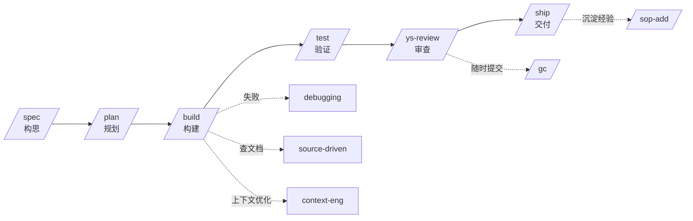

# ys-powers: AI Coding 工作流增强

## refer

### 自研项目(4 个)

- **`spec-coding`(即 `ys-powers`)**: https://github.com/carl10086/ys-powers
  - 覆盖 coding 全流程, 核心抽象层次: `commands` → `skills` → `subagent` → `reference`
- **`cc-view`**: https://github.com/carl10086/cc-view
  - TypeScript 实现, 用来观察和管理 Claude Code 的底层运行时
- **`ys-code`**: https://github.com/carl10086/ys-code
  - TypeScript 实现, 基于 `pi-mono` 架构复刻 Claude Code, 帮助你彻底搞清楚每一个命令背后到底发生了什么
- **`cc-switch-tui`**: https://github.com/carl10086/cc-switch-tui
  - Rust 实现的多模型切换工具
  - 解决传统 `cc-switch` 的两个痛点: 不支持同时启用多个模型; 会污染唯一的 `settings.json`
  - 多 Kimi-code 实例并发, 响应更快、性价比更高
- **`cc-notify`**: 基于 Rust 实现, 为 Claude Code 提供更友好的通知体验

### 配套推荐工具

- `cmux`: 多窗口支持, 命令行体验更舒服
- `mdr`: https://github.com/CleverCloud/mdr (终端 Markdown 渲染器)
- `opencli`: https://github.com/jackwener/opencli

---

## 1. 介绍

### 1.1 AI Coding 的三阶段演进

**Prompt Engineering (2022–2024)** 关注**单次交互**的优化 — 通过 Few-shot Learning、Chain-of-Thought、角色设定等技巧, 让模型在一次对话中给出更好的回答. 它的核心隐喻是"写好一封邮件".

**Context Engineering (2025)** 向前迈了一步, 关注的是"**给 Agent 看什么**" — 动态构建的上下文窗口中应该填充哪些文档、对话历史、工具定义和 RAG (检索增强生成) 检索结果. Shopify CEO Tobi Lütke 将其类比为"给邮件附上所有正确的附件". 这一阶段的核心突破是认识到: **模型的表现上限取决于上下文的质量, 而非 prompt 的措辞**.

**Harness Engineering (2026)** 则站在更高的抽象层次, 不再只关注"一次对话"或"一次上下文窗口", 而是设计跨越多个会话、多个 Agent 角色、多个执行阶段的**完整系统架构**. 正如 OpenAI 工程师 Ryan Lopopolo 在团队用 Agent 构建百万行代码产品后总结的:

> "Agents aren't hard; the Harness is hard."

### 1.2 Coding Agent 的四类典型问题

**Failure Mode 1 — One-shot Syndrome (试图一步到位)**
Agent 拿到复杂需求后, 倾向于在单个上下文窗口内完成全部工作. 实现到一半时上下文已被消耗大半, 模型开始出现幻觉、循环输出、格式错误的 Tool Call. Anthropic 的经验数据表明, 上下文窗口的 Sweet Spot 在 **40% 以下填充率**; 超过此阈值, 输出质量快速衰退.

**Failure Mode 2 — Premature Victory Declaration (过早宣布胜利)**
Agent 完成部分工作就宣布任务结束, 核心功能尚未实现或验证. 这在实践中极为常见 — Agent 输出"编码完成", 但实际上**编译都过不了**.

**Failure Mode 3 — Premature Feature Completion (过早标记功能完成)**
Agent 认为功能已实现, 但未做端到端测试验证, 部署后才发现关键路径不通. Anthropic 的解决方案是引入 Browser Automation (Puppeteer MCP, Model Context Protocol)做自动化的端到端验证截图.

**Failure Mode 4 — Cold Start Problem (环境启动困难)**
多次会话间缺乏持久化记忆, 每次新会话都要花大量 Token 重新理解项目结构, 真正用于编码的 Token Budget 被严重挤压.

---

## 2. 实现思路

Spec 编程的本质, 是把**传统工程的编程思想**和**个人操作习惯**结合起来以提升效率. 无论是 `super-powers`、`gsd`、`gstack`、`agent-skills`, 还是后面层出不穷的新方法论, 底层思路相通.

### 2.1 三层抽象

- **`commands`**: 把你自己对工作流的理解, 用 workflow 的方式组织起来, 编排多个 skill 与 subagent 协作
- **`skills`**: 可复用的工程最佳实践, **无状态**
- **`subagents`**: 隔离主上下文、防止污染的关键工具, 在大型任务中非常有用

### 2.2 开发全阶段总览

`ys-powers` 把一个完整的开发周期切成 6 个主干阶段, 每个阶段对应一个显式 `/command`, 背后由 1 个或多个 skill 提供方法论; 主干之外再挂调试 / 提交 / 经验沉淀等横向支撑能力.

- **实线主干**: 构思 → 规划 → 构建 → 验证 → 审查 → 交付, 有严格顺序
- **虚线支撑**: 主干任一节点按需触发的横向能力, 非强制步骤

### 2.3 详解 spec 阶段(以 `/spec` 为例)

`/spec` 是 command、skills、subagent 三种抽象协同最完整的范例, 内部分四个 Phase:

**Phase 1 — 调用 `explore-then-ask` skill**
探索上下文、与用户沟通、收敛想法.
  - `search-sop`: 搜索历史经验(`requires` 前置)
  - **调查上下文**: 这是高成本动作(很"罪恶"); 当前用内置 LSP server 缓解, 未来方向是 `GitNexus`、`Graphfy` 这类代码图谱方案
  - `ask-question`: 主动澄清需求

**Phase 2 — `prepare-workspace`**
处理 Git 操作: 创建 worktree、新建 feature 分支, 或明确选择不切分支.

**Phase 3 — `spec-driven-development` skill**
从 **6 个维度**产出结构化设计文档(目标 / 命令 / 项目结构 / 代码风格 / 测试策略 / 边界).

**Phase 4(可选)— `html-generator` subagent**
生成"人类自包含、易阅读"的 HTML 文档. **这一步必须用 subagent**, 避免污染主上下文.

### 2.4 其余阶段详解

以下按 command 源文件中的实际流程展开, 每个阶段内部的执行步骤与 2.3 的 `/spec` 同级.

#### `/plan` — 规划阶段

`/plan` (`invokes` → `planning-and-task-breakdown`) 的核心任务是把 spec 拆成**小且可验证**的增量任务, 并建立依赖顺序.

**Step 1 — 读取 spec**
优先使用本会话已生成的 spec; 否则到 `docs/superpowers/specs/` 找最新 spec; 再否则询问用户.

**Step 2 — 进入 plan mode**
只读, 不修改代码. 在此模式下分析代码库, 识别组件间的依赖图.

**Step 3 — 垂直切片**
按"薄垂直切片"原则拆任务: 每个任务应覆盖一个**完整用户路径**的端到端实现, 而不是按水平分层(先全部 DAO, 再全部 Service). 这样每完成一个 task 都有可演示的增量价值.

**Step 4 — 编写任务**
每个任务必须包含:
- 清晰的任务描述
- 验收标准(acceptance criteria)
- 验证步骤(how to verify)
- 与前后任务的依赖关系

**Step 5 — 阶段间加 checkpoint**
在关键节点设置 checkpoint, 确保 task 之间有过渡验证点.

**Step 6 — 人工 review**
把 plan 呈现给用户确认, 而不是直接保存.

**Step 7 — 保存 plan**
确认后保存到 `docs/superpowers/plans/YYYY-MM-DD-<feature-name>.md`, `<feature-name>` 从 plan 标题派生为 kebab-case.

#### `/build` — 构建阶段

`/build` (`combines` → `incremental-implementation` + `test-driven-development`; `fallback` → `debugging-and-error-recovery`) 负责按 plan 逐个 task 增量实现, 严格遵循 RED-GREEN-REFACTOR.

**Step 1 — 读取 plan, 挑选下一个 pending task**
自动找到 plan 中第一个未完成的任务; 如果没有 plan 则询问用户.

**Step 2 — 读验收标准**
先读 task 的 acceptance criteria, 明确"做到什么程度算完成".

**Step 3 — 加载上下文**
读取相关现有代码、设计模式、类型定义, 避免与既有架构冲突.

**Step 4 — 写失败测试(RED)**
先写测试, 描述期望行为. 此时测试**必须失败**, 验证测试本身能捕捉到缺失的实现.

**Step 5 — 最小实现(GREEN)**
写**最少**的代码让测试通过. 不追求优雅, 先让测试变绿.

**Step 6 — 运行完整测试套件**
检查是否有回归 — 新代码是否破坏了已有功能.

**Step 7 — 运行构建验证编译**
确保类型检查、lint、编译都通过.

**Step 8 — 提交**
用描述性 message 提交当前 task 的变更.

**Step 9 — 标记完成, 进入下一个**
在 plan 中标记该 task 完成, 自动推进到下一个 pending task.

**失败路径**
任何步骤失败 → 自动转入 `debugging-and-error-recovery` skill, 系统性地定位根因, 修复后再回到当前步骤.

#### `/test` — 验证阶段

`/test` (`invokes` → `test-driven-development`; `conditional` → `browser-testing-with-devtools`) 按场景走两条路径: 新功能用标准 TDD, Bug 修复用 Prove-It pattern.

**路径 A — 新功能**
1. 写测试描述期望行为(它们应该**失败**)
2. 实现代码使测试通过
3. 重构, 同时保持所有测试绿色

**路径 B — Bug 修复(Prove-It pattern)**
1. 写一个能**重现 bug** 的测试(它必须失败)
2. 确认测试确实失败
3. 实现修复
4. 确认测试通过
5. 运行完整测试套件检查回归

**浏览器场景**
如果变更涉及浏览器运行代码, 额外调用 `browser-testing-with-devtools`, 通过 Chrome DevTools MCP 做真实运行时验证(截图、网络请求、DOM 状态), 而不是仅靠单元测试.

#### `/ys-review` — 审查阶段

`/ys-review` (`invokes` → `code-review-and-quality`; `recommends` → `security-and-hardening`、`performance-optimization`) 对当前变更(staged 或最近 commit)做五轴结构化审查.

**Axis 1 — Correctness(正确性)**
是否匹配 spec? 边界情况是否处理? 测试是否充分?

**Axis 2 — Readability(可读性)**
命名是否清晰? 逻辑是否直观? 组织是否良好?

**Axis 3 — Architecture(架构)**
是否遵循既有模式? 边界是否干净? 抽象层级是否恰当?

**Axis 4 — Security(安全)**
输入是否验证? 密钥是否安全? 认证/授权是否检查? (专项深入时调用 `security-and-hardening`)

**Axis 5 — Performance(性能)**
是否有 N+1 查询? 是否有无界操作? (专项深入时调用 `performance-optimization`)

**输出格式**
所有发现按 **Critical / Important / Suggestion** 三级分类, 输出结构化 review, 包含:
- 具体 file:line 引用
- 问题描述
- 修复建议

#### `/ship` — 交付阶段

`/ship` (`invokes` → `shipping-and-launch`; `orchestrates` → `code-reviewer` / `security-auditor` / `test-engineer`) 是 fan-out orchestrator, 核心机制是**并行 specialist 审查 + 主上下文合并决策**.

**Phase A — 并行 fan-out**
在同一轮 assistant turn 中同时 spawn 三个 subagent, 让它们独立执行:

1. **`code-reviewer`** — 对 staged changes 或最近 commit 做五轴审查, 输出标准 review template
2. **`security-auditor`** — 漏洞与威胁模型审查: OWASP Top 10、密钥处理、认证/授权、依赖 CVE
3. **`test-engineer`** — 测试覆盖率分析: 幸福路径、边界情况、错误路径、并发场景的缺口

约束:
- subagent 之间不共享状态、不互相调用
- 每个 subagent 有独立上下文窗口, 只返回 report 到主会话
- 如果用户在 `.claude/agents/` 或 `~/.claude/agents/` 中定义了同名 agent, 优先使用用户自定义版本

**Phase B — 主上下文合并**
三个 report 回来后, 主 agent(not sub-persona)在单一会话中综合:

1. **Code Quality** — 汇总 Critical/Important 发现, 去重
2. **Security** — 把 Critical/High 安全发现提升为 launch blockers, 与 `code-reviewer` 的安全轴交叉验证
3. **Performance** — 从 `code-reviewer` 性能轴提取, 交叉检查 Core Web Vitals(如适用)
4. **Accessibility** — 键盘导航、屏幕阅读器、对比度(三个 persona 不覆盖, 主 agent 直接处理)
5. **Infrastructure** — 环境变量、数据库迁移、监控、feature flags
6. **Documentation** — README、ADRs、changelog

**Phase C — 决策与回滚**
输出单一结论:

- **Ship Decision: GO | NO-GO**
- **Blockers**(必须修复才能上线)
- **Recommended fixes**(建议修复)
- **Acknowledged risks**(接受风险上线)
- **Rollback plan**(触发条件、精确步骤、恢复时间目标 RTO)—— GO 决策的**强制前置条件**
- **完整 specialist reports**

**规则**
- 三个 persona **必须并行**, 串行调用失去意义
- 任何 persona 返回 Critical finding, **默认 NO-GO**, 除非用户明确接受风险
- 小变更(≤2 文件、≤50 行、不碰 auth/payments/data/config)可跳过 fan-out; 其余情况默认执行并行审查

#### 辅助 command 速览

主干之外还有一组工具型 command, 大多属于 **embedded-workflow**(流程写在 command 本体, 不显式委托 skill), 按场景随调随用:

- **重构与简化**
  - **`/refactor`**: 先 `brainstorming` 出方案, 再用 TDD 守住行为, 在不破坏行为的前提下消除 code smell
  - **`/code-simplify`** → `code-simplification`: 降低复杂度, 不改行为
- **Git 与版本**
  - **`/gc`**: 完整 Git 工作流 — 分支 / 提交 / 推送 / PR 一步完成
  - **`/local-commit`**: 极简本地提交 — 暂存 → 生成 message → 确认 → 提交
  - **`/s2m`**: worktree 工作完成后安全回到 main 并清理
- **理解与沉淀**
  - **`/teach-code`**: 由浅入深逐层讲解任意代码模块
  - **`/doc-codebase`**: 分析代码库并生成 `ARCHITECTURE.md`
  - **`/easy-analysis`**: 对复杂文档做宏观概览 + 逐段精读 + 引用分析
  - **`/sop-add`**: 把当前会话经验抽取为可复用 SOP (Standard Operating Procedure)
- **元能力**
  - **`/wskill`**: 写新 skill — 先 `explore-then-ask` 收敛, 再走 `writing-skills` 生成

### 2.5 为什么用 HTML 而不是 Markdown 打通"人类 ↔ AI"

参考资料:

- [Andrej Karpathy 推文](https://x.com/karpathy/status/2053872850101285137)(via Chrome DevTools 实时抓取)
- [Thariq Shihipar 示例站点](https://thariqs.github.io/html-effectiveness/)(via Chrome DevTools)
- [Simon Willison: Using Claude Code — The Unreasonable Effectiveness of HTML](https://simonwillison.net/2026/May/8/unreasonable-effectiveness-of-html/)(via Chrome DevTools)
- [artifact.land](https://artifact.land)(via Chrome DevTools)
- WebSearch 补充: 《HTML vs Markdown for AI Agents 2026》行业分析
