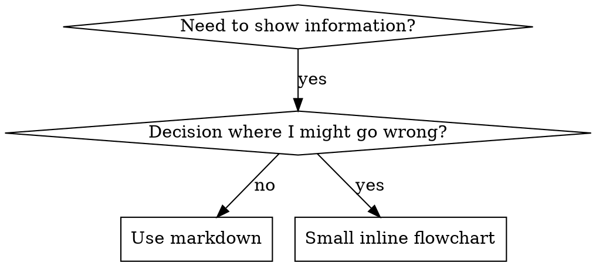
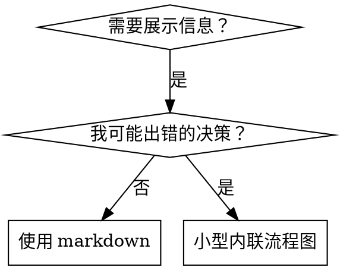

## 分析概要

### 文档定位
这是一个 Skill 创作方法论文档，教 Claude 如何用 TDD（测试驱动开发）的方式编写高质量的 agent skill。

### 核心主张
Skill 创作 = 测试驱动开发应用于流程文档。必须先让 agent 在没有 skill 的情况下失败（RED），再写 skill 让它通过（GREEN），最后完善堵住漏洞（REFACTOR）。

### 结构骨架
- Overview + TDD 映射
- 何时创建 skill（创建条件）
- Skill 类型（Technique/Pattern/Reference）
- 目录结构规范
- SKILL.md 结构模板
- CSO（Claude Search Optimization）策略
- Flowchart 使用规范
- 代码示例规范
- 文件组织方式
- Iron Law（铁律）：没有失败的测试就不能写 skill
- 不同类型 skill 的测试方法
- 常见合理化借口表
- 防弹设计（抵抗合理化）
- RED-GREEN-REFACTOR 完整流程
- 反模式
- 部署检查清单

### 关键洞察
1. **Iron Law**: "NO SKILL WITHOUT A FAILING TEST FIRST" — 无论新建还是修改 skill，都必须先测试
2. **CSO 陷阱**: 描述字段如果总结 workflow，Claude 会跳过正文只读描述，导致行为偏差
3. **Persuasion Principles**: 用权威、承诺、稀缺等心理学原理让 agent 在压力下仍遵守规则
4. **Token Efficiency**: getting-started skill 必须 <150 词，频繁加载的 <200 词，其他 <500 词

---

### 段落 1

**原文:**
---
name: writing-skills
description: Use when creating new skills, editing existing skills, or verifying skills work before deployment
---

**翻译:**
---
name: writing-skills
description: 在创建新技能、编辑现有技能或部署前验证技能时使用
---

**要点:**
- 这是 YAML frontmatter，定义 skill 的元数据
- 名称和描述字段是必需的
- 描述字段遵循 "Use when..." 格式，只描述触发条件

---

### 段落 2

**原文:**
# Writing Skills

## Overview

**Writing skills IS Test-Driven Development applied to process documentation.**

**Personal skills live in agent-specific directories (`~/.claude/skills` for Claude Code, `~/.agents/skills/` for Codex)** 

You write test cases (pressure scenarios with subagents), watch them fail (baseline behavior), write the skill (documentation), watch tests pass (agents comply), and refactor (close loopholes).

**Core principle:** If you didn't watch an agent fail without the skill, you don't know if the skill teaches the right thing.

**REQUIRED BACKGROUND:** You MUST understand superpowers:test-driven-development before using this skill. That skill defines the fundamental RED-GREEN-REFACTOR cycle. This skill adapts TDD to documentation.

**Official guidance:** For Anthropic's official skill authoring best practices, see anthropic-best-practices.md. This document provides additional patterns and guidelines that complement the TDD-focused approach in this skill.

**翻译:**
# 编写技能

## 概述

**编写技能是将测试驱动开发应用于流程文档。**

**个人技能存放在特定于代理的目录中（Claude Code 使用 `~/.claude/skills`，Codex 使用 `~/.agents/skills/`）**

你编写测试用例（使用子代理的压力场景），观察它们失败（基线行为），编写技能（文档），观察测试通过（代理遵守），然后重构（堵住漏洞）。

**核心原则：** 如果你没有观察到代理在没有技能的情况下失败，你就不知道这个技能是否教会了正确的东西。

**必需背景：** 在使用这个技能之前，你必须理解 superpowers:test-driven-development。该技能定义了基本的 RED-GREEN-REFACTOR 循环。本技能将 TDD 适配到文档编写。

**官方指导：** 关于 Anthropic 官方的技能编写最佳实践，请参阅 anthropic-best-practices.md。本文档提供了额外的模式和指导方针，补充了本技能中以 TDD 为重点的方法。

**要点:**
- 将 TDD 的 RED-GREEN-REFACTOR 循环应用于 skill 文档创作
- 测试用例 = 压力场景（pressure scenarios with subagents）
- 必须先观察失败，才能确定 skill 是否有效
- 依赖 superpowers:test-driven-development 作为前置知识
- anthropic-best-practices.md 提供官方指导

---

### 段落 3

**原文:**
## What is a Skill?

A **skill** is a reference guide for proven techniques, patterns, or tools. Skills help future Claude instances find and apply effective approaches.

**Skills are:** Reusable techniques, patterns, tools, reference guides

**Skills are NOT:** Narratives about how you solved a problem once

**翻译:**
## 什么是技能？

**技能**是经过验证的技术、模式或工具的参考指南。技能帮助未来的 Claude 实例找到并应用有效的方法。

**技能是：** 可重用的技术、模式、工具、参考指南

**技能不是：** 关于你如何一次性解决某个问题的叙述

**要点:**
- Skill 的核心定位：参考指南，不是故事
- 可重用性是关键标准
- 区分 "可复用的模式" vs "一次性解决方案的叙述"

---

### 段落 4

**原文:**
## TDD Mapping for Skills

| TDD Concept | Skill Creation |
|-------------|----------------|
| **Test case** | Pressure scenario with subagent |
| **Production code** | Skill document (SKILL.md) |
| **Test fails (RED)** | Agent violates rule without skill (baseline) |
| **Test passes (GREEN)** | Agent complies with skill present |
| **Refactor** | Close loopholes while maintaining compliance |
| **Write test first** | Run baseline scenario BEFORE writing skill |
| **Watch it fail** | Document exact rationalizations agent uses |
| **Minimal code** | Write skill addressing those specific violations |
| **Watch it pass** | Verify agent now complies |
| **Refactor cycle** | Find new rationalizations → plug → re-verify |

The entire skill creation process follows RED-GREEN-REFACTOR.

**翻译:**
## 技能的 TDD 映射

| TDD 概念 | 技能创建 |
|----------|----------|
| **测试用例** | 使用子代理的压力场景 |
| **生产代码** | 技能文档 (SKILL.md) |
| **测试失败 (RED)** | 代理在没有技能的情况下违反规则（基线） |
| **测试通过 (GREEN)** | 代理在有技能的情况下遵守规则 |
| **重构** | 堵住漏洞同时保持合规性 |
| **先写测试** | 在编写技能之前运行基线场景 |
| **观察失败** | 记录代理使用的精确合理化解释 |
| **最小代码** | 编写技能解决那些具体的违规 |
| **观察通过** | 验证代理现在遵守规则 |
| **重构循环** | 发现新的合理化解释 → 堵住 → 重新验证 |

整个技能创建过程遵循 RED-GREEN-REFACTOR。

**要点:**
- 将 TDD 的每个概念映射到 skill 创作的对应物
- 关键洞察：测试失败 = agent 的合理化解释（rationalizations）
- 先观察失败，再写 skill，再验证通过

---

### 段落 5

**原文:**
## When to Create a Skill

**Create when:**
- Technique wasn't intuitively obvious to you
- You'd reference this again across projects
- Pattern applies broadly (not project-specific)
- Others would benefit

**Don't create for:**
- One-off solutions
- Standard practices well-documented elsewhere
- Project-specific conventions (put in CLAUDE.md)
- Mechanical constraints (if it's enforceable with regex/validation, automate it—save documentation for judgment calls)

**翻译:**
## 何时创建技能

**创建时机：**
- 技术对你来说不是直观明显的
- 你会在跨项目中再次参考它
- 模式广泛适用（不是项目特定的）
- 其他人会受益

**不要为以下创建：**
- 一次性解决方案
- 其他地方已有充分文档记录的标准实践
- 项目特定的约定（放入 CLAUDE.md）
- 机械约束（如果可用正则/验证强制执行，就自动化它——将文档留给判断调用）

**要点:**
- 创建标准：非直观、可重用、跨项目、对他人有用
- 不该创建的情况：一次性、已有文档、项目特定、可自动化
- 项目特定约定应放入 CLAUDE.md，不是 skill

---

### 段落 6

**原文:**
## Skill Types

### Technique
Concrete method with steps to follow (condition-based-waiting, root-cause-tracing)

### Pattern
Way of thinking about problems (flatten-with-flags, test-invariants)

### Reference
API docs, syntax guides, tool documentation (office docs)

**翻译:**
## 技能类型

### 技术
有步骤可循的具体方法（基于条件的等待、根本原因追踪）

### 模式
思考问题的方式（用标志扁平化、测试不变量）

### 参考
API 文档、语法指南、工具文档（office 文档）

**要点:**
- 三种 skill 类型：Technique（技术/方法）、Pattern（模式/思维方式）、Reference（参考/文档）
- 每种类型对应不同的测试策略
- Technique 有明确步骤，Pattern 是思维框架，Reference 是查找资料

---

### 段落 7

**原文:**
## Directory Structure


```
skills/
  skill-name/
    SKILL.md              # Main reference (required)
    supporting-file.*     # Only if needed
```

**Flat namespace** - all skills in one searchable namespace

**Separate files for:**
1. **Heavy reference** (100+ lines) - API docs, comprehensive syntax
2. **Reusable tools** - Scripts, utilities, templates

**Keep inline:**
- Principles and concepts
- Code patterns (< 50 lines)
- Everything else

**翻译:**
## 目录结构


```
skills/
  skill-name/
    SKILL.md              # 主要参考（必需）
    supporting-file.*     # 仅在需要时
```

**扁平命名空间** - 所有技能在一个可搜索的命名空间中

**单独文件用于：**
1. **重型参考**（100+ 行）- API 文档、综合语法
2. **可重用工具** - 脚本、实用程序、模板

**保持内联：**
- 原则和概念
- 代码模式（< 50 行）
- 其他一切

**要点:**
- 扁平命名空间：所有 skill 在同一层级，便于搜索
- SKILL.md 是必需的，supporting files 可选
- 分离原则：重型参考和可重用工具单独文件，其他内联

---

### 段落 8

**原文:**
## SKILL.md Structure

**Frontmatter (YAML):**
- Two required fields: `name` and `description` (see [agentskills.io/specification](https://agentskills.io/specification) for all supported fields)
- Max 1024 characters total
- `name`: Use letters, numbers, and hyphens only (no parentheses, special chars)
- `description`: Third-person, describes ONLY when to use (NOT what it does)
  - Start with "Use when..." to focus on triggering conditions
  - Include specific symptoms, situations, and contexts
  - **NEVER summarize the skill's process or workflow** (see CSO section for why)
  - Keep under 500 characters if possible

```markdown
---
name: Skill-Name-With-Hyphens
description: Use when [specific triggering conditions and symptoms]
---

# Skill Name

## Overview
What is this? Core principle in 1-2 sentences.

## When to Use
[Small inline flowchart IF decision non-obvious]

Bullet list with SYMPTOMS and use cases
When NOT to use

## Core Pattern (for techniques/patterns)
Before/after code comparison

## Quick Reference
Table or bullets for scanning common operations

## Implementation
Inline code for simple patterns
Link to file for heavy reference or reusable tools

## Common Mistakes
What goes wrong + fixes

## Real-World Impact (optional)
Concrete results
```


**翻译:**
## SKILL.md 结构

**前置元数据 (YAML):**
- 两个必需字段：`name` 和 `description`（所有支持字段见 [agentskills.io/specification](https://agentskills.io/specification)）
- 总共最多 1024 个字符
- `name`：仅使用字母、数字和连字符（无括号、特殊字符）
- `description`：第三人称，仅描述何时使用（不是做什么）
  - 以 "Use when..." 开头，聚焦触发条件
  - 包含具体症状、情境和上下文
  - **切勿总结技能的过程或工作流**（原因见 CSO 部分）
  - 可能情况下保持在 500 字符以下

```markdown
---
name: Skill-Name-With-Hyphens
description: Use when [specific triggering conditions and symptoms]
---

# Skill Name

## Overview
这是什么？1-2 句话的核心原则。

## When to Use
[如果决策不明显，放小型内联流程图]

带症状和使用场景的要点列表
何时不使用

## Core Pattern (用于技术/模式)
前后代码对比

## Quick Reference
表格或要点，用于扫描常见操作

## Implementation
简单模式内联代码
重型参考或可重用工具链接到文件

## Common Mistakes
出错内容 + 修复方法

## Real-World Impact (可选)
具体结果
```


**要点:**
- YAML frontmatter 是必需的，name 和 description 两个字段
- description 的关键规则：只说何时用，不说做什么（CSO 核心）
- 正文结构模板：Overview → When to Use → Core Pattern → Quick Reference → Implementation → Common Mistakes → Real-World Impact
- 流程图仅在决策不明显时使用

---

### 段落 9

**原文:**
## Claude Search Optimization (CSO)

**Critical for discovery:** Future Claude needs to FIND your skill

### 1. Rich Description Field

**Purpose:** Claude reads description to decide which skills to load for a given task. Make it answer: "Should I read this skill right now?"

**Format:** Start with "Use when..." to focus on triggering conditions

**CRITICAL: Description = When to Use, NOT What the Skill Does**

The description should ONLY describe triggering conditions. Do NOT summarize the skill's process or workflow in the description.

**Why this matters:** Testing revealed that when a description summarizes the skill's workflow, Claude may follow the description instead of reading the full skill content. A description saying "code review between tasks" caused Claude to do ONE review, even though the skill's flowchart clearly showed TWO reviews (spec compliance then code quality).

When the description was changed to just "Use when executing implementation plans with independent tasks" (no workflow summary), Claude correctly read the flowchart and followed the two-stage review process.

**The trap:** Descriptions that summarize workflow create a shortcut Claude will take. The skill body becomes documentation Claude skips.

**翻译:**
## Claude 搜索优化 (CSO)

**对发现至关重要：** 未来的 Claude 需要找到你的技能

### 1. 丰富的描述字段

**目的：** Claude 读取描述来决定为给定任务加载哪些技能。让它回答："我现在应该读取这个技能吗？"

**格式：** 以 "Use when..." 开头，聚焦触发条件

**关键：描述 = 何时使用，不是技能做什么**

描述应该仅描述触发条件。不要在描述中总结技能的过程或工作流。

**为什么重要：** 测试揭示，当描述总结技能的工作流时，Claude 可能遵循描述而不是读取完整的技能内容。一个说 "任务间代码审查" 的描述导致 Claude 只做一次审查，尽管技能的流程图清楚地显示两次审查（规范合规然后代码质量）。

当描述改为仅 "Use when executing implementation plans with independent tasks"（无工作流总结）时，Claude 正确读取流程图并遵循了两阶段审查过程。

**陷阱：** 总结工作流的描述创建了 Claude 会采用的捷径。技能正文变成了 Claude 跳过的文档。

**要点:**
- CSO 的核心目的：让未来的 Claude 能找到并正确加载 skill
- **关键发现**：description 如果总结 workflow，Claude 会只读 description 而不读正文，导致行为偏差
- 真实案例："code review between tasks" → Claude 只做一次 review，而不是两次
- 修正：description 只写触发条件，Claude 才会去读正文获取完整流程

---

### 段落 10

**原文:**
```yaml
# ❌ BAD: Summarizes workflow - Claude may follow this instead of reading skill
description: Use when executing plans - dispatches subagent per task with code review between tasks

# ❌ BAD: Too much process detail
description: Use for TDD - write test first, watch it fail, write minimal code, refactor

# ✅ GOOD: Just triggering conditions, no workflow summary
description: Use when executing implementation plans with independent tasks in the current session

# ✅ GOOD: Triggering conditions only
description: Use when implementing any feature or bugfix, before writing implementation code
```

**Content:**
- Use concrete triggers, symptoms, and situations that signal this skill applies
- Describe the *problem* (race conditions, inconsistent behavior) not *language-specific symptoms* (setTimeout, sleep)
- Keep triggers technology-agnostic unless the skill itself is technology-specific
- If skill is technology-specific, make that explicit in the trigger
- Write in third person (injected into system prompt)
- **NEVER summarize the skill's process or workflow**

```yaml
# ❌ BAD: Too abstract, vague, doesn't include when to use
description: For async testing

# ❌ BAD: First person
description: I can help you with async tests when they're flaky

# ❌ BAD: Mentions technology but skill isn't specific to it
description: Use when tests use setTimeout/sleep and are flaky

# ✅ GOOD: Starts with "Use when", describes problem, no workflow
description: Use when tests have race conditions, timing dependencies, or pass/fail inconsistently

# ✅ GOOD: Technology-specific skill with explicit trigger
description: Use when using React Router and handling authentication redirects
```

**翻译:**
```yaml
# ❌ 不好：总结工作流 - Claude 可能遵循这个而不读取技能
description: Use when executing plans - dispatches subagent per task with code review between tasks

# ❌ 不好：太多过程细节
description: Use for TDD - write test first, watch it fail, write minimal code, refactor

# ✅ 好：仅触发条件，无工作流总结
description: Use when executing implementation plans with independent tasks in the current session

# ✅ 好：仅触发条件
description: Use when implementing any feature or bugfix, before writing implementation code
```

**内容：**
- 使用具体的触发器、症状和情境来表示此技能适用
- 描述*问题*（竞争条件、不一致行为）而不是*语言特定症状*（setTimeout、sleep）
- 保持触发器与技术无关，除非技能本身是技术特定的
- 如果技能是技术特定的，在触发器中明确说明
- 用第三人称写（注入系统提示）
- **切勿总结技能的过程或工作流**

```yaml
# ❌ 不好：太抽象、模糊，不包含何时使用
description: For async testing

# ❌ 不好：第一人称
description: I can help you with async tests when they're flaky

# ❌ 不好：提到技术但技能不特定于它
description: Use when tests use setTimeout/sleep and are flaky

# ✅ 好：以 "Use when" 开头，描述问题，无工作流
description: Use when tests have race conditions, timing dependencies, or pass/fail inconsistently

# ✅ 好：技术特定技能，触发器明确
description: Use when using React Router and handling authentication redirects
```

**要点:**
- description 的 DO 和 DON'T 示例对比
- BAD：总结 workflow、太抽象、第一人称、提到不相关的技术
- GOOD：以 "Use when" 开头、描述问题（非语言特定）、第三人称
- 技术特定 skill 要在描述中明确技术名称

---

### 段落 11

**原文:**
### 2. Keyword Coverage

Use words Claude would search for:
- Error messages: "Hook timed out", "ENOTEMPTY", "race condition"
- Symptoms: "flaky", "hanging", "zombie", "pollution"
- Synonyms: "timeout/hang/freeze", "cleanup/teardown/afterEach"
- Tools: Actual commands, library names, file types

**翻译:**
### 2. 关键词覆盖

使用 Claude 会搜索的词：
- 错误消息："Hook timed out", "ENOTEMPTY", "race condition"
- 症状："flaky", "hanging", "zombie", "pollution"
- 同义词："timeout/hang/freeze", "cleanup/teardown/afterEach"
- 工具：实际命令、库名称、文件类型

**要点:**
- 在 description 和正文中覆盖 Claude 可能搜索的关键词
- 包括错误消息、症状描述、同义词、工具名
- 目的是让 Claude 在相关场景下能"找到"这个 skill

---

### 段落 12

**原文:**
### 3. Descriptive Naming

**Use active voice, verb-first:**
- ✅ `creating-skills` not `skill-creation`
- ✅ `condition-based-waiting` not `async-test-helpers`

### 4. Token Efficiency (Critical)

**Problem:** getting-started and frequently-referenced skills load into EVERY conversation. Every token counts.

**Target word counts:**
- getting-started workflows: <150 words each
- Frequently-loaded skills: <200 words total
- Other skills: <500 words (still be concise)

**翻译:**
### 3. 描述性命名

**使用主动语态，动词优先：**
- ✅ `creating-skills` 而不是 `skill-creation`
- ✅ `condition-based-waiting` 而不是 `async-test-helpers`

### 4. Token 效率（关键）

**问题：** getting-started 和频繁引用的技能会加载到每次对话中。每个 token 都重要。

**目标字数：**
- getting-started 工作流：每个 <150 词
- 频繁加载的技能：总共 <200 词
- 其他技能：<500 词（仍然要简洁）

**要点:**
- 命名规范：主动语态、动词开头（creating- 而不是 skill-creation）
- Token 效率是关键约束，因为某些 skill 会加载到每次对话
- 字数目标：getting-started <150, frequent <200, others <500

---

### 段落 13

**原文:**
**Techniques:**

**Move details to tool help:**
```bash
# ❌ BAD: Document all flags in SKILL.md
search-conversations supports --text, --both, --after DATE, --before DATE, --limit N

# ✅ GOOD: Reference --help
search-conversations supports multiple modes and filters. Run --help for details.
```

**Use cross-references:**
```markdown
# ❌ BAD: Repeat workflow details
When searching, dispatch subagent with template...
[20 lines of repeated instructions]

# ✅ GOOD: Reference other skill
Always use subagents (50-100x context savings). REQUIRED: Use [other-skill-name] for workflow.
```

**Compress examples:**
```markdown
# ❌ BAD: Verbose example (42 words)
your human partner: "How did we handle authentication errors in React Router before?"
You: I'll search past conversations for React Router authentication patterns.
[Dispatch subagent with search query: "React Router authentication error handling 401"]

# ✅ GOOD: Minimal example (20 words)
Partner: "How did we handle auth errors in React Router?"
You: Searching...
[Dispatch subagent → synthesis]
```

**Eliminate redundancy:**
- Don't repeat what's in cross-referenced skills
- Don't explain what's obvious from command
- Don't include multiple examples of same pattern

**翻译:**
**技术：**

**将细节移到工具帮助：**
```bash
# ❌ 不好：在 SKILL.md 中记录所有标志
search-conversations supports --text, --both, --after DATE, --before DATE, --limit N

# ✅ 好：引用 --help
search-conversations supports multiple modes and filters. Run --help for details.
```

**使用交叉引用：**
```markdown
# ❌ 不好：重复工作流细节
搜索时，派遣子代理使用模板...
[20 行重复指令]

# ✅ 好：引用其他技能
始终使用子代理（节省 50-100 倍上下文）。必需：使用 [other-skill-name] 处理工作流。
```

**压缩示例：**
```markdown
# ❌ 不好：冗长示例（42 词）
你的人类伙伴："我们之前如何处理 React Router 中的认证错误？"
你：我将搜索过去对话中的 React Router 认证模式。
[派遣子代理搜索查询："React Router authentication error handling 401"]

# ✅ 好：最小示例（20 词）
伙伴："我们如何处理 React Router 中的认证错误？"
你：搜索中...
[派遣子代理 → 综合]
```

**消除冗余：**
- 不要重复交叉引用技能中的内容
- 不要解释命令中显而易见的内容
- 不要包含同一模式的多个示例

**要点:**
- Token 效率的具体技术：
  1. 工具细节移到 --help
  2. 交叉引用其他 skill，不重复
  3. 压缩示例到最小
  4. 消除冗余（不重复、不解释显而易见的东西、不多示例）

---

### 段落 14

**原文:**
**Verification:**
```bash
wc -w skills/path/SKILL.md
# getting-started workflows: aim for <150 each
# Other frequently-loaded: aim for <200 total
```

**Name by what you DO or core insight:**
- ✅ `condition-based-waiting` > `async-test-helpers`
- ✅ `using-skills` not `skill-usage`
- ✅ `flatten-with-flags` > `data-structure-refactoring`
- ✅ `root-cause-tracing` > `debugging-techniques`

**Gerunds (-ing) work well for processes:**
- `creating-skills`, `testing-skills`, `debugging-with-logs`
- Active, describes the action you're taking

**翻译:**
**验证：**
```bash
wc -w skills/path/SKILL.md
# getting-started 工作流：目标每个 <150 词
# 其他频繁加载的：目标总共 <200 词
```

**按你做什么或核心洞察命名：**
- ✅ `condition-based-waiting` > `async-test-helpers`
- ✅ `using-skills` 而不是 `skill-usage`
- ✅ `flatten-with-flags` > `data-structure-refactoring`
- ✅ `root-cause-tracing` > `debugging-techniques`

**动名词 (-ing) 适用于过程：**
- `creating-skills`, `testing-skills`, `debugging-with-logs`
- 主动的，描述你正在采取的行动

**要点:**
- 用 wc -w 验证字数目标
- 命名策略：按核心行为或洞察命名，动名词形式适用于过程
- 对比：condition-based-waiting 比 async-test-helpers 更精确

---

### 段落 15

**原文:**
### 4. Cross-Referencing Other Skills

**When writing documentation that references other skills:**

Use skill name only, with explicit requirement markers:
- ✅ Good: `**REQUIRED SUB-SKILL:** Use superpowers:test-driven-development`
- ✅ Good: `**REQUIRED BACKGROUND:** You MUST understand superpowers:systematic-debugging`
- ❌ Bad: `See skills/testing/test-driven-development` (unclear if required)
- ❌ Bad: `@skills/testing/test-driven-development/SKILL.md` (force-loads, burns context)

**Why no @ links:** `@` syntax force-loads files immediately, consuming 200k+ context before you need them.

**翻译:**
### 4. 交叉引用其他技能

**编写引用其他技能的文档时：**

仅使用技能名称，并带有明确要求标记：
- ✅ 好：`**REQUIRED SUB-SKILL:** Use superpowers:test-driven-development`
- ✅ 好：`**REQUIRED BACKGROUND:** You MUST understand superpowers:systematic-debugging`
- ❌ 不好：`See skills/testing/test-driven-development`（不清楚是否必需）
- ❌ 不好：`@skills/testing/test-driven-development/SKILL.md`（强制加载，消耗上下文）

**为什么不用 @ 链接：** `@` 语法会立即强制加载文件，在需要它们之前消耗 200k+ 上下文。

**要点:**
- 引用其他 skill 的规范：只写 skill name，用 REQUIRED 标记明确是否必需
- 避免 @ 链接：会强制加载文件，浪费 200k+ token
- BAD："See..." 不明确是否必需；"@..." 强制加载

---

### 段落 16

**原文:**
## Flowchart Usage



**Use flowcharts ONLY for:**
- Non-obvious decision points
- Process loops where you might stop too early
- "When to use A vs B" decisions

**Never use flowcharts for:**
- Reference material → Tables, lists
- Code examples → Markdown blocks
- Linear instructions → Numbered lists
- Labels without semantic meaning (step1, helper2)

See @graphviz-conventions.dot for graphviz style rules.

**Visualizing for your human partner:** Use `render-graphs.js` in this directory to render a skill's flowcharts to SVG:
```bash
./render-graphs.js ../some-skill           # Each diagram separately
./render-graphs.js ../some-skill --combine # All diagrams in one SVG
```

**翻译:**
## 流程图使用



**仅在以下情况使用流程图：**
- 不明显的决策点
- 你可能过早停止的过程循环
- "何时使用 A 或 B" 的决策

**切勿对以下使用流程图：**
- 参考材料 → 表格、列表
- 代码示例 → Markdown 代码块
- 线性指令 → 编号列表
- 无语义意义的标签（step1, helper2）

见 @graphviz-conventions.dot 了解 graphviz 样式规则。

**为人类伙伴可视化：** 使用本目录中的 `render-graphs.js` 将技能的流程图渲染为 SVG：
```bash
./render-graphs.js ../some-skill           # 每个图表单独
./render-graphs.js ../some-skill --combine # 所有图表在一个 SVG 中
```

**要点:**
- 流程图使用原则：仅在非明显决策点、可能过早停止的循环、A/B 选择时使用
- 不该用的情况：参考材料、代码示例、线性指令、无意义标签
- 提供 render-graphs.js 工具将 dot 流程图渲染为 SVG

---

### 段落 17

**原文:**
## Code Examples

**One excellent example beats many mediocre ones**

Choose most relevant language:
- Testing techniques → TypeScript/JavaScript
- System debugging → Shell/Python
- Data processing → Python

**Good example:**
- Complete and runnable
- Well-commented explaining WHY
- From real scenario
- Shows pattern clearly
- Ready to adapt (not generic template)

**Don't:**
- Implement in 5+ languages
- Create fill-in-the-blank templates
- Write contrived examples

You're good at porting - one great example is enough.

**翻译:**
## 代码示例

**一个优秀的示例胜过许多平庸的示例**

选择最相关的语言：
- 测试技术 → TypeScript/JavaScript
- 系统调试 → Shell/Python
- 数据处理 → Python

**好的示例：**
- 完整且可运行
- 有充分注释解释原因
- 来自真实场景
- 清晰展示模式
- 可立即适配（不是通用模板）

**不要：**
- 用 5+ 语言实现
- 创建填空模板
- 编写人为构造的示例

你擅长移植——一个出色的示例就够了。

**要点:**
- 代码示例质量 > 数量
- 按场景选择语言（测试用 TS/JS，调试用 Shell/Python，数据处理用 Python）
- 好示例标准：完整可运行、注释解释 WHY、真实场景、清晰展示模式、可适配
- 不要多语言、不要模板、不要人为构造

---

### 段落 18

**原文:**
## File Organization

### Self-Contained Skill
```
defense-in-depth/
  SKILL.md    # Everything inline
```
When: All content fits, no heavy reference needed

### Skill with Reusable Tool
```
condition-based-waiting/
  SKILL.md    # Overview + patterns
  example.ts  # Working helpers to adapt
```
When: Tool is reusable code, not just narrative

### Skill with Heavy Reference
```
pptx/
  SKILL.md       # Overview + workflows
  pptxgenjs.md   # 600 lines API reference
  ooxml.md       # 500 lines XML structure
  scripts/       # Executable tools
```
When: Reference material too large for inline

**翻译:**
## 文件组织

### 自包含技能
```
defense-in-depth/
  SKILL.md    # 所有内容内联
```
何时：所有内容适合，不需要重型参考

### 带可重用工具的技能
```
condition-based-waiting/
  SKILL.md    # 概述 + 模式
  example.ts  # 可适配的工作助手
```
何时：工具是可重用代码，不只是叙述

### 带重型参考的技能
```
pptx/
  SKILL.md       # 概述 + 工作流
  pptxgenjs.md   # 600 行 API 参考
  ooxml.md       # 500 行 XML 结构
  scripts/       # 可执行工具
```
何时：参考材料太大，无法内联

**要点:**
- 三种文件组织模式：自包含、带可重用工具、带重型参考
- 选择依据：内容量、是否有可重用代码、是否有大量参考材料
- 重型参考应分离到单独文件，避免 SKILL.md 过长

---

### 段落 19

**原文:**
## The Iron Law (Same as TDD)

```
NO SKILL WITHOUT A FAILING TEST FIRST
```

This applies to NEW skills AND EDITS to existing skills.

Write skill before testing? Delete it. Start over.
Edit skill without testing? Same violation.

**No exceptions:**
- Not for "simple additions"
- Not for "just adding a section"
- Not for "documentation updates"
- Don't keep untested changes as "reference"
- Don't "adapt" while running tests
- Delete means delete

**REQUIRED BACKGROUND:** The superpowers:test-driven-development skill explains why this matters. Same principles apply to documentation.

**翻译:**
## 铁律（与 TDD 相同）

```
没有失败的测试，就不能写技能
```

这适用于新技能和对现有技能的编辑。

在测试之前写技能？删除它。重新开始。
未经测试就编辑技能？同样是违规。

**没有例外：**
- 不适用于"简单添加"
- 不适用于"只是添加一节"
- 不适用于"文档更新"
- 不要将未经测试的更改保留为"参考"
- 不要在运行测试时"适配"
- 删除意味着删除

**必需背景：** superpowers:test-driven-development 技能解释了为什么这很重要。相同的原则适用于文档。

**要点:**
- Iron Law：没有失败的测试就不能写/改 skill
- 适用于所有情况，无例外（包括简单添加、文档更新）
- 如果违反了，删除重写，不要保留"作为参考"
- 参考 TDD skill 理解为什么这条规则如此严格

---

### 段落 20

**原文:**
## Testing All Skill Types

Different skill types need different test approaches:

### Discipline-Enforcing Skills (rules/requirements)

**Examples:** TDD, verification-before-completion, designing-before-coding

**Test with:**
- Academic questions: Do they understand the rules?
- Pressure scenarios: Do they comply under stress?
- Multiple pressures combined: time + sunk cost + exhaustion
- Identify rationalizations and add explicit counters

**Success criteria:** Agent follows rule under maximum pressure

### Technique Skills (how-to guides)

**Examples:** condition-based-waiting, root-cause-tracing, defensive-programming

**Test with:**
- Application scenarios: Can they apply the technique correctly?
- Variation scenarios: Do they handle edge cases?
- Missing information tests: Do instructions have gaps?

**Success criteria:** Agent successfully applies technique to new scenario

### Pattern Skills (mental models)

**Examples:** reducing-complexity, information-hiding concepts

**Test with:**
- Recognition scenarios: Do they recognize when pattern applies?
- Application scenarios: Can they use the mental model?
- Counter-examples: Do they know when NOT to apply?

**Success criteria:** Agent correctly identifies when/how to apply pattern

### Reference Skills (documentation/APIs)

**Examples:** API documentation, command references, library guides

**Test with:**
- Retrieval scenarios: Can they find the right information?
- Application scenarios: Can they use what they found correctly?
- Gap testing: Are common use cases covered?

**Success criteria:** Agent finds and correctly applies reference information

**翻译:**
## 测试所有技能类型

不同的技能类型需要不同的测试方法：

### 纪律执行技能（规则/要求）

**示例：** TDD、完成前验证、编码前设计

**测试方法：**
- 学术问题：他们理解规则吗？
- 压力场景：他们在压力下遵守吗？
- 多重压力组合：时间 + 沉没成本 + 疲惫
- 识别合理化解释并添加明确对策

**成功标准：** 代理在最大压力下遵循规则

### 技术技能（操作指南）

**示例：** 基于条件的等待、根本原因追踪、防御性编程

**测试方法：**
- 应用场景：他们能正确应用技术吗？
- 变体场景：他们处理边缘情况吗？
- 缺失信息测试：指令有漏洞吗？

**成功标准：** 代理成功将技术应用于新场景

### 模式技能（心智模型）

**示例：** 降低复杂性、信息隐藏概念

**测试方法：**
- 识别场景：他们识别模式何时适用吗？
- 应用场景：他们能使用心智模型吗？
- 反例：他们知道何时不应用吗？

**成功标准：** 代理正确识别何时/如何应用模式

### 参考技能（文档/API）

**示例：** API 文档、命令参考、库指南

**测试方法：**
- 检索场景：他们能找到正确信息吗？
- 应用场景：他们能正确使用找到的信息吗？
- 漏洞测试：常见用例被覆盖了吗？

**成功标准：** 代理找到并正确应用参考信息

**要点:**
- 四种 skill 类型各有不同的测试策略
- Discipline：重在压力测试，成功标准 = 最大压力下仍遵守
- Technique：重在应用和边缘情况，成功标准 = 正确应用于新场景
- Pattern：重在识别和反例，成功标准 = 正确识别何时/如何应用
- Reference：重在检索和应用，成功标准 = 找到并正确应用信息

---

### 段落 21

**原文:**
## Common Rationalizations for Skipping Testing

| Excuse | Reality |
|--------|---------|
| "Skill is obviously clear" | Clear to you ≠ clear to other agents. Test it. |
| "It's just a reference" | References can have gaps, unclear sections. Test retrieval. |
| "Testing is overkill" | Untested skills have issues. Always. 15 min testing saves hours. |
| "I'll test if problems emerge" | Problems = agents can't use skill. Test BEFORE deploying. |
| "Too tedious to test" | Testing比调试生产环境中的坏技能 less tedious. |
| "I'm confident it's good" | Overconfidence guarantees issues. Test anyway. |
| "Academic review is enough" | Reading ≠ using. Test application scenarios. |
| "No time to test" | Deploying untested skill wastes more time fixing it later. |

**All of these mean: Test before deploying. No exceptions.**

**翻译:**
## 跳过测试的常见合理化借口

| 借口 | 现实 |
|------|------|
| "技能显然很清楚" | 对你清楚 ≠ 对其他代理清楚。测试它。 |
| "这只是参考" | 参考可能有漏洞、不清晰的章节。测试检索。 |
| "测试是过度杀伤" | 未经测试的技能总是有问题。15 分钟测试节省数小时。 |
| "如果出现问题我会测试" | 问题 = 代理无法使用技能。在部署前测试。 |
| "测试太繁琐" | 测试比调试生产环境中的坏技能 less 繁琐。 |
| "我确信它是好的" | 过度自信保证会有问题。还是测试吧。 |
| "学术审查就够了" | 阅读 ≠ 使用。测试应用场景。 |
| "没时间测试" | 部署未经测试的技能会浪费更多时间以后修复。 |

**所有这些都意味着：部署前测试。没有例外。**

**要点:**
- 列举 8 个常见的跳过测试的借口及对应的现实
- 核心信息：所有借口都不成立，部署前必须测试
- 15 分钟测试 vs 数小时调试生产问题的对比

---

### 段落 22

**原文:**
## Bulletproofing Skills Against Rationalization

Skills that enforce discipline (like TDD) need to resist rationalization. Agents are smart and will find loopholes when under pressure.

**Psychology note:** Understanding WHY persuasion techniques work helps you apply them systematically. See persuasion-principles.md for research foundation (Cialdini, 2021; Meincke et al., 2025) on authority, commitment, scarcity, social proof, and unity principles.

**翻译:**
## 让技能防弹以抵抗合理化

执行纪律的技能（如 TDD）需要抵抗合理化。代理很聪明，会在压力下找到漏洞。

**心理学注释：** 理解说服技巧为什么有效有助于你系统地应用它们。见 persuasion-principles.md 了解权威、承诺、稀缺、社会认同和统一原则的研究基础（Cialdini, 2021; Meincke et al., 2025）。

**要点:**
- Discipline-enforcing skill 需要"防弹"（bulletproofing）
- Agent 在压力下会找借口（rationalization）绕过规则
- 引用 persuasion-principles.md 研究来设计更有效的 skill

---

### 段落 23

**原文:**
### Close Every Loophole Explicitly

Don't just state the rule - forbid specific workarounds:

<Bad>
```markdown
Write code before test? Delete it.
```
</Bad>

<Good>
```markdown
Write code before test? Delete it. Start over.

**No exceptions:**
- Don't keep it as "reference"
- Don't "adapt" it while writing tests
- Don't look at it
- Delete means delete
```
</Good>

**翻译:**
### 明确堵住每个漏洞

不要只陈述规则——禁止具体的变通方法：

<不好>
```markdown
测试前写代码？删除它。
```
</不好>

<好>
```markdown
测试前写代码？删除它。重新开始。

**没有例外：**
- 不要将其保留为"参考"
- 不要在写测试时"适配"它
- 不要看它
- 删除意味着删除
```
</好>

**要点:**
- 防弹技巧 1：明确列出所有可能的变通方法并禁止
- Bad：只说"删除"，agent 可能找漏洞（保留为参考、适配等）
- Good：明确禁止每一个可能的漏洞

---

### 段落 24

**原文:**
### Address "Spirit vs Letter" Arguments

Add foundational principle early:

```markdown
**Violating the letter of the rules is violating the spirit of the rules.**
```

This cuts off entire class of "I'm following the spirit" rationalizations.

**翻译:**
### 解决"精神 vs 字面"论点

尽早添加基础原则：

```markdown
**违反规则的字面就是违反规则的精神。**
```

这切断了整个"我在遵循精神"的合理化类别。

**要点:**
- 防弹技巧 2：提前声明"违反字面就是违反精神"
- 阻止 agent 用"我在遵循精神"作为借口
- 这是 foundational principle，放在文档早期

---

### 段落 25

**原文:**
### Build Rationalization Table

Capture rationalizations from baseline testing (see Testing section below). Every excuse agents make goes in the table:

```markdown
| Excuse | Reality |
|--------|---------|
| "Too simple to test" | Simple code breaks. Test takes 30 seconds. |
| "I'll test after" | Tests passing immediately prove nothing. |
| "Tests after achieve same goals" | Tests-after = "what does this do?" Tests-first = "what should this do?" |
```

**翻译:**
### 构建合理化表格

从基线测试中捕获合理化解释（见下文测试部分）。代理提出的每个借口都放入表格：

```markdown
| 借口 | 现实 |
|------|------|
| "太简单了，不需要测试" | 简单代码也会坏。测试只需 30 秒。 |
| "我以后会测试" | 测试立即通过证明不了什么。 |
| "测试后也能达到同样目标" | 测试后 = "这做什么？" 测试先 = "这应该做什么？" |
```

**要点:**
- 防弹技巧 3：建立合理化表格
- 从基线测试中收集 agent 的所有借口
- 为每个借口提供对应的"现实"反驳
- 这个表格放在 skill 中，让 agent 看到借口已被预见

---

### 段落 26

**原文:**
### Create Red Flags List

Make it easy for agents to self-check when rationalizing:

```markdown
## Red Flags - STOP and Start Over

- Code before test
- "I already manually tested it"
- "Tests after achieve the same purpose"
- "It's about spirit not ritual"
- "This is different because..."

**All of these mean: Delete code. Start over with TDD.**
```

**翻译:**
### 创建红旗列表

让代理在合理化时容易自我检查：

```markdown
## 红旗 - 停止并重新开始

- 测试前写代码
- "我已经手动测试过了"
- "测试后也能达到同样目的"
- "这是关于精神不是仪式"
- "这次不同，因为..."

**所有这些都意味着：删除代码。用 TDD 重新开始。**
```

**要点:**
- 防弹技巧 4：创建红旗列表
- 列出 agent 常用的合理化借口
- 明确告诉 agent：看到这些信号 = 停止并重新开始
- 让 agent 能自我检查是否正在找借口

---

### 段落 27

**原文:**
### Update CSO for Violation Symptoms

Add to description: symptoms of when you're ABOUT to violate the rule:

```yaml
description: use when implementing any feature or bugfix, before writing implementation code
```

**翻译:**
### 为违规症状更新 CSO

添加到描述：你即将违反规则时的症状：

```yaml
description: use when implementing any feature or bugfix, before writing implementation code
```

**要点:**
- 防弹技巧 5：在 description 中加入"即将违反的症状"
- 让 Claude 在快要违反规则时能识别并加载 skill
- 示例："before writing implementation code" 提示在写代码前加载

---

### 段落 28

**原文:**
## RED-GREEN-REFACTOR for Skills

Follow the TDD cycle:

### RED: Write Failing Test (Baseline)

Run pressure scenario with subagent WITHOUT the skill. Document exact behavior:
- What choices did they make?
- What rationalizations did they use (verbatim)?
- Which pressures triggered violations?

This is "watch the test fail" - you must see what agents naturally do before writing the skill.

### GREEN: Write Minimal Skill

Write skill that addresses those specific rationalizations. Don't add extra content for hypothetical cases.

Run same scenarios WITH skill. Agent should now comply.

### REFACTOR: Close Loopholes

Agent found new rationalization? Add explicit counter. Re-test until bulletproof.

**Testing methodology:** See @testing-skills-with-subagents.md for the complete testing methodology:
- How to write pressure scenarios
- Pressure types (time, sunk cost, authority, exhaustion)
- Plugging holes systematically
- Meta-testing techniques

**翻译:**
## 技能的 RED-GREEN-REFACTOR

遵循 TDD 循环：

### RED：编写失败的测试（基线）

使用子代理运行压力场景，不加载技能。记录精确行为：
- 他们做了什么选择？
- 他们使用了什么合理化解释（逐字）？
- 哪些压力触发了违规？

这是"观察测试失败"——你必须在编写技能之前看到代理自然做什么。

### GREEN：编写最小技能

编写解决那些特定合理化解释的技能。不要为假设情况添加额外内容。

使用技能运行相同场景。代理现在应该遵守。

### REFACTOR：堵住漏洞

代理发现新的合理化解释？添加明确对策。重新测试直到防弹。

**测试方法：** 见 @testing-skills-with-subagents.md 了解完整测试方法：
- 如何编写压力场景
- 压力类型（时间、沉没成本、权威、疲惫）
- 系统地堵住漏洞
- 元测试技术

**要点:**
- RED：无 skill 运行压力场景，观察失败，记录选择和借口
- GREEN：针对具体失败写最小 skill，再运行场景验证通过
- REFACTOR：发现新漏洞 → 添加对策 → 重新测试，循环直到防弹
- 引用 testing-skills-with-subagents.md 获取详细测试方法

---

### 段落 29

**原文:**
## Anti-Patterns

### ❌ Narrative Example
"In session 2025-10-03, we found empty projectDir caused..."
**Why bad:** Too specific, not reusable

### ❌ Multi-Language Dilution
example-js.js, example-py.py, example-go.go
**Why bad:** Mediocre quality, maintenance burden

### ❌ Code in Flowcharts
```dot
step1 [label="import fs"];
step2 [label="read file"];
```
**Why bad:** Can't copy-paste, hard to read

### ❌ Generic Labels
helper1, helper2, step3, pattern4
**Why bad:** Labels should have semantic meaning

**翻译:**
## 反模式

### ❌ 叙述示例
"在 2025-10-03 会话中，我们发现空 projectDir 导致..."
**为什么不好：** 太具体，不可重用

### ❌ 多语言稀释
example-js.js, example-py.py, example-go.go
**为什么不好：** 质量平庸，维护负担

### ❌ 流程图中的代码
```dot
step1 [label="import fs"];
step2 [label="read file"];
```
**为什么不好：** 无法复制粘贴，难以阅读

### ❌ 通用标签
helper1, helper2, step3, pattern4
**为什么不好：** 标签应该有语义意义

**要点:**
- 四个反模式：叙述示例、多语言稀释、流程图中放代码、通用标签
- 叙述示例太具体；多语言降低质量；流程图放代码不可复制；通用标签无意义

---

### 段落 30

**原文:**
## STOP: Before Moving to Next Skill

**After writing ANY skill, you MUST STOP and complete the deployment process.**

**Do NOT:**
- Create multiple skills in batch without testing each
- Move to next skill before current one is verified
- Skip testing because "batching is more efficient"

**The deployment checklist below is MANDATORY for EACH skill.**

Deploying untested skills = deploying untested code. It's a violation of quality standards.

**翻译:**
## 停止：在转到下一个技能之前

**编写任何技能后，你必须停止并完成部署过程。**

**不要：**
- 批量创建多个技能而不测试每个
- 在当前技能验证前转到下一个
- 跳过测试因为"批量更高效"

**下面的部署检查清单对每个技能都是强制性的。**

部署未经测试的技能 = 部署未经测试的代码。这是违反质量标准的。

**要点:**
- 强制要求：每个 skill 写完后必须完成部署流程，不能批量跳过
- 部署未测试 skill = 部署未测试代码，违反质量标准
- 强调逐个测试的重要性

---

### 段落 31

**原文:**
## Skill Creation Checklist (TDD Adapted)

**IMPORTANT: Use TodoWrite to create todos for EACH checklist item below.**

**RED Phase - Write Failing Test:**
- [ ] Create pressure scenarios (3+ combined pressures for discipline skills)
- [ ] Run scenarios WITHOUT skill - document baseline behavior verbatim
- [ ] Identify patterns in rationalizations/failures

**GREEN Phase - Write Minimal Skill:**
- [ ] Name uses only letters, numbers, hyphens (no parentheses/special chars)
- [ ] YAML frontmatter with required `name` and `description` fields (max 1024 chars; see [spec](https://agentskills.io/specification))
- [ ] Description starts with "Use when..." and includes specific triggers/symptoms
- [ ] Description written in third person
- [ ] Keywords throughout for search (errors, symptoms, tools)
- [ ] Clear overview with core principle
- [ ] Address specific baseline failures identified in RED
- [ ] Code inline OR link to separate file
- [ ] One excellent example (not multi-language)
- [ ] Run scenarios WITH skill - verify agents now comply

**翻译:**
## 技能创建检查清单（TDD 适配）

**重要：使用 TodoWrite 为下面的每个检查项创建待办事项。**

**RED 阶段 - 编写失败的测试：**
- [ ] 创建压力场景（纪律技能需要 3+ 组合压力）
- [ ] 不加载技能运行场景 - 逐字记录基线行为
- [ ] 识别合理化解释/失败中的模式

**GREEN 阶段 - 编写最小技能：**
- [ ] 名称仅使用字母、数字、连字符（无括号/特殊字符）
- [ ] YAML 前置元数据，包含必需的 `name` 和 `description` 字段（最多 1024 字符；见 [spec](https://agentskills.io/specification)）
- [ ] 描述以 "Use when..." 开头，包含特定触发器/症状
- [ ] 描述用第三人称写
- [ ] 全文关键词用于搜索（错误、症状、工具）
- [ ] 清晰的概述，包含核心原则
- [ ] 解决 RED 中识别的特定基线失败
- [ ] 代码内联或链接到单独文件
- [ ] 一个出色的示例（不是多语言）
- [ ] 加载技能运行场景 - 验证代理现在遵守

**要点:**
- 完整的 TDD 检查清单，分 RED 和 GREEN 阶段
- RED：压力场景（3+ 组合）、基线记录、识别模式
- GREEN：name/description 规范、关键词、核心原则、解决基线失败、单示例、验证通过
- 要求用 TodoWrite 为每个检查项创建待办事项

---

### 段落 32

**原文:**
**REFACTOR Phase - Close Loopholes:**
- [ ] Identify NEW rationalizations from testing
- [ ] Add explicit counters (if discipline skill)
- [ ] Build rationalization table from all test iterations
- [ ] Create red flags list
- [ ] Re-test until bulletproof

**Quality Checks:**
- [ ] Small flowchart only if decision non-obvious
- [ ] Quick reference table
- [ ] Common mistakes section
- [ ] No narrative storytelling
- [ ] Supporting files only for tools or heavy reference

**Deployment:**
- [ ] Commit skill to git and push to your fork (if configured)
- [ ] Consider contributing back via PR (if broadly useful)

**翻译:**
**REFACTOR 阶段 - 堵住漏洞：**
- [ ] 从测试中识别新的合理化解释
- [ ] 添加明确对策（如果是纪律技能）
- [ ] 从所有测试迭代中构建合理化表格
- [ ] 创建红旗列表
- [ ] 重新测试直到防弹

**质量检查：**
- [ ] 仅当决策不明显时使用小型流程图
- [ ] 快速参考表
- [ ] 常见错误部分
- [ ] 无叙述性讲故事
- [ ] 支持文件仅用于工具或重型参考

**部署：**
- [ ] 将技能提交到 git 并推送到你的 fork（如果已配置）
- [ ] 考虑通过 PR 贡献回去（如果广泛有用）

**要点:**
- REFACTOR 阶段：识别新合理化、添加对策、构建表格、创建红旗、重新测试
- 质量检查：流程图节制、快速参考、常见错误、无叙述、supporting files 适度
- 部署：提交到 git，考虑贡献回社区

---

### 段落 33

**原文:**
## Discovery Workflow

How future Claude finds your skill:

1. **Encounters problem** ("tests are flaky")
3. **Finds SKILL** (description matches)
4. **Scans overview** (is this relevant?)
5. **Reads patterns** (quick reference table)
6. **Loads example** (only when implementing)

**Optimize for this flow** - put searchable terms early and often.

**翻译:**
## 发现工作流

未来的 Claude 如何找到你的技能：

1. **遇到问题**（"测试不稳定"）
3. **找到技能**（描述匹配）
4. **扫描概述**（这相关吗？）
5. **阅读模式**（快速参考表）
6. **加载示例**（仅在实现时）

**为此流程优化** - 尽早并频繁放置可搜索术语。

**要点:**
- Skill 的发现流程：遇到问题 → 描述匹配 → 扫描概述 → 读模式 → 加载示例
- 优化策略：将可搜索术语放在前面和频繁出现
- 对应 SKILL.md 结构：description（匹配）→ Overview（扫描）→ Quick Reference（读模式）→ Implementation（示例）

---

### 段落 34

**原文:**
## The Bottom Line

**Creating skills IS TDD for process documentation.**

Same Iron Law: No skill without failing test first.
Same cycle: RED (baseline) → GREEN (write skill) → REFACTOR (close loopholes).
Same benefits: Better quality, fewer surprises, bulletproof results.

If you follow TDD for code, follow it for skills. It's the same discipline applied to documentation.

**翻译:**
## 底线

**创建技能就是针对流程文档的 TDD。**

相同的铁律：没有失败的测试就不能写技能。
相同的循环：RED（基线）→ GREEN（写技能）→ REFACTOR（堵住漏洞）。
相同的好处：更好的质量、更少的意外、防弹的结果。

如果你遵循代码的 TDD，也遵循技能的 TDD。这是将相同的纪律应用于文档。

**要点:**
- 总结：创建 skill = TDD for process documentation
- 铁律、循环、好处都相同
- 呼吁行动：如果遵循代码 TDD，也应该遵循 skill TDD

---

## 引用文件分析

### testing-skills-with-subagents.md

**文件定位：** Skill 测试的完整方法论，是 writing-skills 的配套参考文档

**核心主张：** Skill 测试就是 TDD，用压力场景测试 agent 在压力下的合规性

**关键内容：**
- **7 种压力类型**：时间、沉没成本、权威、经济、疲惫、社交、务实
- **好场景标准**：具体选项（A/B/C）、真实约束、真实路径、让 agent 行动、无简单出路
- **Meta-testing**：当 agent 仍违反规则时，询问"技能如何写才能让你明确选 A？"
  - 三种回答类型："技能清楚但我选择忽略"（需要更强基础原则）、"技能应该说 X"（文档问题）、"我没看到 Y 节"（组织问题）
- **防弹标志**：agent 在最大压力下选正确选项、引用技能章节、承认诱惑但遵守规则
- **常见错误**：跳过 RED、不看失败、弱测试用例（单一压力）、不记录精确失败、模糊修复、第一次通过就停止

**与主文档的关系：** 主文档说"See @testing-skills-with-subagents.md"，这个文件提供了完整的测试方法论细节

---

### anthropic-best-practices.md

**文件定位：** Anthropic 官方 skill 编写最佳实践

**核心主张：** 提供渐进式披露、自由度控制和评估驱动开发的方法

**关键内容：**
- **渐进式披露模式**：
  1. 最小启动（getting-started）：<150 词，每次对话加载
  2. 按需加载（lazy-loaded）：通过交叉引用按需加载
  3. 显式加载（explicitly-loaded）：用户通过命令触发
- **自由度**：High（开放式探索）、Medium（有约束的创造力）、Low（精确执行）
  - Skill 应根据任务类型指定自由度
  - 错误匹配：High freedom + precise task = 错误；Low freedom + creative task = 挫败
- **评估驱动开发（5 步）**：
  1. 定义成功标准（measurable）
  2. 创建评估数据集（inputs + expected outputs）
  3. 运行基线评估（无 skill）
  4. 迭代 skill（每次变更后重测）
  5. 设定通过阈值（通常 80%+）

**与主文档的关系：** 主文档说"For Anthropic's official skill authoring best practices, see anthropic-best-practices.md"，这个文件提供了更丰富的设计和评估模式

---

### persuasion-principles.md

**文件定位：** 说服心理学在 skill 设计中的应用

**核心主张：** LLM 对说服原则的反应与人类相同，合理应用可提高合规率

**关键内容：**
- **研究基础**：Meincke et al. (2025) 测试 7 个说服原则，N=28,000 AI 对话，合规率从 33% 提升到 72%（p < .001）
- **七个原则**：权威（Authority）、承诺（Commitment）、稀缺（Scarcity）、社会认同（Social Proof）、统一（Unity）、互惠（Reciprocity）、喜好（Liking）
- **Discipline-enforcing skill 推荐组合**：Authority + Commitment + Social Proof
- **避免**：Liking（导致谄媚）、Reciprocity（感觉操纵）
- **道德测试**："如果用户完全理解，这种技巧是否服务于用户的真正利益？"

**与主文档的关系：** 主文档说"See persuasion-principles.md for research foundation"，这个文件提供了防弹设计的具体心理学技巧

---

## 整体总结

### 核心概念

1. **Skill = 可重用的参考指南**（不是一次性叙述）
2. **TDD for Skills**：RED（基线失败）→ GREEN（最小 skill）→ REFACTOR（堵住漏洞）
3. **Iron Law**：没有失败的测试就不能写/改 skill
4. **CSO**：description 只写触发条件，不写 workflow，否则 Claude 会跳过正文
5. **防弹设计**：明确堵住每个漏洞、解决"精神 vs 字面"、建立合理化表格、创建红旗列表
6. **Token 效率**：getting-started <150 词，frequent <200 词，其他 <500 词

### 工作流程

```
发现需求 → 确定 skill 类型 → RED 阶段（压力场景 + 基线失败）
  → GREEN 阶段（写最小 skill + 验证通过）
  → REFACTOR 阶段（发现新漏洞 → 添加对策 → 重新测试）
  → 质量检查 → 部署
```

### 关键文件

| 文件 | 作用 |
|------|------|
| `SKILL.md` | 主 skill 文档（必需） |
| `testing-skills-with-subagents.md` | 压力测试方法论 |
| `anthropic-best-practices.md` | Anthropic 官方最佳实践 |
| `persuasion-principles.md` | 说服心理学研究 |
| `render-graphs.js` | 流程图渲染工具 |

### 关键要点

1. **Description 陷阱**：总结 workflow 会导致 Claude 跳过正文，只读 description 就行动
2. **压力测试必须**：3+ 组合压力（时间 + 沉没成本 + 疲惫）才能测试真实合规性
3. **Rationalization 表格**：收集 agent 所有借口，逐一反驳，是防弹的关键
4. **Token 效率是硬约束**：字数限制不是建议，是每次对话加载的成本
5. **交叉引用规范**：用 "REQUIRED: Use skill-name"，不用 @ 链接（会强制加载 200k+ token）
6. **Four skill types, four test strategies**：Discipline 测压力合规，Technique 测应用，Pattern 测识别，Reference 测检索
