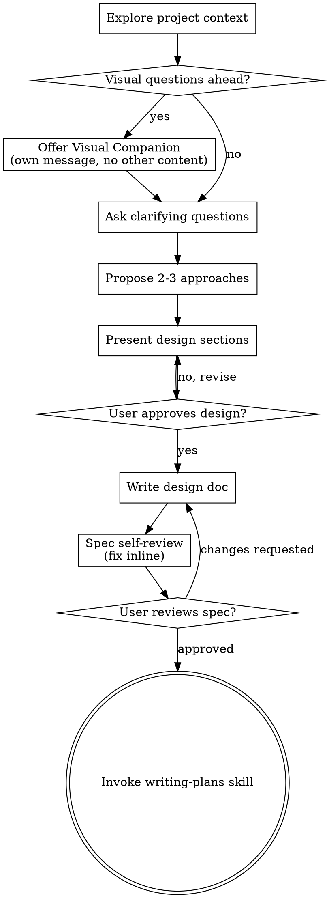

## 分析概要

### 文档定位
这是一个 Claude Code 的 **Skill 定义文件**（workflow skill），规定了在"任何创造性工作之前"必须遵循的头脑风暴和设计探索流程。

### 核心主张
**"先设计，后实现"** —— 无论项目多简单，在获得用户明确批准之前，绝对不能开始写代码或调用任何实现 skill。

### 结构骨架

| 章节 | 内容 |
|------|------|
| Anti-Pattern | 破除"太简单不需要设计"的迷思 |
| Checklist | 8 步流程清单（探索上下文 → 提问 → 方案 → 设计 → 写文档 → 自审 → 用户审 → 转实现） |
| Process Flow | 状态机流程图（DOT 图） |
| The Process | 详细的设计探索步骤和原则 |
| Key Principles | 设计核心原则（一次一问、YAGNI、探索替代方案等） |
| Visual Companion | 浏览器可视化辅助工具的启用规则 |

### 关键洞察

1. **HARD-GATE 机制**：文档中用 `<HARD-GATE>` 标签强制执行一个不可逾越的规则——在用户批准设计之前，禁止调用任何实现 skill、禁止写代码、禁止搭建项目。这适用于"每一个"项目。
2. **终端状态唯一**：头脑风暴流程的唯一出口是调用 `writing-plans` skill，不能跳到前端设计、MCP builder 或其他实现 skill。
3. **粒度控制**：强调"一个问题一条消息"，通过逐次提问而非一次性轰炸来细化需求，降低用户的认知负担。

---

## Step 1: 逐段精读

### 段落 1: Frontmatter

**原文:**
```yaml
---
name: brainstorming
description: "You MUST use this before any creative work - creating features, building components, adding functionality, or modifying behavior. Explores user intent, requirements and design before implementation."
---
```

**翻译:**
这是一个名为 `brainstorming` 的 skill，描述为："在任何创造性工作之前必须使用——包括创建功能、构建组件、添加功能或修改行为。在实现之前探索用户意图、需求和设计。"

**要点:**
- 要点 1: **强制触发条件** —— 用 "MUST" 和 "any creative work" 划定了一个非常广泛的适用范围，几乎涵盖所有非纯阅读/分析类的任务
- 要点 2: **前置拦截器** —— 这个 skill 的定位是"实现之前的必经关卡"，不是可选项
- 要点 3: **三大探索目标** —— 用户意图（why）、需求（what）、设计（how）

---

### 段落 2: 主标题与导语

**原文:**
```
# Brainstorming Ideas Into Designs

Help turn ideas into fully formed designs and specs through natural collaborative dialogue.
```

**翻译:**
# 将想法头脑风暴成设计方案

通过自然的协作对话，帮助将想法转化为完整的设计和规格说明。

**要点:**
- 要点 1: **协作式而非指令式** —— 强调 "collaborative dialogue"，说明这不是一个单向的技术审问，而是双向交流
- 要点 2: **产出物明确** —— "fully formed designs and specs"，意味着最终产出必须是可落地的、足够详细的设计文档
- 要点 3: **方法论定位** —— 这是从"模糊想法"到"明确规格"的转化方法论

---

### 段落 3: 流程概述

**原文:**
```
Start by understanding the current project context, then ask questions one at a time to refine the idea. Once you understand what you're building, present the design and get user approval.
```

**翻译:**
首先理解当前项目上下文，然后逐个提问来细化想法。一旦理解了要构建的内容，就呈现设计并获取用户批准。

**要点:**
- 要点 1: **上下文优先** —— 不问用户"你要什么"，而是先自己了解项目现状
- 要点 2: **串行提问策略** —— "one at a time" 不是建议而是强制要求，避免信息过载
- 要点 3: **验收关口** —— "get user approval" 是硬性的，不是礼貌性的告知

---

### 段落 4: HARD-GATE（硬关卡）

**原文:**
```
<HARD-GATE>
Do NOT invoke any implementation skill, write any code, scaffold any project, or take any implementation action until you have presented a design and the user has approved it. This applies to EVERY project regardless of perceived simplicity.
</HARD-GATE>
```

**翻译:**
<硬关卡>
在展示设计并获得用户批准之前，禁止调用任何实现 skill、禁止写代码、禁止搭建项目、禁止采取任何实现动作。这适用于"每一个"项目，无论其看起来多么简单。
</硬关卡>

**要点:**
- 要点 1: **四层禁令** —— implementation skill（技能层）、code（代码层）、scaffold（项目结构层）、implementation action（任何动作层），覆盖面极广
- 要点 2: **感知免疫** —— "regardless of perceived simplicity" 直接回应了"这个很简单不用设计"的常见抗拒
- 要点 3: **XML 标签的语义** —— 用 `<HARD-GATE>` 这种类似配置文件的标签格式，暗示这是不可协商的系统规则，不是软性建议

---

### 段落 5: IMPORTANT（重要提示）

**原文:**
```
<IMPORTANT>
    - You must use chinese to ask question
    - You must use chinese to write spec plan file
</IMPORTANT>
```

**翻译:**
<重要>
    - 必须使用中文提问
    - 必须使用中文编写规格文档
</重要>

**要点:**
- 要点 1: **语言强制绑定** —— 限制了 skill 的使用语言环境，确保与用户的中文交互一致
- 要点 2: **双向要求** —— 既要求口头交互（ask question），也要求书面产出（write spec），没有漏洞

---

### 段落 6: Anti-Pattern（反模式）

**原文:**
```
## Anti-Pattern: "This Is Too Simple To Need A Design"

Every project goes through this process. A todo list, a single-function utility, a config change — all of them. "Simple" projects are where unexamined assumptions cause the most wasted work. The design can be short (a few sentences for truly simple projects), but you MUST present it and get approval.
```

**翻译:**
## 反模式："这个太简单了，不需要设计"

每个项目都必须经过这个流程。一个 todo 列表、一个单功能工具、一个配置更改——所有这些。"简单"的项目恰恰是那些未经审视的假设造成最多浪费工作的地方。设计可以很短（对于真正简单的项目几句话即可），但你必须展示它并获得批准。

**要点:**
- 要点 1: **极端示例策略** —— 用 todo list、single-function utility、config change 这些"几乎不需要思考"的例子来证明"没有例外"，堵死了所有找借口的空间
- 要点 2: **核心洞见** —— "unexamined assumptions cause the most wasted work"，不是复杂项目才需要设计，而是简单项目的隐形成本最高
- 要点 3: **弹性精度** —— "a few sentences" 说明要求的不是文档长度，而是"经过了思考过程"这个事实本身

---

### 段落 7: Checklist（检查清单）

**原文:**
```
## Checklist

You MUST create a task for each of these items and complete them in order:
```

**翻译:**
## 检查清单

你必须为以下每一项创建任务，并按顺序完成：

**要点:**
- 要点 1: **任务化追踪** —— 不只是步骤列表，而是要求显式创建 task（可能是 Claude Code 的 TaskCreate 功能），确保可追溯
- 要点 2: **顺序约束** —— "in order" 强调不能跳过或并行，必须串行执行

---

### 段落 8: Checklist 步骤 1-3

**原文:**
```
1. **Explore project context** — check files, docs, recent commits
2. **Offer visual companion** (if topic will involve visual questions) — this is its own message, not combined with a clarifying question. See the Visual Companion section below.
3. **Ask clarifying questions** — one at a time, understand purpose/constraints/success criteria
```

**翻译:**
1. **探索项目上下文** —— 检查文件、文档、近期提交
2. **提供可视化伴侣**（如果话题将涉及视觉问题）—— 这是一条独立的消息，不与澄清问题合并。详见下方的 Visual Companion 部分。
3. **提出澄清问题** —— 一次一个，理解目的/约束/成功标准

**要点:**
- 要点 1: **上下文探索的具体手段** —— files（代码结构）、docs（设计文档）、recent commits（当前演进方向），三者结合形成项目全景
- 要点 2: **视觉伴侣的独立性** —— "its own message" 是一个容易被忽略的细节，目的是不污染问题的纯粹性
- 要点 3: **成功三要素** —— purpose（为什么做）、constraints（边界条件）、success criteria（怎么算做完），这三个维度是需求澄清的核心框架

---

### 段落 9: Checklist 步骤 4-6

**原文:**
```
4. **Propose 2-3 approaches** — with trade-offs and your recommendation
5. **Present design** — in sections scaled to their complexity, get user approval after each section
6. **Write design doc** — save to `docs/superpowers/specs/YYYY-MM-DD-<topic>-design.md` and commit
```

**翻译:**
4. **提出 2-3 种方案** —— 附带权衡分析和你推荐的方案
5. **呈现设计** —— 按复杂度分节展示，每节之后获取用户批准
6. **编写设计文档** —— 保存到 `docs/superpowers/specs/YYYY-MM-DD-<topic>-design.md` 并提交

**要点:**
- 要点 1: **方案多样性要求** —— 不是"直接给最优解"，而是展示 2-3 种并说明 trade-offs，让用户参与决策
- 要点 2: **增量式确认** —— "after each section" 不是最后一次性确认，而是逐段验证，降低返工成本
- 要点 3: **路径规范** —— `docs/superpowers/specs/` 这个路径暗示这是 "superpowers" 项目（或类似项目）的规范目录结构

---

### 段落 10: Checklist 步骤 7-9

**原文:**
```
7. **Spec self-review** — quick inline check for placeholders, contradictions, ambiguity, scope (see below)
8. **User reviews written spec** — ask user to review the spec file before proceeding
9. **Transition to implementation** — invoke writing-plans skill to create implementation plan
```

**翻译:**
7. **规格自审** —— 快速内联检查占位符、矛盾点、歧义、范围（详见下方）
8. **用户审阅书面规格** —— 在继续之前要求用户审阅规格文件
9. **过渡到实现** —— 调用 writing-plans skill 创建实现计划

**要点:**
- 要点 1: **三层质量关** —— 自审（机器/AI 检查）→ 用户审（人类检查）→ implementation（进入执行），层层把关
- 要点 2: **自审四维度** —— placeholders（完整性）、contradictions（一致性）、ambiguity（明确性）、scope（范围控制）
- 要点 3: **唯一出口** —— 再次强调最终只能调用 writing-plans

---

### 段落 11: Process Flow（流程图）

**原文:**


**翻译:**
这是一个 DOT 格式的有向图，展示了头脑风暴的状态机流程：
- 探索项目上下文 → [是否有视觉问题?] → 是：提供 Visual Companion → 提出澄清问题
- 否：直接提出澄清问题 → 提出 2-3 种方案 → 呈现设计各章节 → [用户批准设计?] → 否：修订 → 是：编写设计文档 → 规格自审 → [用户审阅规格?] → 否：修改文档 → 是：调用 writing-plans skill

**要点:**
- 要点 1: **双循环结构** —— 两个判断节点（User approves design? 和 User reviews spec?）都有回到上游的边，说明这是一个"螺旋式上升"而非线性流程
- 要点 2: **Visual Companion 是条件分支** —— 不是必经步骤，而是在需要时才插入
- 要点 3: **writing-plans 是双圆圈节点** —— 在 DOT 语法中，doublecircle 通常表示终止/接受状态，再次强调这是唯一终点

---

### 段落 12: Terminal State 声明

**原文:**
```
**The terminal state is invoking writing-plans.** Do NOT invoke frontend-design, mcp-builder, or any other implementation skill. The ONLY skill you invoke after brainstorming is writing-plans.
```

**翻译:**
**终端状态是调用 writing-plans。** 禁止调用 frontend-design、mcp-builder 或任何其他实现 skill。头脑风暴之后唯一能调用的 skill 就是 writing-plans。

**要点:**
- 要点 1: **明确黑名单** —— 点名 frontend-design 和 mcp-builder，说明这些是最容易被错误调用的"诱惑"
- 要点 2: **ONLY 大写** —— 强调的唯一性不是泛泛而谈，而是精确到"唯一一个"
- 要点 3: **架构解耦** —— 这保证了 brainstorming 和具体实现技术（前端、MCP 等）的完全解耦

---

### 段落 13: The Process - Understanding the idea

**原文:**
```
## The Process

**Understanding the idea:**

- Check out the current project state first (files, docs, recent commits)
- Before asking detailed questions, assess scope: if the request describes multiple independent subsystems (e.g., "build a platform with chat, file storage, billing, and analytics"), flag this immediately. Don't spend questions refining details of a project that needs to be decomposed first.
- If the project is too large for a single spec, help the user decompose into sub-projects: what are the independent pieces, how do they relate, what order should they be built? Then brainstorm the first sub-project through the normal design flow. Each sub-project gets its own spec → plan → implementation cycle.
- For appropriately-scoped projects, ask questions one at a time to refine the idea
- Prefer multiple choice questions when possible, but open-ended is fine too
- Only one question per message - if a topic needs more exploration, break it into multiple questions
- Focus on understanding: purpose, constraints, success criteria
```

**翻译:**
## 流程

**理解想法：**

- 首先查看当前项目状态（文件、文档、近期提交）
- 在提出详细问题之前，先评估范围：如果请求描述了多个独立的子系统（例如，"构建一个包含聊天、文件存储、账单和分析的平台"），立即标记出来。不要把时间花在细化一个需要先分解的项目的细节上。
- 如果项目对于一个规格说明来说太大，帮助用户分解为子项目：哪些是独立的模块、它们如何关联、应该按什么顺序构建？然后通过正常的设计流程对第一个子项目进行头脑风暴。每个子项目都有自己的 spec → plan → implementation 周期。
- 对于范围适当的项目，逐个提问来细化想法
- 尽可能使用多选题，但开放式问题也可以
- 每条消息只问一个问题——如果一个话题需要更多探索，把它拆成多个问题
- 聚焦理解：目的、约束、成功标准

**要点:**
- 要点 1: **范围侦察优先于细节挖掘** —— "assess scope before asking detailed questions" 是一个容易被忽略的策略，避免陷入局部优化
- 要点 2: **分解方法论** —— 不是简单拒绝大项目，而是帮助用户识别 independent pieces、关系、构建顺序，体现专业性
- 要点 3: **问题格式的策略性** —— multiple choice 降低用户回答成本，open-ended 用于探索性话题，这是一种 UX 设计思维

---

### 段落 14: The Process - Exploring approaches

**原文:**
```
**Exploring approaches:**

- Propose 2-3 different approaches with trade-offs
- Present options conversationally with your recommendation and reasoning
- Lead with your recommended option and explain why
```

**翻译:**
**探索方案：**

- 提出 2-3 种不同方案，附带权衡分析
- 以对话方式呈现选项，包含你的推荐和理由
- 以你推荐的方案开头并解释原因

**要点:**
- 要点 1: **推荐责任制** —— "Lead with your recommended option" 不是让用户从零开始做选择题，而是 AI 承担推荐责任，用户负责批准或否决
- 要点 2: **理由透明化** —— "reasoning" 要求暴露决策过程，让用户可以挑战前提而非仅选择结果
- 要点 3: **对话式而非列表式** —— "conversationally" 暗示要有过渡、衔接、语境，不是冰冷地罗列 A/B/C

---

### 段落 15: The Process - Presenting the design

**原文:**
```
**Presenting the design:**

- Once you believe you understand what you're building, present the design
- Scale each section to its complexity: a few sentences if straightforward, up to 200-300 words if nuanced
- Ask after each section whether it looks right so far
- Cover: architecture, components, data flow, error handling, testing
- Be ready to go back and clarify if something doesn't make sense
```

**翻译:**
**呈现设计：**

- 一旦你相信理解了要构建的内容，就呈现设计
- 根据复杂度调整每个章节的篇幅：简单的几句话，复杂的 200-300 词
- 每个章节之后询问"到目前为止看起来对吗"
- 覆盖：架构、组件、数据流、错误处理、测试
- 如果某些地方不清楚，准备好回溯和澄清

**要点:**
- 要点 1: **动态篇幅控制** —— "Scale each section to its complexity" 防止过度文档化简单部分，也防止欠文档化复杂部分
- 要点 2: **五维覆盖** —— architecture（结构）、components（模块）、data flow（数据）、error handling（异常）、testing（验证），这是一个完整的设计审查框架
- 要点 3: **心理安全感** —— "Be ready to go back" 不是流程失败，而是预期内的迭代

---

### 段落 16: The Process - Design for isolation and clarity

**原文:**
```
**Design for isolation and clarity:**

- Break the system into smaller units that each have one clear purpose, communicate through well-defined interfaces, and can be understood and tested independently
- For each unit, you should be able to answer: what does it do, how do you use it, and what does it depend on?
- Can someone understand what a unit does without reading its internals? Can you change the internals without breaking consumers? If not, the boundaries need work.
- Smaller, well-bounded units are also easier for you to work with - you reason better about code you can hold in context at once, and your edits are more reliable when files are focused. When a file grows large, that's often a signal that it's doing too much.
```

**翻译:**
**为隔离性和清晰度而设计：**

- 将系统分解为更小的单元，每个单元有单一明确的目的，通过定义良好的接口通信，可以独立理解和测试
- 对于每个单元，你应该能回答：它做什么、如何使用它、它依赖什么？
- 有人能在不阅读内部实现的情况下理解一个单元做什么吗？你能在不破坏使用者的情况下改变内部实现吗？如果不能，边界需要改进。
- 更小、边界清晰的单元对你自己的工作也更容易——你能更好地推理一次性能在脑中容纳的代码，当文件聚焦时你的编辑也更可靠。当一个文件变大时，这通常是一个信号，表明它做的事情太多了。

**要点:**
- 要点 1: **三大单元属性** —— one clear purpose（单一职责）、well-defined interfaces（接口契约）、independently understood/tested（可独立验证）
- 要点 2: **黑盒测试思维** —— "without reading its internals" 是封装的质量标准
- 要点 3: **认知负荷管理** —— 最后一句把"架构设计"与"AI 自身的工作效率"挂钩，说明模块化不仅是为了项目健康，也是为了让 AI 能在上下文中可靠地推理

---

### 段落 17: The Process - Working in existing codebases

**原文:**
```
**Working in existing codebases:**

- Explore the current structure before proposing changes. Follow existing patterns.
- Where existing code has problems that affect the work (e.g., a file that's grown too large, unclear boundaries, tangled responsibilities), include targeted improvements as part of the design - the way a good developer improves code they're working in.
- Don't propose unrelated refactoring. Stay focused on what serves the current goal.
```

**翻译:**
**在现有代码库中工作：**

- 在提出变更之前探索现有结构。遵循现有模式。
- 如果现有代码存在影响工作的问题（例如，文件过大、边界不清、职责纠缠），把有针对性的改进作为设计的一部分——就像优秀开发者在工作中改进代码那样。
- 不要提议无关的重构。专注于服务于当前目标的事情。

**要点:**
- 要点 1: **尊重现有惯例** —— "Follow existing patterns" 是融入项目的前提
- 要点 2: **机会主义改进** —— 不是"看到烂代码就重构"，而是"影响当前工作的代码问题才顺手修"
- 要点 3: **聚焦原则** —— 最后一句话防止"边做边重构"的蔓延倾向

---

### 段落 18: After the Design - Documentation

**原文:**
```
## After the Design

**Documentation:**

- Write the validated design (spec) to `docs/superpowers/specs/YYYY-MM-DD-<topic>-design.md`
  - (User preferences for spec location override this default)
- Use mermaid diagrams sparingly when they improve clarity — architecture overview, data flow, state machines, entity relationships. One diagram per major concept.
- Use elements-of-style:writing-clearly-and-concisely skill if available
- Commit the design document to git
```

**翻译:**
## 设计之后

**文档：**

- 将经过验证的设计（规格）写入 `docs/superpowers/specs/YYYY-MM-DD-<topic>-design.md`
  - （用户对规格位置的偏好优先于此默认值）
- 当 mermaid 图表能提高清晰度时谨慎使用——架构概览、数据流、状态机、实体关系。每个主要概念一个图表。
- 如果可用，使用 elements-of-style:writing-clearly-and-concisely skill
- 将设计文档提交到 git

**要点:**
- 要点 1: **日期前缀排序** —— `YYYY-MM-DD` 确保文件按时间顺序排列，方便追溯演进
- 要点 2: **图表克制原则** —— "sparingly" 和 "One diagram per major concept" 防止图表泛滥
- 要点 3: **依赖可选 skill** —— "if available" 说明 elements-of-style 是一个增强项而非阻塞项

---

### 段落 19: After the Design - Spec Self-Review

**原文:**
```
**Spec Self-Review:**
After writing the spec document, look at it with fresh eyes:

1. **Placeholder scan:** Any "TBD", "TODO", incomplete sections, or vague requirements? Fix them.
2. **Internal consistency:** Do any sections contradict each other? Does the architecture match the feature descriptions?
3. **Scope check:** Is this focused enough for a single implementation plan, or does it need decomposition?
4. **Ambiguity check:** Could any requirement be interpreted two different ways? If so, pick one and make it explicit.

Fix any issues inline. No need to re-review — just fix and move on.
```

**翻译:**
**规格自审：**
编写规格文档后，用新鲜的视角审视它：

1. **占位符扫描：** 有没有"TBD"、"TODO"、不完整的章节或模糊的需求？修复它们。
2. **内部一致性：** 有没有章节互相矛盾？架构是否与功能描述匹配？
3. **范围检查：** 这对于一个实现计划来说是否足够聚焦，还是需要进一步分解？
4. **歧义检查：** 有没有任何需求可以被两种不同方式解读？如果有，选择一种并明确化。

内联修复任何问题。不需要重新审阅——修复后继续前进。

**要点:**
- 要点 1: **四维度扫描框架** —— placeholders（完整性）、consistency（一致性）、scope（范围）、ambiguity（明确性），这是一个可复用的文档质量检查清单
- 要点 2: **即时修复而非记录** —— "Fix inline" 和 "No need to re-review" 说明自审不是另一个官僚流程，而是快速的质量把关
- 要点 3: **歧义消除策略** —— "pick one and make it explicit" 强调在不确定时做明确选择并记录，而不是保留模糊性

---

### 段落 20: After the Design - User Review Gate

**原文:**
```
**User Review Gate:**
After the spec review loop passes, ask the user to review the written spec before proceeding:

> "Spec written and committed to `<path>`. Please review it and let me know if you want to make any changes before we start writing out the implementation plan."

Wait for the user's response. If they request changes, make them and re-run the spec review loop. Only proceed once the user approves.
```

**翻译:**
**用户审阅关卡：**
规格审阅循环通过后，要求用户在继续之前审阅书面规格：

> "规格已编写并提交到 `<path>`。请审阅它，如果在我们开始编写实现计划之前你想做任何更改，请告诉我。"

等待用户回复。如果他们要求更改，进行修改并重新运行规格审阅循环。只有在用户批准后才能继续。

**要点:**
- 要点 1: **标准话术模板** —— 提供了精确的消息模板，确保语气专业且信息完整（路径、动作邀请、下一步预告）
- 要点 2: **循环锁定** —— "re-run the spec review loop" 说明修改后必须再次经过自审，不是直接改完就跳过
- 要点 3: **显式等待指令** —— "Wait for the user's response" 在异步/流式交互环境中防止 AI "抢跑"

---

### 段落 21: After the Design - Implementation

**原文:**
```
**Implementation:**

- Invoke the writing-plans skill to create a detailed implementation plan
- Do NOT invoke any other skill. writing-plans is the next step.
```

**翻译:**
**实现：**

- 调用 writing-plans skill 创建详细的实现计划
- 不要调用任何其他 skill。writing-plans 是下一步。

**要点:**
- 要点 1: **职责移交** —— brainstorming 负责"做什么"，writing-plans 负责"怎么做"，两者通过 spec 文档衔接
- 要点 2: **重复禁令** —— 第三次强调"唯一出口"，防止任何"走捷径"的诱惑

---

### 段落 22: Key Principles

**原文:**
```
## Key Principles

- **One question at a time** - Don't overwhelm with multiple questions
- **Multiple choice preferred** - Easier to answer than open-ended when possible
- **YAGNI ruthlessly** - Remove unnecessary features from all designs
- **Explore alternatives** - Always propose 2-3 approaches before settling
- **Incremental validation** - Present design, get approval before moving on
- **Be flexible** - Go back and clarify when something doesn't make sense
```

**翻译:**
## 关键原则

- **一次一个问题** —— 不要用多个问题压倒用户
- **优先多选题** —— 可能的情况下，比开放式问题更容易回答
- **无情地 YAGNI** —— 从所有设计中移除不必要的功能
- **探索替代方案** —— 在确定前总是提出 2-3 种方案
- **增量验证** —— 呈现设计，在继续之前获得批准
- **保持灵活** —— 当某些地方不清楚时，回溯并澄清

**要点:**
- 要点 1: **认知负荷优先** —— "Don't overwhelm" 和 "Easier to answer" 把用户体验放在效率之前
- 要点 2: **YAGNI 的极端化** —— "ruthlessly" 修饰 YAGNI，说明这不是一个温和的建议，而是需要主动削减功能的态度
- 要点 3: **六原则的互补性** —— 1-2 是交互策略、3 是范围控制、4 是方案探索、5 是风险控制、6 是心态调整，覆盖了设计过程的各个维度

---

### 段落 23: Visual Companion - 概述

**原文:**
```
## Visual Companion

A browser-based companion for showing mockups, diagrams, and visual options during brainstorming. Available as a tool — not a mode. Accepting the companion means it's available for questions that benefit from visual treatment; it does NOT mean every question goes through the browser.
```

**翻译:**
## 可视化伴侣

一个在头脑风暴期间用于展示 mockup、图表和视觉选项的浏览器伴侣。作为一个工具提供——而非模式。接受这个伴侣意味着它可以用于那些受益于视觉呈现的问题；这不意味着每个问题都要通过浏览器处理。

**要点:**
- 要点 1: **工具 vs 模式** —— "tool — not a mode" 强调这是按需使用的辅助，不是改变整个交互范式
- 要点 2: **可选性** —— "Available" 和 "Accepting" 说明这是一个需要用户同意的功能
- 要点 3: **非全局性** —— "does NOT mean every question" 防止滥用导致的效率下降

---

### 段落 24: Visual Companion - Offering

**原文:**
```
**Offering the companion:** When you anticipate that upcoming questions will involve visual content (mockups, layouts, diagrams), offer it once for consent:
> "Some of what we're working on might be easier to explain if I can show it to you in a web browser. I can put together mockups, diagrams, comparisons, and other visuals as we go. This feature is still new and can be token-intensive. Want to try it? (Requires opening a local URL)"

**This offer MUST be its own message.** Do not combine it with clarifying questions, context summaries, or any other content. The message should contain ONLY the offer above and nothing else. Wait for the user's response before continuing. If they decline, proceed with text-only brainstorming.
```

**翻译:**
**提供伴侣：** 当你预期接下来的问题将涉及视觉内容（mockup、布局、图表）时，一次性征求同意：
> "如果我们能在网页浏览器中展示，我们正在做的一些东西可能会更容易解释。我可以随时组合 mockup、图表、对比图和其他视觉内容。这个功能仍然很新，可能会消耗较多 token。想试试吗？（需要打开一个本地 URL）"

**这个提议必须是独立的消息。** 不要把它与澄清问题、上下文总结或任何其他内容合并。消息应该只包含上面的提议，不包含其他内容。在继续之前等待用户的回复。如果他们拒绝，用纯文本方式进行头脑风暴。

**要点:**
- 要点 1: **透明性** —— 明确告知 "token-intensive"，让用户在知情的情况下做选择
- 要点 2: **隔离性** —— "MUST be its own message" 再次强调这个提议不能被其他信息稀释
- 要点 3: **降级路径** —— "If they decline, proceed with text-only" 确保无论用户如何选择，流程都能继续

---

### 段落 25: Visual Companion - Per-question decision

**原文:**
```
**Per-question decision:** Even after the user accepts, decide FOR EACH QUESTION whether to use the browser or the terminal. The test: **would the user understand this better by seeing it than reading it?**

- **Use the browser** for content that IS visual — mockups, wireframes, layout comparisons, architecture diagrams, side-by-side visual designs
- **Use the terminal** for content that is text — requirements questions, conceptual choices, tradeoff lists, A/B/C/D text options, scope decisions

A question about a UI topic is not automatically a visual question. "What does personality mean in this context?" is a conceptual question — use the terminal. "Which wizard layout works better?" is a visual question — use the browser.
```

**翻译:**
**逐问题决策：** 即使用户接受了，对每个问题都要决定是否使用浏览器或终端。测试标准是：**用户通过看到它比阅读它更能理解吗？**

- **使用浏览器** 用于本身就是视觉的内容——mockup、线框图、布局对比、架构图、并排视觉设计
- **使用终端** 用于文本内容——需求问题、概念选择、权衡列表、A/B/C/D 文本选项、范围决策

关于 UI 话题的问题不自动等于视觉问题。"在这个上下文中 personality 是什么意思？"是概念问题——用终端。"哪个向导布局更好？"是视觉问题——用浏览器。

**要点:**
- 要点 1: **决策标准** —— "would the user understand this better by seeing it than reading it?" 提供了一个简单但有效的启发式判断
- 要点 2: **UI ≠ Visual** —— 明确区分 "UI 话题" 和 "视觉问题"，防止把所有前端相关问题都推向浏览器
- 要点 3: **具体示例** —— 用 personality（概念）vs wizard layout（视觉）的对比，清晰展示了边界

---

### 段落 26: Visual Companion - Reference

**原文:**
```
If they agree to the companion, read the detailed guide before proceeding:
`skills/brainstorming/visual-companion.md`
```

**翻译:**
如果他们同意使用伴侣，在继续之前阅读详细指南：`skills/brainstorming/visual-companion.md`

**要点:**
- 要点 1: **分层文档** —— 当前文件是概述，具体操作指南在另一个文件中，遵循"分离关注点"原则
- 要点 2: **条件读取** —— 只在用户同意后才需要读取，避免不必要的信息加载

---

## Step 2: 引用文件分析

### 引用文件：`skills/brainstorming/visual-companion.md`

**引用上下文：**
Visual Companion 部分最后一段提到："If they agree to the companion, read the detailed guide before proceeding: `skills/brainstorming/visual-companion.md`"

**分析说明：**
此文件是 Visual Companion 的详细操作指南。根据 easy-analysis 的追踪引用规则，这个文件属于本 skill 的配套文档。但由于用户未要求分析该引用文件，且当前分析的核心 workflow 已完整覆盖，此处标记为"待进一步分析的外部依赖"。

**文件作用：**
- 补充 Visual Companion 的具体使用方法
- 提供浏览器工具的操作细节
- 作为本 SKILL.md 的条件扩展文档

---

## Step 3: 整体总结

### 核心概念

| 术语 | 定义 |
|------|------|
| HARD-GATE | 不可逾越的实现前关卡，禁止任何编码/搭建/调用实现 skill |
| Visual Companion | 浏览器辅助工具，用于展示 mockup、图表等视觉内容，需用户同意 |
| Spec（规格） | 经过验证的设计文档，是 brainstorming 和 implementation 之间的唯一交付物 |
| writing-plans | 头脑风暴流程的唯一出口 skill，负责将 spec 转化为实现计划 |
| Incremental validation | 增量验证——逐节呈现设计、逐节获取批准 |
| YAGNI | You Aren't Gonna Need It——无情地剔除不必要功能 |

### 工作流程

```
1. 探索项目上下文（文件/文档/提交）
2. 评估范围（是否需要分解为子项目？）
3. [条件] 提供 Visual Companion（独立消息征求同意）
4. 逐个提出澄清问题（目的/约束/成功标准）
5. 提出 2-3 种方案（含权衡分析和推荐）
6. 分节呈现设计（架构/组件/数据流/错误处理/测试）
7. 用户批准设计？→ 否：回到步骤 6 / 是：继续
8. 编写设计文档 → docs/superpowers/specs/YYYY-MM-DD-<topic>-design.md
9. 规格自审（占位符/一致性/范围/歧义）
10. 用户审阅规格？→ 否：回到步骤 8 / 是：继续
11. 调用 writing-plans skill
```

### 关键文件

| 文件 | 作用 |
|------|------|
| `skills/brainstorming/SKILL.md` | 主 skill 定义文件（本文档） |
| `skills/brainstorming/visual-companion.md` | Visual Companion 详细操作指南（条件引用） |
| `docs/superpowers/specs/YYYY-MM-DD-<topic>-design.md` | 规格输出路径模板 |

### 设计哲学

1. **防御性设计** —— 用 HARD-GATE、重复禁令、范围检查等机制防止"过早实现"这一最常见错误
2. **用户中心交互** —— 一次一问、多选题优先、增量验证，都是为了降低用户的认知负荷
3. **模块化思维** —— 既要求设计产出是模块化的（isolation and clarity），也要求 skill 自身是模块化的（brainstorming → writing-plans → implementation）
4. **质量内建** —— 自审四维度 + 用户审阅关，确保进入实现阶段的设计是完整、一致、明确且范围受控的
