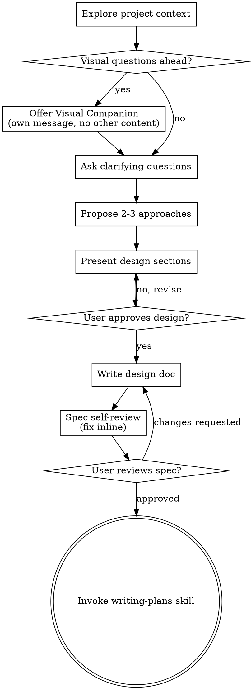

# Brainstorming Skill 分析报告

## 段落 1

**原文:**
```yaml
---
name: brainstorming
description: "You MUST use this before any creative work - creating features, building components, adding functionality, or modifying behavior. Explores user intent, requirements and design before implementation."
---
```

**翻译:**
```yaml
---
name: brainstorming
description: "在任何创意工作之前必须使用此技能 —— 包括创建功能、构建组件、添加功能或修改行为。在实现之前探索用户意图、需求和设计。"
---
```

**要点:**
- Skill 名称为 `brainstorming`
- **强制执行原则**：在任何创意工作之前必须使用，不可跳过
- 适用场景：创建功能、构建组件、添加功能、修改行为
- 核心目的：在实现之前探索用户意图、需求和设计

---

## 段落 2

**原文:**
# Brainstorming Ideas Into Designs

Help turn ideas into fully formed designs and specs through natural collaborative dialogue.

Start by understanding the current project context, then ask questions one at a time to refine the idea. Once you understand what you're building, present the design and get user approval.

**翻译:**
# 将想法头脑风暴转化为设计

通过自然协作对话帮助将想法转化为完整的设计和规范文档。

首先理解当前项目上下文，然后逐个提出问题来完善想法。一旦理解你要构建的内容，呈现设计并获得用户批准。

**要点:**
- **目标**：将模糊的想法转化为完整的设计和规范
- **方法**：自然协作对话
- **流程**：理解上下文 → 逐个提问 → 呈现设计 → 获得批准
- **核心理念**：先理解，再实现

---

## 段落 3

**原文:**
<HARD-GATE>
Do NOT invoke any implementation skill, write any code, scaffold any project, or take any implementation action until you have presented a design and the user has approved it. This applies to EVERY project regardless of perceived simplicity.
</HARD-GATE>

**翻译:**
<HARD-GATE>
在呈现设计并获得用户批准之前，**不要**调用任何实现类 skill、编写任何代码、搭建任何项目或采取任何实现行动。这适用于**每个项目**，无论看起来多么简单。
</HARD-GATE>

**要点:**
- **硬性门槛（HARD-GATE）**：设计批准前禁止任何实现行动
- **禁用动作**：
  - 调用实现类 skill
  - 编写代码
  - 搭建项目
  - 采取实现行动
- **无例外原则**：无论项目多简单都必须走此流程
- 这是一个**强制安全门**，防止过早进入实现

---

## 段落 4

**原文:**
<IMPORTANT>
    - You must use chinese to ask question
    - You must use chinese to write spec plan file
</IMPORTANT>

**翻译:**
<IMPORTANT>
    - 你必须使用中文提问
    - 你必须使用中文编写规范文档
</IMPORTANT>

**要点:**
- **语言要求**：中文（针对中文用户）
- 提问必须用中文
- 规范文档必须用中文编写

---

## 段落 5

**原文:**
## Anti-Pattern: "This Is Too Simple To Need A Design"

Every project goes through this process. A todo list, a single-function utility, a config change — all of them. "Simple" projects are where unexamined assumptions cause the most wasted work. The design can be short (a few sentences for truly simple projects), but you MUST present it and get approval.

**翻译:**
## 反模式："这太简单了，不需要设计"

每个项目都要经过这个过程。待办列表、单功能工具、配置更改 —— 全都一样。"简单"项目恰恰是未经检验的假设造成最多浪费工作的地方。设计可以很短（对于真正简单的项目，几句话就行），但你**必须**呈现它并获得批准。

**要点:**
- **反模式警告**：不要以"太简单"为由跳过设计流程
- **核心洞察**：简单项目更容易因假设未经检验而浪费工作
- **灵活处理**：简单项目的设计可以很短（几句话）
- **不可跳过**：即使设计很短，也必须呈现并获得批准

---

## 段落 6

**原文:**
## Checklist

You MUST create a task for each of these items and complete them in order:

1. **Explore project context** — check files, docs, recent commits
2. **Offer visual companion** (if topic will involve visual questions) — this is its own message, not combined with a clarifying question. See the Visual Companion section below.
3. **Ask clarifying questions** — one at a time, understand purpose/constraints/success criteria
4. **Propose 2-3 approaches** — with trade-offs and your recommendation
5. **Present design** — in sections scaled to their complexity, get user approval after each section
6. **Write design doc** — save to `docs/superpowers/specs/YYYY-MM-DD-<topic>-design.md` and commit
7. **Spec self-review** — quick inline check for placeholders, contradictions, ambiguity, scope (see below)
8. **User reviews written spec** — ask user to review the spec file before proceeding
9. **Transition to implementation** — invoke writing-plans skill to create implementation plan

**翻译:**
## 检查清单

你必须为每个项目创建任务并按顺序完成：

1. **探索项目上下文** — 检查文件、文档、最近的提交
2. **提供视觉伴侣**（如果主题涉及视觉问题）— 这是单独的一条消息，不要与澄清问题合并。详见下面的视觉伴侣章节。
3. **提出澄清问题** — 逐个提问，理解目的/约束/成功标准
4. **提出 2-3 种方案** — 包含权衡和你的推荐
5. **呈现设计** — 按复杂度分节呈现，每节后获得用户批准
6. **编写设计文档** — 保存到 `docs/superpowers/specs/YYYY-MM-DD-<topic>-design.md` 并提交
7. **规范自审** — 快速内联检查占位符、矛盾、歧义、范围（见下文）
8. **用户审核书面规范** — 要求用户在继续之前审核规范文件
9. **过渡到实现** — 调用 writing-plans skill 创建实施计划

**要点:**
- **9 步强制流程**：必须按顺序完成每一步
- **关键节点**：
  - 步骤 2：视觉伴侣是单独消息，不合并
  - 步骤 5：设计分节呈现，逐步获得批准
  - 步骤 6：保存到特定格式的文档
  - 步骤 7-8：双重审核机制
  - 步骤 9：只调用 writing-plans skill

---

## 段落 7

**原文:**
## Process Flow



**翻译:**
## 流程图

[流程图如上所示]

**要点:**
- **起点**：探索项目上下文
- **菱形判断节点**（需要决策）：
  - "有视觉问题吗？" → 是则提供视觉伴侣
  - "用户批准设计了吗？" → 否返回重做
  - "用户审核规范了吗？" → 有变更请求则重写
- **迭代循环**：
  - 设计批准前可以循环修改
  - 规范审核后可要求修改
- **终点**：调用 writing-plans skill（双圆圈标记）
- **唯一出口**：完成 brainstorming 后只能调用 writing-plans

---

## 段落 8

**原文:**
**The terminal state is invoking writing-plans.** Do NOT invoke frontend-design, mcp-builder, or any other implementation skill. The ONLY skill you invoke after brainstorming is writing-plans.

**翻译:**
**最终状态是调用 writing-plans。** 不要调用 frontend-design、mcp-builder 或任何其他实现类 skill。brainstorming 之后你唯一调用的 skill 是 writing-plans。

**要点:**
- **单一出口**： brainstorming 完成后只能调用 writing-plans
- **禁止调用**： frontend-design、mcp-builder 等实现类 skill
- **锁定原则**：确保从设计到实现的单一过渡点

---

## 段落 9

**原文:**
## The Process

**Understanding the idea:**

- Check out the current project state first (files, docs, recent commits)
- Before asking detailed questions, assess scope: if the request describes multiple independent subsystems (e.g., "build a platform with chat, file storage, billing, and analytics"), flag this immediately. Don't spend questions refining details of a project that needs to be decomposed first.
- If the project is too large for a single spec, help the user decompose into sub-projects: what are the independent pieces, how do they relate, what order should they be built? Then brainstorm the first sub-project through the normal design flow. Each sub-project gets its own spec → plan → implementation cycle.
- For appropriately-scoped projects, ask questions one at a time to refine the idea
- Prefer multiple choice questions when possible, but open-ended is fine too
- Only one question per message - if a topic needs more exploration, break it into multiple questions
- Focus on understanding: purpose, constraints, success criteria

**翻译:**
## 流程详解

**理解想法：**

- 首先检查当前项目状态（文件、文档、最近提交）
- 在提出详细问题之前，评估范围：如果请求描述了多个独立子系统（例如"构建一个包含聊天、文件存储、计费和分析的平台"），立即标记这一点。不要在需要首先分解的项目上花时间细化细节。
- 如果项目太大无法容纳在单一规范中，帮助用户分解为子项目：有哪些独立部分，它们如何关联，应该按什么顺序构建？然后通过正常的设计流程头脑风暴第一个子项目。每个子项目都有自己的 spec → plan → implementation 循环。
- 对于范围适当的项目，逐个提出问题来完善想法
- 尽可能使用多选问题，但开放式问题也可以
- 每条消息只问一个问题 —— 如果一个主题需要更多探索，分解为多个问题
- 专注于理解：目的、约束、成功标准

**要点:**
- **第一步永远是了解现状**：检查文件、文档、提交历史
- **范围评估前置**：多子系统项目必须先分解
- **分解策略**：独立部分 → 关联关系 → 构建顺序
- **提问规则**：
  - 一次只问一个问题
  - 优先多选
  - 分解复杂问题
- **理解重点**：目的、约束、成功标准

---

## 段落 10

**原文:**
**Exploring approaches:**

- Propose 2-3 different approaches with trade-offs
- Present options conversationally with your recommendation and reasoning
- Lead with your recommended option and explain why

**翻译:**
**探索方案：**

- 提出 2-3 种不同方案，包含权衡
- 以对话方式呈现选项，包含你的推荐和理由
- 首先展示你推荐的方案并解释原因

**要点:**
- **数量要求**：必须提出 2-3 种方案
- **内容要求**：必须包含权衡分析
- **呈现方式**：对话式，有推荐有理由
- **推荐前置**：把推荐方案放在最前面

---

## 段落 11

**原文:**
**Presenting the design:**

- Once you believe you understand what you're building, present the design
- Scale each section to its complexity: a few sentences if straightforward, up to 200-300 words if nuanced
- Ask after each section whether it looks right so far
- Cover: architecture, components, data flow, error handling, testing
- Be ready to go back and clarify if something doesn't make sense

**翻译:**
**呈现设计：**

- 一旦你认为理解了要构建的内容，就呈现设计
- 根据每部分的复杂度调整篇幅：简单的几句话，复杂的 200-300 词
- 每部分后询问"目前看起来对吗"
- 覆盖内容：架构、组件、数据流、错误处理、测试
- 准备好在内容不合理时返回澄清

**要点:**
- **呈现时机**：理解后立即呈现，不要拖延
- **篇幅弹性**：简单短，复杂长（200-300词）
- **互动确认**：每节后主动询问
- **覆盖范围**：5 个核心方面
- **迭代意愿**：随时准备返回澄清

---

## 段落 12

**原文:**
**Design for isolation and clarity:**

- Break the system into smaller units that each have one clear purpose, communicate through well-defined interfaces, and can be understood and tested independently
- For each unit, you should be able to answer: what does it do, how do you use it, and what does it depend on?
- Can someone understand what a unit does without reading its internals? Can you change the internals without breaking consumers? If not, the boundaries need work.
- Smaller, well-bounded units are also easier for you to work with - you reason better about code you can hold in context at once, and your edits are more reliable when files are focused. When a file grows large, that's often a signal that it's doing too much.

**翻译:**
**为隔离性和清晰度而设计：**

- 将系统拆分为更小的单元，每个单元只有一个清晰的目的，通过定义良好的接口通信，可以独立理解和测试
- 对于每个单元，你应该能够回答：它做什么，你怎么使用它，它依赖什么？
- 有人能够在不阅读内部实现的情况下理解一个单元做什么吗？你能在不破坏消费者的情况下更改内部实现吗？如果不能，边界需要调整。
- 更小、边界更清晰的单元也更容易让你工作 —— 你能更好地理解可以一口气掌握的代码，当文件专注于单一职责时，你的编辑也更可靠。当一个文件变得很大时，这通常是一个信号，表明它做得太多了。

**要点:**
- **单一职责**：每个单元只做一件事
- **接口清晰**：通过良好定义的接口通信
- **可独立理解**：不读内部也能知道外部行为
- **可独立测试**：单元之间解耦
- **三个问题检验**：做什么、用什么、依赖什么
- **文件膨胀是信号**：大文件通常意味着职责过多

---

## 段落 13

**原文:**
**Working in existing codebases:**

- Explore the current structure before proposing changes. Follow existing patterns.
- Where existing code has problems that affect the work (e.g., a file that's grown too large, unclear boundaries, tangled responsibilities), include targeted improvements as part of the design - the way a good developer improves code they're working in.
- Don't propose unrelated refactoring. Stay focused on what serves the current goal.

**翻译:**
**在现有代码库中工作：**

- 在提出变更之前先探索当前结构。遵循现有模式。
- 如果现有代码有问题影响工作（例如，文件变得太大、边界不清晰、职责纠缠不清），将针对性的改进作为设计的一部分 —— 就像一个优秀的开发者在工作时改进代码一样。
- 不要提议无关的重构。保持专注于为目标服务的内容。

**要点:**
- **先了解再提案**：探索现有结构
- **遵循现有模式**：保持一致性
- **改进要针对性**：只改影响当前工作的部分
- **不做无关重构**：保持聚焦当前目标

---

## 段落 14

**原文:**
## After the Design

**Documentation:**

- Write the validated design (spec) to `docs/superpowers/specs/YYYY-MM-DD-<topic>-design.md`
  - (User preferences for spec location override this default)
- Use elements-of-style:writing-clearly-and-concisely skill if available
- Commit the design document to git

**翻译:**
## 设计之后

**文档化：**

- 将经过验证的设计（规范）写入 `docs/superpowers/specs/YYYY-MM-DD-<topic>-design.md`
  - （用户对规范位置的偏好优先于此默认位置）
- 如果有的话，使用 elements-of-style:writing-clearly-and-concisely skill
- 将设计文档提交到 git

**要点:**
- **命名格式**：`YYYY-MM-DD-<topic>-design.md`
- **位置可覆盖**：用户偏好优先
- **使用写作风格 skill**：如果可用
- **必须提交 git**：确保版本控制

---

## 段落 15

**原文:**
**Spec Self-Review:**
After writing the spec document, look at it with fresh eyes:

1. **Placeholder scan:** Any "TBD", "TODO", incomplete sections, or vague requirements? Fix them.
2. **Internal consistency:** Do any sections contradict each other? Does the architecture match the feature descriptions?
3. **Scope check:** Is this focused enough for a single implementation plan, or does it need decomposition?
4. **Ambiguity check:** Could any requirement be interpreted two different ways? If so, pick one and make it explicit.

Fix any issues inline. No need to re-review — just fix and move on.

**翻译:**
**规范自审：**
写完规范文档后，用新鲜的眼光审视它：

1. **占位符扫描：** 是否有"TBD"、"TODO"、不完整的部分或模糊的需求？修复它们。
2. **内部一致性：** 是否有任何部分相互矛盾？架构是否与功能描述匹配？
3. **范围检查：** 这是否足够专注，可以容纳在单一实施计划中，还是需要分解？
4. **歧义检查：** 是否有任何需求可以有两种不同的解释？如果有，选择一个并明确它。

内联修复任何问题。不需要重新审查 —— 直接修复然后继续。

**要点:**
- **4 步自审清单**：
  1. 占位符扫描（无 TBD/TODO）
  2. 内部一致性（无矛盾）
  3. 范围检查（单一计划可容纳）
  4. 歧义检查（无双重解释）
- **处理方式**：发现即修复，不重新审查
- **修复后继续**：无需重复检查

---

## 段落 16

**原文:**
**User Review Gate:**
After the spec review loop passes, ask the user to review the written spec before proceeding:

> "Spec written and committed to `<path>`. Please review it and let me know if you want to make any changes before we start writing out the implementation plan."

Wait for the user's response. If they request changes, make them and re-run the spec review loop. Only proceed once the user approves.

**翻译:**
**用户审核门槛：**
规范审核循环通过后，在继续之前要求用户审核书面规范：

> "规范已编写并提交到 `<path>`。请审核，如果在我们开始编写实施计划之前你想做任何更改，请告诉我。"

等待用户的回应。如果他们要求更改，进行修改并重新运行规范审核循环。只有在用户批准后才能继续。

**要点:**
- **标准话术**：使用指定的审核请求文本
- **必须等待**：不能跳过等待用户响应
- **可迭代**：用户要求更改 → 修改 → 重新审核
- **批准门槛**：用户批准后才能进入下一阶段

---

## 段落 17

**原文:**
**Implementation:**

- Invoke the writing-plans skill to create a detailed implementation plan
- Do NOT invoke any other skill. writing-plans is the next step.

**翻译:**
**实现：**

- 调用 writing-plans skill 创建详细的实施计划
- 不要调用任何其他 skill。writing-plans 是下一步。

**要点:**
- **唯一下一步**：writing-plans skill
- **禁止其他 skill**：锁定工作流

---

## 段落 18

**原文:**
## Key Principles

- **One question at a time** - Don't overwhelm with multiple questions
- **Multiple choice preferred** - Easier to answer than open-ended when possible
- **YAGNI ruthlessly** - Remove unnecessary features from all designs
- **Explore alternatives** - Always propose 2-3 approaches before settling
- **Incremental validation** - Present design, get approval before moving on
- **Be flexible** - Go back and clarify when something doesn't make sense

**翻译:**
## 关键原则

- **一次只问一个问题** — 不要用多个问题让用户应接不暇
- **尽量使用多选** — 能多选时比开放式问题更容易回答
- **无情遵循 YAGNI** — 从所有设计中移除不必要的功能
- **探索替代方案** — 在确定之前始终提出 2-3 种方案
- **增量验证** — 呈现设计，获得批准后再继续
- **保持灵活** — 当内容不合理时返回澄清

**要点:**
- **6 大核心原则**：
  1. 一次一问
  2. 优先多选
  3. YAGNI（你不需要它）
  4. 多方案探索
  5. 增量验证
  6. 灵活回调

---

## 段落 19

**原文:**
## Visual Companion

A browser-based companion for showing mockups, diagrams, and visual options during brainstorming. Available as a tool — not a mode. Accepting the companion means it's available for questions that benefit from visual treatment; it does NOT mean every question goes through the browser.

**Offering the companion:** When you anticipate that upcoming questions will involve visual content (mockups, layouts, diagrams), offer it once for consent:
> "Some of what we're working on might be easier to explain if I can show it to you in a web browser. I can put together mockups, diagrams, comparisons, and other visuals as we go. This feature is still new and can be token-intensive. Want to try it? (Requires opening a local URL)"

**This offer MUST be its own message.** Do not combine it with clarifying questions, context summaries, or any other content. The message should contain ONLY the offer above and nothing else. Wait for the user's response before continuing. If they decline, proceed with text-only brainstorming.

**Per-question decision:** Even after the user accepts, decide FOR EACH QUESTION whether to use the browser or the terminal. The test: **would the user understand this better by seeing it than reading it?**

- **Use the browser** for content that IS visual — mockups, wireframes, layout comparisons, architecture diagrams, side-by-side visual designs
- **Use the terminal** for content that is text — requirements questions, conceptual choices, tradeoff lists, A/B/C/D text options, scope decisions

A question about a UI topic is not automatically a visual question. "What does personality mean in this context?" is a conceptual question — use the terminal. "Which wizard layout works better?" is a visual question — use the browser.

If they agree to the companion, read the detailed guide before proceeding:
`skills/brainstorming/visual-companion.md`

**翻译:**
## 视觉伴侣

一个基于浏览器的伴侣，用于在头脑风暴过程中展示模型、图表和视觉选项。作为工具提供 —— 不是一种模式。接受伴侣意味着它可以用于从视觉处理中受益的问题；这并不意味着每个问题都要通过浏览器。

**提供伴侣：** 当你预见到即将到来的问题会涉及视觉内容（模型、布局、图表）时，提供一次以征得同意：
> "我们正在做的一些内容如果我能在网络浏览器中展示给你，可能会更容易解释。我可以随事准备模型、图表、比较和其他视觉内容。这个功能还很新，可能会消耗较多 token。想试试吗？（需要打开一个本地 URL）"

**这个提议必须是它自己的消息。** 不要将其与澄清问题、上下文摘要或任何其他内容合并。消息应该只包含上述提议，不含其他内容。在继续之前等待用户的回应。如果他们拒绝，继续纯文本头脑风暴。

**逐问题决策：** 即使在用户接受之后，也要为**每个问题**决定是使用浏览器还是终端。判断标准：**用户通过观看比阅读更能理解吗？**

- **使用浏览器**处理确实是视觉的内容 —— 模型、线框图、布局比较、架构图表、并排视觉设计
- **使用终端**处理文本内容 —— 需求问题、概念选择、权衡列表、A/B/C/D 文本选项、范围决策

关于 UI 主题的问题并不自动成为视觉问题。"在这个上下文中个性意味着什么？"是一个概念问题 —— 使用终端。"哪个向导布局效果更好？"是一个视觉问题 —— 使用浏览器。

如果他们同意伴侣，在继续之前阅读详细指南：
`skills/brainstorming/visual-companion.md`

**要点:**
- **工具属性**：视觉伴侣是一个工具，不是模式
- **可选功能**：需要用户明确同意才能使用
- **独立消息**：提供伴侣必须单独发一条消息
- **拒绝处理**：用户拒绝则继续纯文本
- **逐问题决策**：每次都要判断是否需要视觉
- **判断标准**：看比读是否理解更好
- **浏览器适用**：模型、线框图、布局比较、架构图
- **终端适用**：需求、概念、权衡列表、多选选项
- **非自动原则**：UI 话题 ≠ 视觉问题
- **后续阅读**：用户同意后需阅读 visual-companion.md

---

## 引用文件解释

### visual-companion.md

**文件位置：** `skills/brainstorming/visual-companion.md`

**文件性质：** 视觉伴侣功能的详细使用指南

**用途说明：** 当用户同意使用视觉伴侣后，brainstorming skill 要求阅读此文件以获取详细指导。这是 brainstorming 流程的可选增强功能，提供浏览器-based 的可视化支持。

**注意事项：** 根据主文件，这是用户同意后的**后续必读文件**，但主文件中没有详细展开其内容。

---

## 整体总结

### 核心概念

| 概念 | 定义 |
|------|------|
| **Brainstorming** | 在任何创意工作前必须使用的设计探索流程 |
| **HARD-GATE** | 设计批准前禁止任何实现行动的硬性门槛 |
| **YAGNI** | "You Aren't Gonna Need It" — 无情移除不必要功能 |
| **Visual Companion** | 基于浏览器的可视化辅助工具 |
| **Spec Self-Review** | 规范文档的四步自审机制 |
| **Incremental Validation** | 分节呈现设计，逐步获得批准 |

### 工作流程

```
开始
  │
  ▼
┌─────────────────────────┐
│ 1. 探索项目上下文        │
│ (文件/文档/提交历史)     │
└─────────────────────────┘
  │
  ▼
┌─────────────────────────┐
│ 2. 视觉问题判断          │←──────────────────┐
│ (菱形决策节点)           │                   │
└─────────────────────────┘                   │
  │ 是              │ 否                      │
  ▼                 ▼                         │
┌──────────┐  ┌──────────────────┐           │
│ 3. 提供   │  │ 4. 逐个提问      │           │
│ 视觉伴侣  │  │ (澄清问题)        │           │
└──────────┘  └──────────────────┘           │
       │              │                      │
       └──────────────┘                      │
                    ▼                        │
            ┌──────────────────┐              │
            │ 5. 提出 2-3 方案 │              │
            │ (含权衡和推荐)    │              │
            └──────────────────┘              │
                    │                        │
                    ▼                        │
            ┌──────────────────┐              │
            │ 6. 分节呈现设计  │              │
            │ (每节后确认)     │              │
            └──────────────────┘              │
                    │                        │
                    ▼                        │
        ┌───────────────────────┐             │
        │ 用户批准？ (菱形判断)  │             │
        └───┬───────────────┬───┘             │
           是│              │否               │
            ▼              └──► 返回步骤 6 ───┘
            │
            ▼
    ┌──────────────────┐
    │ 7. 编写设计文档   │
    │ (保存并提交 git) │
    └──────────────────┘
            │
            ▼
    ┌──────────────────┐
    │ 8. 规范自审      │
    │ (4 步检查)       │
    └──────────────────┘
            │
            ▼
    ┌───────────────────────┐
    │ 用户审核？ (菱形判断)  │
    └───┬───────────────┬───┘
       是│              │变更请求
        ▼              └──► 返回步骤 7 ───┘
        │
        ▼
┌─────────────────────────┐
│ 9. 调用 writing-plans   │ ← 唯一出口
└─────────────────────────┘
        │
        ▼
      结束
```

### 关键文件

| 文件路径 | 作用 |
|---------|------|
| `skills/brainstorming/SKILL.md` | 主 skill 定义文件（本分析对象） |
| `skills/brainstorming/visual-companion.md` | 视觉伴侣功能详细指南（用户同意后的后续阅读） |
| `docs/superpowers/specs/YYYY-MM-DD-<topic>-design.md` | 设计文档输出位置 |

### 如何复刻/应用

**何时使用 Brainstorming：**
- 创建新功能
- 构建新组件
- 添加新功能
- 修改现有行为
- **任何创意工作之前**（强制）

**如何使用：**
1. 用户发起创意请求
2. AI 自动进入 brainstorming 流程
3. 遵循 9 步检查清单
4. 使用中文提问和编写规范
5. 最终调用 writing-plans 进入实现阶段

**关键约束：**
- HARD-GATE：设计批准前不写代码
- 一次只问一个问题
- 必须提出 2-3 种方案
- 简单项目也必须走流程
- 唯一出口是 writing-plans

---

*分析完成时间：2026/04/22*
*源文件：skills/brainstorming/SKILL.md*
